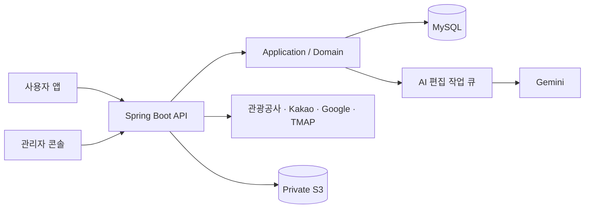

# KoReady Backend

KoReady는 한국에 머무는 외국인 유학생과 장기 체류자가 유명 관광지 밖의 새로운 장소를 찾고, 자신의 취향과 현재 위치에 맞는 여행을 계획하도록 돕는 서비스입니다.

[서비스 바로가기](https://koready.site/) · [API 계약](docs/koready-backend-design/openapi.yaml) · [개발·운영 가이드](docs/DEVELOPMENT_AND_OPERATIONS.md)

한국관광공사에서 받은 원본 정보를 그대로 나열하기보다, 여행자가 실제로 궁금해할 설명과 이미지, 위치 정보로 다듬어 제공합니다. 백엔드에서는 관광 데이터 수집과 AI 가공, 장소 추천, 이동 경로, Buddy 기능, 사용자·관리자 인증과 운영 기록을 담당합니다.

## 제가 맡은 일

- Java와 Spring으로 사용자·관리자 API와 도메인 구조 개발
- 한국관광공사, Kakao, Google, TMAP API 연동과 데이터 정리
- 관광 원문과 AI 가공 결과를 저장하고 변경 사항을 다시 확인하는 동기화 흐름 구현
- OAuth 로그인, JWT 갱신과 사용자·관리자 권한 분리
- 관리자 페이지 개발과 AWS 배포, CI 품질 검사 구성

관리자 페이지는 외부에 공개하는 서비스가 아니라, 새로 수집한 장소와 AI 가공 결과를 확인하고 공개 여부를 결정하는 운영 도구로 사용하고 있습니다.

## 서비스 구조



관광공사 API를 사용자 요청마다 실시간으로 호출하지는 않습니다. 장소 설명을 AI로 미리 다듬고 여러 외부 정보와 연결해야 했기 때문에, 원본을 내부 DB에 저장한 뒤 사용자에게 보여줄 데이터를 준비하는 방식을 선택했습니다.

대신 이 선택으로 외부 원본과 내부 데이터가 달라질 수 있다는 새로운 문제가 생겼습니다. 이를 해결하기 위해 원본 변경을 주기적으로 확인하고, 달라진 내용은 관리자 페이지에서 비교한 뒤 서비스에 반영하도록 만들었습니다.

## 주요 문제 해결

### 1. 빠른 응답을 위해 데이터를 저장하자 최신성을 직접 관리해야 했습니다

관광공사 API와 AI를 사용자 요청 때마다 함께 호출하면 응답이 느려지고, 어느 한쪽만 문제가 생겨도 장소를 보여줄 수 없습니다. 그래서 관광 원본과 AI가 가공한 결과를 미리 저장해 두고 사용자 API는 준비된 데이터를 읽도록 했습니다.

하지만 원본 장소의 주소나 소개가 바뀌면 과거 정보를 기준으로 만든 AI 설명도 함께 낡게 됩니다. 원본에서 중요한 필드를 모아 fingerprint를 만들고, 이전 값과 달라졌을 때 다시 검토할 수 있도록 했습니다. 일부 세부 속성이 fingerprint에서 빠져 변경을 놓칠 수 있는 경우도 찾아 비교 기준을 보완했습니다.

원본이 바뀌었다고 기존 데이터를 바로 지우지는 않습니다. 새로운 내용의 확인과 가공이 끝날 때까지 현재 공개 중인 데이터를 유지해, 동기화 중인 상태가 사용자 화면에 그대로 드러나지 않게 했습니다.

### 2. 외부 API의 빈 응답을 '모든 데이터 삭제'로 오해하지 않게 했습니다

외부 API가 빈 배열을 반환했다고 해서 실제 관광지가 모두 사라진 것은 아닙니다. 일시적인 장애나 특정 구간의 호출 실패일 수 있는데, 이를 정상 동기화로 처리하면 기존 장소를 대량으로 비활성화할 수 있습니다.

배치 전체 결과만 보지 않고 호출 구간과 항목별 성공·실패를 따로 기록했습니다. 일부 구간이 실패하면 성공한 데이터만으로 전체 동기화가 끝났다고 판단하지 않고, 실패한 범위를 다시 시도할 수 있게 했습니다. 외부 호출에 사용한 요청 정보와 응답 상태도 민감한 값은 가린 채 남겨 문제를 추적할 수 있도록 했습니다.

### 3. AI 결과를 바로 공개하지 않고 확인 가능한 작업으로 만들었습니다

AI 호출은 늦어지거나 실패할 수 있고, 같은 작업이 두 번 들어오거나 처리하는 사이 관광 원문이 바뀔 수도 있습니다. 단순히 비동기 메서드 하나로 실행하는 대신, DB에 작업 상태를 저장하고 worker가 하나씩 가져가 처리하도록 만들었습니다.

- 같은 request key의 작업이 중복 등록되지 않도록 제한
- `FOR UPDATE SKIP LOCKED`로 여러 worker가 같은 작업을 가져가지 않도록 처리
- 작업이 오래 멈추면 lease 만료 상태로 구분하고 정해진 횟수 안에서 재시도
- AI 응답의 형식과 필수 내용을 서버에서 다시 검사
- 작업 중 원문이 바뀌면 결과를 바로 공개하지 않고 새 작업으로 처리

AI가 응답했다는 사실만으로 작업을 성공 처리하지 않고, 서버 검증과 운영 확인을 통과한 결과만 사용자에게 보여주도록 했습니다.

### 4. 자동 연결이 애매한 데이터는 관리자가 근거를 보고 결정하게 했습니다

영문 장소나 이미지는 이름이 비슷하다는 이유만으로 자동 연결하면 다른 관광지가 붙을 수 있습니다. 거리나 주소가 애매한 후보도 있어 모든 결과를 자동 공개하는 방식은 위험했습니다.

관리자 페이지에서 원본과 변경된 값, 연결 후보와 판단 근거를 함께 보여주고 승인·거절 이력을 남겼습니다. 자동화가 잘 처리할 수 있는 부분은 줄이되, 잘못 연결됐을 때 사용자 경험에 영향이 큰 데이터는 사람이 마지막으로 확인하도록 했습니다.

### 5. 개발 규칙을 문서에만 두지 않고 CI에서 확인했습니다

기능이 많아지면서 코드 리뷰만으로 계층 의존성, 테스트 누락과 설정 오류를 모두 찾기 어려웠습니다. 그래서 이슈에서 요구사항을 정리한 뒤 테스트를 먼저 만들고, 구현과 리팩터링을 거쳐 전체 품질 검사를 통과해야 병합할 수 있는 흐름을 만들었습니다.

- 단위 테스트와 웹 테스트, MySQL Testcontainers 통합 테스트 분리
- ArchUnit으로 domain, application, controller, infrastructure 의존 방향 검사
- JaCoCo 라인 커버리지가 80% 아래로 내려가면 빌드 실패
- Docker 컨테이너를 512 MiB 제한으로 실제 부팅해 시작 여부 확인
- GitHub Actions OIDC로 AWS 장기 키 없이 배포
- Gitleaks로 저장소에 포함된 secret 검사

## 검증 결과

`main`의 [`38c7bf0`](https://github.com/ppp1969/koready-backend/commit/38c7bf0598cb83352026648ff7bda2cb59b08b6d)에서 실행한 CI 결과입니다.

| 검증 | 결과 | 근거 |
| --- | --- | --- |
| 일반 테스트 | 699개 통과 | [Gradle Test 실행](https://github.com/ppp1969/koready-backend/actions/runs/36005463523) |
| MySQL 통합 테스트 | 171개 통과 | [Gradle Test 실행](https://github.com/ppp1969/koready-backend/actions/runs/36005463523) |
| 라인 커버리지 | 84.49% | JaCoCo 품질 검사 통과 |
| 컨테이너 | Docker build 및 512 MiB 부팅 확인 | [Docker Build 실행](https://github.com/ppp1969/koready-backend/actions/runs/36005463523) |
| 배포 | Elastic Beanstalk 배포 및 readiness 확인 | [배포 실행](https://github.com/ppp1969/koready-backend/actions/runs/36005463523) |
| 보안 | Gitleaks 검사 통과 | [Secret Scan 실행](https://github.com/ppp1969/koready-backend/actions/runs/36005463568) |

## 기술 스택

| 영역 | 기술 |
| --- | --- |
| Backend | Java 21, Spring Boot 4.1, Spring Security, Spring JDBC |
| Data | MySQL 8, Flyway, Private S3 |
| AI / External API | Spring AI, Gemini, 한국관광공사 OpenAPI, Kakao, Google, TMAP |
| Test | JUnit 5, MockMvc, Testcontainers, ArchUnit, JaCoCo |
| Infra | Docker, AWS Elastic Beanstalk, CloudFront, Route 53, Aiven |
| Delivery | GitHub Actions, AWS OIDC, Gitleaks |

## 주요 기능

- 취향과 위치를 반영한 K-Local Pick 추천, 월별 축제 탐색
- 장소 저장, 공개 Buddy 프로필, 차단·신고와 1:1 쪽지
- 한국어·영어 위치 검색과 위변조 방지 token 기반 위치 저장
- 관광 데이터 수집, 번역·이미지 연결 검수와 데이터 품질 확인
- Hori Tip, 약관, 온보딩 후보와 AI 편집 작업을 관리하는 운영 API
- 외부 API 호출과 배치 실행 이력을 활용한 공모전 증빙 생성

## 실행과 문서

```powershell
# 빠른 단위·슬라이스·아키텍처 테스트
./gradlew test

# Docker 기반 MySQL 통합 테스트
./gradlew integrationTest

# PR 전 전체 품질 검사
./gradlew clean check
```

- [로컬 실행, 프로필, 배포, API 규칙](docs/DEVELOPMENT_AND_OPERATIONS.md)
- [AI 개발 품질 검사](docs/AI_DEVELOPMENT_HARNESS.md)
- [공개 가능한 데이터 기준](docs/PUBLIC_DATA_POLICY.md)
- [관리자 계정 역할 설정](docs/ADMIN_ACCOUNT_ROLE.md)
- [기여 절차](CONTRIBUTING.md)

## 프로젝트 상태

2026 관광데이터 활용 공모전을 목표로 개발하고 있습니다. 공개 서비스는 기능을 검증하는 단계이며, `staging` 환경은 프론트 연동과 데이터 수집을 함께 확인하는 데 사용합니다.
