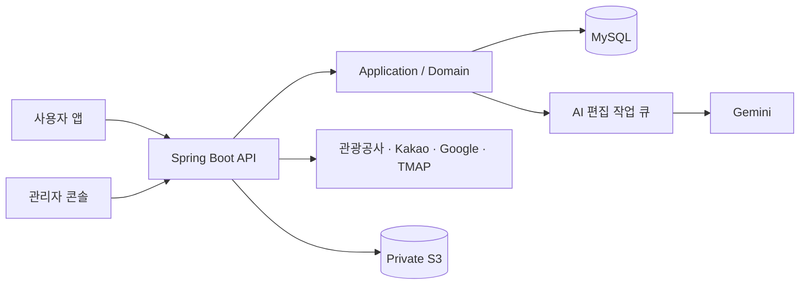

# KoReady Backend

KoReady는 한국에 머무는 외국인 유학생과 장기 체류자가 유명 관광지 밖의 새로운 장소를 찾고, 자신의 취향과 현재 위치에 맞는 여행을 계획하도록 돕는 서비스입니다.

<p align="center">
  
  
  
  
</p>

[서비스 바로가기](https://koready.site/) · [API 계약](docs/koready-backend-design/openapi.yaml) · [개발·운영 가이드](docs/DEVELOPMENT_AND_OPERATIONS.md)

한국관광공사에서 받은 원본 정보를 그대로 나열하기보다, 여행자가 실제로 궁금해할 설명과 이미지, 위치 정보로 다듬어 제공합니다. 백엔드에서는 관광 데이터 수집과 AI 가공, 장소 추천, 이동 경로, Buddy 기능, 사용자·관리자 인증과 운영 기록을 담당합니다.

<br>

## 담당 역할

- Java와 Spring으로 사용자·관리자 API와 도메인 구조 개발
- 한국관광공사, Kakao, Google, TMAP API 연동과 데이터 정리
- 관광 원문과 AI 가공 결과를 저장하고 변경 사항을 다시 확인하는 동기화 흐름 구현
- OAuth 로그인, JWT 갱신과 사용자·관리자 권한 분리
- 관리자 페이지 개발과 AWS 배포, CI 품질 검사 구성

관리자 페이지는 외부에 공개하는 서비스가 아니라, 새로 수집한 장소와 AI 가공 결과를 확인하고 공개 여부를 결정하는 운영 도구로 사용하고 있습니다.

<br>

## 서비스 구조



관광공사 API를 사용자 요청마다 실시간으로 호출하지는 않습니다. 장소 설명을 AI로 미리 다듬고 여러 외부 정보와 연결해야 했기 때문에, 원본을 내부 DB에 저장한 뒤 사용자에게 보여줄 데이터를 준비하는 방식을 선택했습니다.

대신 이 선택으로 외부 원본과 내부 데이터가 달라질 수 있다는 새로운 문제가 생겼습니다. 이를 해결하기 위해 원본 변경을 주기적으로 확인하고, 달라진 내용은 관리자 페이지에서 비교한 뒤 서비스에 반영하도록 만들었습니다.

<br>

## 주요 문제 해결

### 1. 관광 데이터 최신성 관리

관광공사 API와 AI를 사용자 요청 때마다 함께 호출하면 응답이 느려지고, 어느 한쪽만 문제가 생겨도 장소를 보여줄 수 없습니다. 그래서 관광 원본과 AI가 가공한 결과를 미리 저장해 두고 사용자 API는 준비된 데이터를 읽도록 했습니다.

원본 장소의 주소나 소개가 바뀌면 과거 정보를 기준으로 만든 AI 설명도 함께 낡게 됩니다. 이를 확인하기 위해 원본의 주요 필드로 fingerprint를 만들었습니다.

**주요 변경 사항**

- fingerprint 비교를 통한 원본 변경 감지
- 비교에서 누락된 세부 속성 추가
- 원본 변경 시 재검토 및 가공 흐름 연결
- 새 결과 확인·가공 완료 전까지 기존 공개 데이터 유지

동기화가 진행되는 동안에도 사용자는 현재 공개된 장소 정보를 계속 볼 수 있도록 했습니다.

<br>

### 2. 불완전한 동기화로 인한 데이터 비활성화 방지

외부 API가 빈 배열을 반환했다고 해서 실제 관광지가 모두 사라진 것은 아닙니다. 일시적인 장애나 특정 구간의 호출 실패일 수 있는데, 이를 정상 동기화로 처리하면 기존 장소를 대량으로 비활성화할 수 있습니다.

**주요 변경 사항**

- 호출 구간과 항목별 성공·실패 기록
- 일부 구간 실패 시 전체 동기화 완료 처리 방지
- 실패 범위만 다시 처리할 수 있는 재시도 흐름 구성
- 민감한 값을 가린 요청 정보와 응답 상태 기록

성공한 일부 데이터만으로 전체 동기화가 끝났다고 판단하지 않도록 했습니다. 문제가 생겼을 때 실패 범위와 외부 호출 이력을 함께 확인할 수 있습니다.

<br>

### 3. AI 가공 작업의 중복 방지와 결과 검증

AI 호출은 늦어지거나 실패할 수 있고, 같은 작업이 두 번 들어오거나 처리하는 사이 관광 원문이 바뀔 수도 있습니다. 단순히 비동기 메서드 하나로 실행하는 대신, DB에 작업 상태를 저장하고 worker가 하나씩 가져가 처리하도록 만들었습니다.

**주요 변경 사항**

- 동일 request key의 중복 작업 등록 제한
- `FOR UPDATE SKIP LOCKED`를 통한 worker 간 중복 작업 획득 방지
- lease 만료 상태 구분 및 정해진 횟수 내 재시도
- AI 응답 형식과 필수 내용의 서버 검증
- 처리 중 원문 변경 시 기존 결과 공개 보류 및 새 작업 처리

AI 응답 수신만으로 작업을 성공 처리하지 않고, 서버 검증과 운영 확인을 통과한 결과만 사용자에게 보여주도록 했습니다.

<br>

### 4. 장소·이미지 연결 후보 검수

영문 장소나 이미지는 이름이 비슷하다는 이유만으로 자동 연결하면 다른 관광지가 붙을 수 있습니다. 거리나 주소가 애매한 후보도 있어 모든 결과를 자동 공개하는 방식은 위험했습니다.

**주요 변경 사항**

- 관리자 페이지에서 원본과 변경된 값 비교
- 연결 후보와 판단 근거 제공
- 승인·거절 이력 저장

자동으로 처리할 수 있는 부분은 자동화하되, 잘못 연결됐을 때 사용자 경험에 영향이 큰 데이터는 관리자가 마지막으로 확인하도록 했습니다.

<br>

### 5. CI 기반 테스트·아키텍처·배포 검증

기능이 많아지면서 코드 리뷰만으로 계층 의존성, 테스트 누락과 설정 오류를 모두 찾기 어려웠습니다.

**주요 변경 사항**

- 단위·웹 테스트와 MySQL Testcontainers 통합 테스트 분리
- ArchUnit을 통한 계층 간 의존 방향 검사
- JaCoCo 라인 커버리지 80% 미만 시 빌드 실패 처리
- 512 MiB 제한 환경의 Docker 컨테이너 부팅 확인
- GitHub Actions OIDC 기반 AWS 배포
- Gitleaks를 통한 저장소 secret 검사

이슈에서 요구사항을 정리하고 테스트·구현·리팩터링을 거친 뒤, 전체 품질 검사를 통과해야 병합할 수 있도록 구성했습니다.

<br>

## 검증 결과

`main`의 [`38c7bf0`](https://github.com/ppp1969/koready-backend/commit/38c7bf0598cb83352026648ff7bda2cb59b08b6d)에서 실행한 CI 결과입니다.

| 검증 | 결과 | 근거 |
| --- | --- | --- |
| 일반 테스트 | 699개 통과 | [Gradle Test 실행](https://github.com/ppp1969/koready-backend/actions/runs/36005463523) |
| MySQL 통합 테스트 | 171개 통과 | [Gradle Test 실행](https://github.com/ppp1969/koready-backend/actions/runs/36005463523) |
| 라인 커버리지 | 84.49% | JaCoCo 품질 검사 통과 |
| 컨테이너 | Docker build 및 512 MiB 부팅 확인 | [Docker Build 실행](https://github.com/ppp1969/koready-backend/actions/runs/36005463523) |
| 배포 | Elastic Beanstalk 배포 및 readiness 확인 | [배포 실행](https://github.com/ppp1969/koready-backend/actions/runs/36005463523) |
| 보안 | Gitleaks 검사 통과 | [Secret Scan 실행](https://github.com/ppp1969/koready-backend/actions/runs/36005463568) |

<br>

## 기술 스택

| 영역 | 기술 |
| --- | --- |
| Backend | Java 21, Spring Boot 4.1, Spring Security, Spring JDBC |
| Data | MySQL 8, Flyway, Private S3 |
| AI / External API | Spring AI, Gemini, 한국관광공사 OpenAPI, Kakao, Google, TMAP |
| Test | JUnit 5, MockMvc, Testcontainers, ArchUnit, JaCoCo |
| Infra | Docker, AWS Elastic Beanstalk, CloudFront, Route 53, Aiven |
| Delivery | GitHub Actions, AWS OIDC, Gitleaks |

<br>

## 주요 기능

- 취향과 위치를 반영한 K-Local Pick 추천, 월별 축제 탐색
- 장소 저장, 공개 Buddy 프로필, 차단·신고와 1:1 쪽지
- 한국어·영어 위치 검색과 위변조 방지 token 기반 위치 저장
- 관광 데이터 수집, 번역·이미지 연결 검수와 데이터 품질 확인
- Hori Tip, 약관, 온보딩 후보와 AI 편집 작업을 관리하는 운영 API
- 외부 API 호출과 배치 실행 이력을 활용한 공모전 증빙 생성

<br>

## 실행과 문서

```powershell
# 빠른 단위·슬라이스·아키텍처 테스트
./gradlew test

# Docker 기반 MySQL 통합 테스트
./gradlew integrationTest

# PR 전 전체 품질 검사
./gradlew clean check
```

- [로컬 실행, 프로필, 배포, API 규칙](docs/DEVELOPMENT_AND_OPERATIONS.md)
- [AI 개발 품질 검사](docs/AI_DEVELOPMENT_HARNESS.md)
- [공개 가능한 데이터 기준](docs/PUBLIC_DATA_POLICY.md)
- [관리자 계정 역할 설정](docs/ADMIN_ACCOUNT_ROLE.md)
- [기여 절차](CONTRIBUTING.md)

<br>

## 프로젝트 상태

2026 관광데이터 활용 공모전을 목표로 개발하고 있습니다. 공개 서비스는 기능을 검증하는 단계이며, `staging` 환경은 프론트 연동과 데이터 수집을 함께 확인하는 데 사용합니다.
