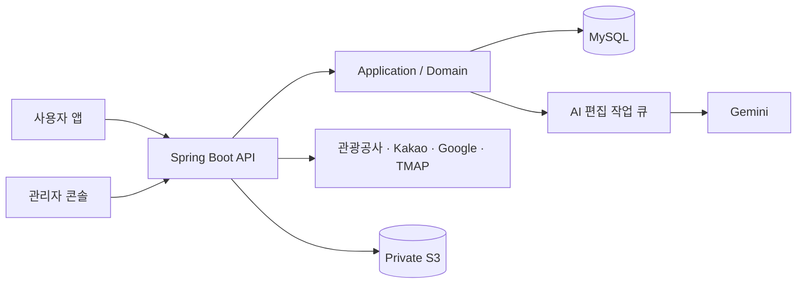

# KoReady Backend

> 외국인 유학생과 장기 체류자가 한국의 로컬 여행지를 발견하고, 실제로 갈 수 있는지 판단하도록 돕는 여행 서비스의 백엔드입니다.

[서비스 바로가기](https://koready.site/) · [API 계약](docs/koready-backend-design/openapi.yaml) · [개발·운영 가이드](docs/DEVELOPMENT_AND_OPERATIONS.md)

KoReady는 한국관광공사 데이터를 사용자 관점의 장소 정보로 정리하고, 체류 위치와 여행 취향을 반영한 추천, 이동 경로, 여행 메이트 연결을 제공합니다. 백엔드는 외부 데이터 수집부터 검수·공개, 인증과 권한, 추천 상태, 운영 증빙까지 담당합니다.

## 담당 범위

- Java/Spring 기반 API와 도메인 구조 설계
- 한국관광공사·Kakao·Google·TMAP 등 외부 API 연계와 데이터 정규화
- AI 편집 작업의 큐, 검증, 재시도, 원문 변경 추적 설계
- OAuth 로그인, JWT 회전, 사용자·관리자 역할별 접근 제어
- Testcontainers·ArchUnit·JaCoCo를 포함한 품질 게이트와 AWS 배포 자동화

관리자 콘솔도 별도로 개발했지만 운영 도구이므로 URL은 공개하지 않습니다. 로그인과 서버 측 역할 검증을 통과한 계정만 접근할 수 있습니다.

## 서비스 흐름



외부 원본을 바로 사용자에게 노출하지 않습니다. 수집 결과를 저장하고, 정규화와 자동 검증을 거친 뒤 운영 승인 상태에 따라 공개 API가 읽도록 분리했습니다. 사용자 앱과 관리자 콘솔은 같은 백엔드를 사용하되 인증 주체와 권한 경계를 서버에서 다시 확인합니다.

## 핵심 문제 해결

### 1. AI 결과를 검증 가능한 데이터 처리 과정으로 만들기

장소 설명을 생성하는 AI 호출은 지연되거나 실패할 수 있고, 같은 요청이 다시 들어오거나 처리 중 원문이 바뀔 수 있습니다. 단순 비동기 호출 대신 MySQL 작업 큐와 명시적인 상태 전이를 사용했습니다.

- `request key`를 유일하게 저장해 동일 작업의 중복 등록 방지
- `FOR UPDATE SKIP LOCKED`로 여러 worker가 같은 작업을 동시에 가져가지 않도록 제어
- lease 만료, 제한된 재시도, stale 상태를 기록해 중단된 작업을 다시 판단 가능하게 구성
- 구조화된 AI 응답을 서버 규칙으로 검증한 뒤에만 발행 후보로 저장
- 원문 fingerprint가 바뀌면 새 결과가 준비될 때까지 기존 `READY` 콘텐츠 유지

이 구조로 AI 응답 자체를 신뢰하는 대신, 백엔드가 결과의 유효성과 공개 시점을 결정하도록 만들었습니다.

### 2. 외부 관광 데이터를 수집부터 공개까지 추적하기

한국관광공사 데이터는 API 종류마다 식별자와 갱신 방식이 다르고, 사진이나 영문 정보는 자동 연결만으로 공개하기 어렵습니다. 그래서 호출, 원본 snapshot, batch item, 동기화 cursor, 관리자 판단을 각각 기록합니다.

- 외부 호출의 성공·실패와 마스킹된 요청 정보를 저장해 장애 원인 추적
- 원본 snapshot을 변경하지 않고 보관하고, 공개 가능 여부와 보존 기간을 별도 관리
- 배치 작업을 항목 단위로 기록해 부분 실패와 재시도 범위를 구분
- 영문 장소와 이미지 연결은 후보 근거를 보여주고 관리자 승인 이력을 보존
- 수집 완료와 사용자 공개를 분리해 검수 전 데이터의 노출 방지

### 3. 개발 규칙을 자동 품질 게이트로 연결하기

Issue 명세에서 시작해 `RED → GREEN → REFACTOR → clean check → CI → 배포 확인`으로 이어지는 개발 흐름을 저장소 규칙으로 만들었습니다.

- 단위·웹 슬라이스·아키텍처 테스트와 Testcontainers MySQL 통합 테스트 분리
- ArchUnit으로 domain/application/controller/infrastructure 의존 방향 검증
- JaCoCo 라인 커버리지 80% 미만이면 빌드 실패
- Docker 이미지를 512 MiB 제한으로 부팅해 실제 컨테이너 시작 여부 확인
- GitHub Actions OIDC로 AWS 장기 키 없이 Elastic Beanstalk 배포
- Gitleaks로 커밋에 포함된 secret 검사

## 검증 근거

`main`의 [`38c7bf0`](https://github.com/ppp1969/koready-backend/commit/38c7bf0598cb83352026648ff7bda2cb59b08b6d) 기준 결과입니다.

| 검증 | 결과 | 근거 |
| --- | --- | --- |
| 일반 테스트 | 699개 통과 | [Gradle Test 실행](https://github.com/ppp1969/koready-backend/actions/runs/36005463523) |
| MySQL 통합 테스트 | 171개 통과 | [Gradle Test 실행](https://github.com/ppp1969/koready-backend/actions/runs/36005463523) |
| 라인 커버리지 | 84.49% | JaCoCo 품질 게이트 통과 |
| 컨테이너 | Docker build 및 512 MiB 부팅 smoke 통과 | [Docker Build 실행](https://github.com/ppp1969/koready-backend/actions/runs/36005463523) |
| 배포 | Elastic Beanstalk 배포 및 readiness 확인 | [배포 실행](https://github.com/ppp1969/koready-backend/actions/runs/36005463523) |
| 보안 | Gitleaks 검사 통과 | [Secret Scan 실행](https://github.com/ppp1969/koready-backend/actions/runs/36005463568) |

테스트 수와 커버리지는 위 커밋의 CI 산출물 기준이며 이후 변경에 따라 달라질 수 있습니다.

## 기술 스택

| 영역 | 기술 |
| --- | --- |
| Backend | Java 21, Spring Boot 4.1, Spring Security, Spring JDBC |
| Data | MySQL 8, Flyway, Private S3 |
| AI / External API | Spring AI, Gemini, 한국관광공사 OpenAPI, Kakao, Google, TMAP |
| Test | JUnit 5, MockMvc, Testcontainers, ArchUnit, JaCoCo |
| Infra | Docker, AWS Elastic Beanstalk, CloudFront, Route 53, Aiven |
| Delivery | GitHub Actions, AWS OIDC, Gitleaks |

## 주요 기능

- 취향·위치 기반 K-Local Pick 추천과 월별 축제 탐색
- 장소 저장, 공개 Buddy 프로필, 차단·신고, 1:1 쪽지
- 한국어·영어 위치 검색과 위변조 방지 token 기반 위치 저장
- 관광 데이터 수집, 번역·이미지 연결 검수, 데이터 품질 집계
- Hori Tip, 약관, 온보딩 후보, AI 편집 작업을 관리하는 운영 API
- 외부 API 호출과 배치 실행의 감사·공모전 증빙 생성

## 실행과 문서

```powershell
# 빠른 단위·슬라이스·아키텍처 테스트
./gradlew test

# Docker 기반 MySQL 통합 테스트
./gradlew integrationTest

# PR 전 전체 품질 게이트
./gradlew clean check
```

- [로컬 실행, 프로필, 배포, API 규칙](docs/DEVELOPMENT_AND_OPERATIONS.md)
- [AI 개발 품질 게이트](docs/AI_DEVELOPMENT_HARNESS.md)
- [공개 가능한 데이터 기준](docs/PUBLIC_DATA_POLICY.md)
- [관리자 계정 역할 설정](docs/ADMIN_ACCOUNT_ROLE.md)
- [기여 절차](CONTRIBUTING.md)

## 프로젝트 상태

2026 관광데이터 활용 공모전을 목표로 개발 중입니다. 공개 서비스는 기능 검증 단계이며, `staging`은 프론트 연동과 통제된 데이터 수집을 위한 공유 환경으로 사용합니다.
