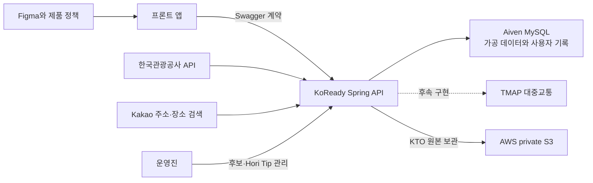

# KoReady 개발 현황 및 회의 협의 보고서

> 기준 시각: 2026-07-19 21:18 KST
> 대상: PM, 디자이너, 프론트엔드, 백엔드
> 목적: 현재까지 만든 범위와 신뢰 수준을 공유하고, 다음 개발 전에 제품·화면 결정을 한 번에 확인한다.

## 1. 회의에서 먼저 볼 결론

KoReady 백엔드는 **관광지 데이터 수집·가공, 온보딩, 위치, 홈, 추천, 장소, Buddy 프로필·쪽지·신고, 관리자 큐레이션**까지 실제 코드와 DB로 구현되어 있다. 현재 Swagger에 정의된 API는 71개이며, 그중 **55개는 구현**, **16개는 앞으로 만들 계약만 정의**되어 있다.

단, 55/71이라는 수치인 **77.5%는 API 개수 기준**이다. 화면 난이도, 외부 서비스 연동, 운영 준비도를 반영한 전체 프로젝트 완성률로 해석하면 안 된다.

회의에서 합의하면 바로 진행 가능한 핵심 흐름은 다음과 같다.

- 위치 입력 → 관광 유형 1~4개 → 운영진이 고른 관광지 10개 중 1~3개 선택
- 홈과 월별 축제·관광지 조회
- 추천 카드 묶음 생성, 카드 이동·저장 이벤트 기록, 30일 재노출 제한
- 관광지 검색·목록·상세·저장
- Buddy 프로필, 장소별 메이트, 1:1 비실시간 쪽지, 차단·신고
- 온보딩 후보와 Hori Tip을 포함한 관리자 큐레이션
- KTO 수집 상태, 원본 메타데이터, 배치·동기화 위치, 데이터 품질 조회

아직 사용자 화면에서 완결되지 않는 큰 부분은 다음과 같다.

- Google·Apple 로그인, 토큰 갱신·로그아웃, 약관 동의, 내 계정 조회
- TMAP 대중교통 경로 생성·상세 조회와 경로 응답에 Hori Tip을 합치는 마지막 단계
- 원본·공모전 증빙 파일의 임시 다운로드 주소 발급
- 관리자의 수동 배치 실행·재시도, 증빙 묶음 생성, 상세 감사 로그 조회

**권장 회의 결론:** 현재 구현된 화면 계약을 1차 동결하고 프론트 연동을 시작한다. 동시에 로그인·약관을 다음 백엔드 우선순위로 올리며, Route 화면과 Hori Tip 노출 위치는 디자인 확인 후 개발한다. AWS private S3는 실제 배포와 보안 스모크까지 끝났고, EB와 DB 이전은 예정대로 후속 단계에서 결정한다.

## 2. 상태와 신뢰도 읽는 법

| 표시 | 의미 | 회의에서의 해석 |
|---|---|---|
| 구현 | Controller, 서비스, DB 또는 외부 연동 코드가 있고 자동 테스트를 통과함 | 프론트 연동과 화면 검토 가능 |
| 명세 | Swagger에 요청·응답은 자세히 적혀 있지만 실행 코드는 없음 | 화면 협의용이며 호출하면 안 됨 |
| A | 자동 테스트, 실제 MySQL, HTTP 계약, CI에서 반복 검증된 범위 | 코드 수준 신뢰도가 높음 |
| B | 코드와 테스트는 있으나 실제 외부 서비스, 운영 데이터량, 스테이징 인증 중 하나가 더 필요함 | 기능 검증은 가능하나 운영 확정은 아님 |
| C | 설계만 있거나 외부 결정·계정 설정을 기다리는 범위 | 구현 후 재검증 필요 |

### 비개발자를 위한 용어

| 용어 | 쉬운 설명 |
|---|---|
| API | 앱 화면이 서버에 정보를 요청하거나 저장하는 약속된 창구 |
| Swagger | 각 창구에 무엇을 보내고 무엇을 받는지 웹에서 보는 설명서 겸 시험 화면 |
| DTO | 화면과 서버 사이에 주고받는 정보 묶음의 모양 |
| DB | 사용자 선택, 관광지, 추천 기록 등을 오래 보관하는 저장소 |
| cursor | 긴 목록에서 다음 페이지를 이어 받기 위한 위치표. 페이지 번호 대신 사용 |
| 멱등성 키 | 전송 버튼을 두 번 눌러도 쪽지·신고가 중복 생성되지 않게 하는 요청표 |
| migration | DB 구조 변경을 순서대로 기록해 모든 환경에 똑같이 적용하는 파일 |
| CI | 코드가 GitHub에 올라갈 때 테스트·빌드·보안 검사를 자동 수행하는 절차 |
| staging | 프론트·PM이 함께 확인하는 테스트 서버. 현재 Render와 Aiven을 사용 |

## 3. 현재 시스템 구성

- 백엔드: Java 21, Spring Boot 4.1.0
- 데이터 접근: Spring JDBC, MySQL, Flyway migration
- 로컬 개발: 로컬 서버 + Docker MySQL + 로컬 전용 시험 사용자
- 공유 테스트: Render `staging` + Aiven MySQL
- 향후 운영: AWS Elastic Beanstalk는 약 한 달 뒤 재검토, 서울 리전 private S3는 KTO 원본 보관용으로 실제 배포·검증 완료
- 프론트 기준 URL: `https://koready-backend-staging.onrender.com/api/v1`
- 공유 Swagger: `https://koready-backend-staging.onrender.com/swagger-ui/index.html`
- 로컬 Swagger: `http://localhost:8080/swagger-ui/index.html`

2026-07-19 확인 결과 Render의 준비 상태, Swagger UI, 기계 판독 API 문서가 모두 HTTP 200을 반환했다. 다만 실제 로그인은 아직 없으므로 **staging의 로그인 필요 API는 401이 정상**이다. 로컬에서만 공개된 시험 인증값으로 보호 API를 확인할 수 있다.

## 4. 구현 진행도

| 제품 영역 | 구현/전체 | 현재 상태 | 신뢰도 |
|---|---:|---|---|
| 로그인·약관·내 계정 | 1/7 | 언어 저장만 구현. 실제 인증과 약관은 명세 | C |
| 온보딩 | 3/3 | 3단계 진행·완료와 운영 후보 10개 제공 | A |
| 위치 | 5/5 | 검색, 저장, 기본 위치, 삭제 | A/B |
| 홈 | 1/1 | 위치·언어·월별 추천·안 읽은 쪽지 요약 | A |
| 추천 | 4/4 | 월별 목록, 카드 묶음, 다음 묶음, 행동 기록 | A |
| 장소 | 6/6 | 검색·목록·상세·저장·해제 | A |
| Route | 0/2 | TMAP 프로파일링과 계약만 완료 | C |
| Buddy | 4/4 | 내 프로필, 공개 프로필, 장소별 메이트 | A |
| 쪽지 | 5/5 | 목록, 생성, 상세, 답장, 읽음 | A |
| 차단·신고 | 3/3 | 양방향 차단 반영과 신고 접수 | A |
| 관리자 온보딩 후보 | 6/6 | 초안, 수정, 발행, 보관 | A |
| 관리자 Hori Tip | 5/5 | 초안, 수정, 상태·노출 조건 관리 | A |
| 외부 API 운영 조회 | 5/6 | 호출·원본 메타데이터 조회, 다운로드만 명세 | A/B |
| 배치·동기화 관리 | 6/8 | 조회·활성화·cursor 초기화, 수동 실행·재시도는 명세 | B |
| 공모전 증빙 묶음 | 0/4 | private S3 준비 완료, 묶음 생성·다운로드는 미구현 | C |
| 데이터 품질·감사 | 1/2 | 품질 요약 구현, 상세 감사 목록은 명세 | A/C |
| **합계** | **55/71** | API 개수 기준 77.5% | 전체 완성률 아님 |

## 5. 제품 정책이 코드에 반영된 방식

### 5.1 핵심 사용자와 온보딩

- 핵심 사용자는 외국인 유학생·교환학생·장기체류 외국인이다. 단기 여행자는 확장 사용자다.
- 방문 목적 단계와 `TravelPurpose` 값은 제거했다.
- 온보딩은 `위치 → 관광 유형 1~4개 → 관심 관광지 1~3개` 순서다.
- 관심 관광지는 운영진이 품질을 확인해 발행한 **정확히 10개 후보**에서만 고른다.
- 프론트가 후보 목록의 버전도 함께 보내므로, 사용자가 보는 동안 운영 목록이 바뀐 경우 잘못된 선택을 조용히 저장하지 않는다.

### 5.2 위치

- GPS를 자동 수집하지 않는다. 사용자가 검색해 선택한 주소·학교·건물·장소만 저장한다.
- 검색은 Kakao를 이용하되, 프론트는 Kakao를 직접 호출하지 않는다.
- 검색 결과마다 서버가 짧게 유효한 `searchResultToken`을 발급한다. 저장할 때 이 값을 보내므로 프론트가 임의 좌표를 만들어 넣는 것을 막는다.
- 기본 위치는 추천 권역과 Route 출발점에 사용한다.

### 5.3 관광지·축제·추천

- 관광지의 기준 원천은 한국관광공사 KTO API이며, KoReady DB에 정리해 저장한 뒤 화면에 제공한다.
- 축제는 같은 이름이라도 **행사 연도와 개최 기간을 별도 회차로 저장**한다.
- 행사 시작 6개월 전부터 노출할 수 있고, 종료 후에도 해당 월 목록에는 `ENDED`로 남는다.
- 홈과 현재 추천은 해당 달의 `UPCOMING`, `ONGOING`을 우선한다.
- 추천 카드는 API 응답에 포함된 시점부터 30일간 같은 사용자에게 다시 내보내지 않는다. 후보가 너무 빨리 줄면 기간이나 기록 시점을 정책 버전으로 조정한다.
- 추천은 MVP에서 설명 가능한 규칙 기반이다. 관광 유형, 권역, 콘텐츠 준비도, 최근 노출 이력을 사용한다.

### 5.4 Route와 Hori Tip

- TMAP 원본은 그대로 노출하지 않고 `총시간, 요금, 환승, 도보, 구간`으로 단순화할 예정이다.
- 편도 10,800초 미만은 `당일치기 가능`, 이상은 `숙박 권장`으로 분류하는 현재 계약이 있다.
- Hori Tip은 운영진이 미리 저장한 짧은 이동 팁이다. Route 조회 시 목적지·구간·기간 조건이 맞는 활성 팁을 찾아 함께 응답한다.
- KTX 예매 가이드·시뮬레이션은 프론트 정적 콘텐츠다. 영상·오디오 가이드는 MVP에서 제외한다.

### 5.5 Buddy·쪽지·안전

- 장소별 메이트는 그 장소를 실제로 저장했고 공개 프로필을 켠 사용자만 후보가 된다. 온보딩 관심 선택은 공개하지 않는다.
- 본인, 탈퇴 사용자, 비공개 프로필, 어느 한쪽이라도 차단한 관계는 목록에서 제외한다.
- SNS 공개를 끄면 SNS 링크는 빈 목록으로 응답한다.
- 쪽지는 실시간 채팅이 아니라 비실시간 메시지다. 같은 두 사람과 같은 장소에는 하나의 대화만 만든다.
- 차단해도 기존 대화 기록은 남지만 새 답장은 보낼 수 없다.
- 신고는 접수만 하며 자동 차단·자동 제재하지 않는다. 운영 정책과 관리자 처리 화면은 후속 범위다.

## 6. 데이터가 겹치지 않게 유지하는 기준

| 대상 | 중복 방지 기준 | 쉬운 설명 |
|---|---|---|
| 관광지 | KTO `contentId` 유일 | 같은 원천 관광지를 두 번 저장하지 않음 |
| 축제 회차 | 축제 묶음 + 행사 연도 + 회차 번호 | 작년 행사와 올해 행사를 섞지 않음 |
| 온보딩 후보 | 후보 버전 유일, 한 후보 안의 장소·표시 순서 유일 | 발행된 10개 구성을 그대로 재현 |
| 추천 카드 | 추천 묶음 + 장소 유일 | 한 묶음 안에서 같은 장소를 반복하지 않음 |
| 저장 장소 | 사용자 + 장소 유일 | 저장 버튼을 여러 번 눌러도 한 건만 유지 |
| Buddy 프로필 | 사용자당 하나 | 한 계정에 공개 프로필이 여러 개 생기지 않음 |
| 쪽지 대화 | 장소 + 두 사용자 조합 유일 | 같은 장소·상대와 대화방이 중복 생성되지 않음 |
| 쪽지·신고 | 발신 사용자 + `Idempotency-Key` 유일 | 네트워크 재시도로 중복 전송되지 않음 |
| 차단 | 차단한 사용자 + 차단된 사용자 유일 | 반복 차단에서도 최초 차단 기록 유지 |
| Hori Tip | 운영 코드 `code` 유일 | 같은 운영 팁이 이름만 달리해 중복되지 않음 |
| KTO 원본 | 호출 기록·저장 위치·SHA-256 해시 | 어느 호출에서 나온 파일인지와 변조 여부를 추적 |

숫자형 내부 ID는 DB가 발급한다. 외부에 오래 노출하거나 재시도에 쓰는 추천 묶음·대화·이벤트 등은 별도 공개 ID를 사용한다. 프론트는 ID의 모양을 해석하거나 직접 만들지 않고 받은 값을 그대로 다음 API에 전달해야 한다.

## 7. 공통 응답과 화면 처리 규칙

성공 응답은 공통으로 `success`, `code`, `message`, `data`, `traceId`를 가진다. 실제 화면 데이터는 `data` 안에 있다. 실패 응답은 `success=false`, 오류 `code`, 사용자 또는 개발자용 `message`, 입력 항목별 `errors`, 문의 추적용 `traceId`로 구성된다.

목록 API는 보통 `items`, `nextCursor`, `hasMore`를 반환한다. `hasMore=true`일 때만 `nextCursor`로 다음 목록을 요청한다. 전체 개수를 계산할 수 있는 화면에만 `totalCount`가 포함된다.

| 상황 | 대표 HTTP 상태 | 화면에서 필요한 행동 |
|---|---:|---|
| 입력 누락·형식 오류 | 400 | 해당 입력 가까이에 안내 표시 |
| 로그인 정보 없음·만료 | 401 | 로그인 또는 토큰 갱신 흐름으로 이동 |
| 관리자 권한 없음 | 403 | 기능 숨김 또는 권한 안내 |
| 대상 없음 | 404 | 삭제됨·존재하지 않음 화면 |
| 중복 요청·버전 충돌 | 409 | 최신 정보 재조회 후 다시 시도 |
| 제품 규칙상 처리 불가 | 422 | 선택 개수·프로필 필요 등 구체 안내 |
| 호출 제한 | 429 | 잠시 후 재시도 |
| 외부 서비스 실패 | 502/503 | 현재 사용할 수 없음과 재시도 제공 |

`null`은 “정보를 아직 확보하지 못함”, 빈 배열 `[]`은 “목록을 확인했지만 항목이 없음”으로 구분한다. 디자이너는 장소 상세의 영업시간·요금·주차처럼 `null`이 가능한 영역과 목록이 비어 있는 상태를 각각 설계해야 한다.

## 8. 전체 API 정보 구성

아래 표는 프론트가 보내는 핵심 정보와 서버가 돌려주는 핵심 정보를 화면 언어로 요약한 것이다. 정확한 글자 수, 필수 여부, 예시는 Swagger가 최종 기준이다.

### 8.1 로그인·약관·계정: 1/7 구현

| 상태/신뢰 | 호출 시점과 API | 보내는 정보 | 받는 정보 | 데이터 출처·주의 |
|---|---|---|---|---|
| 명세/C | 로그인 `POST /auth/social/login` | `GOOGLE` 또는 `APPLE`, ID 토큰 또는 인증 코드, 기기 ID, 선택 푸시 토큰 | access/refresh 토큰, 사용자, 다음 화면 `nextStep` | 소셜 제공자 검증과 계정 연결 미구현 |
| 명세/C | 토큰 갱신 `POST /auth/refresh` | refresh 토큰, 기기 ID | 교체된 토큰, 사용자, 다음 화면 | 탈취·재사용 방지 정책과 저장 방식 구현 필요 |
| 명세/C | 로그아웃 `POST /auth/logout` | Authorization 헤더 | 본문 없음(204) | 해당 기기의 refresh 세션 폐기 예정 |
| 명세/C | 필수 약관 조회 `GET /terms/required` | 없음 | 약관 ID·종류·버전·제목·필수 여부·동의 여부, 전체 동의 상태 | 실제 약관 원문·버전 확정 필요 |
| 명세/C | 약관 동의 저장 `PUT /users/me/term-agreements` | 약관 ID·버전·동의 여부 목록 | 저장된 동의 목록, 전체 필수 동의 여부, 다음 화면 | 오래된 버전 동의 방지 예정 |
| 명세/C | 내 계정 요약 `GET /users/me` | 로그인 정보 | 사용자, 가입 상태, 다음 화면, 기본 위치, 온보딩·Buddy 여부, 안 읽은 쪽지 수, 재동의 필요 여부 | 인증 구현 뒤 계정 진입점 |
| 구현/A | 언어 저장 `PATCH /users/me/language` | `KO` 또는 `EN` | 저장 언어, 다음 화면, 수정 시각 | 사용자 DB 저장. 표시 헤더는 `ko-KR`/`en-US` 사용 |

### 8.2 온보딩·위치: 8/8 구현

| 상태/신뢰 | 호출 시점과 API | 보내는 정보 | 받는 정보 | 데이터 출처·주의 |
|---|---|---|---|---|
| 구현/A | 온보딩 이어하기 `GET /users/me/onboarding` | 로그인 정보 | 완료 여부, 현재 단계, 위치 ID, 관광 유형, 후보 세트 ID·버전, 선택 관광지 ID | 중단한 화면을 복원. 방문 목적 없음 |
| 구현/A | 온보딩 완료 `PUT /users/me/onboarding` | 위치 ID, 관광 유형 1~4개, 후보 세트 ID·버전, 관광지 1~3개 | 완료 시각, 다음 화면, 완성된 선호 프로필 | 발행된 후보 10개 안의 선택인지 검증 |
| 구현/A | 현재 후보 10개 `GET /onboarding/place-candidate-sets/current` | 언어 헤더 | 후보 세트 ID·버전·상태·발행 시각, 최소/최대 선택 수, 10개 관광지 카드 | 운영진 발행본만 노출 |
| 구현/B | 위치 검색 `GET /locations/search` | 검색어 `query`, 최대 개수 `limit` | 주소·장소 이름, 주소, 좌표, 권역, 결과 종류, 서명된 저장 토큰 | staging은 Kakao, local은 비식별 fixture |
| 구현/A | 저장 위치 목록 `GET /users/me/locations` | 로그인 정보 | 위치 ID, 이름·주소·좌표·권역, 기본 여부, 생성 시각 목록 | 사용자 DB |
| 구현/A/B | 위치 저장 `POST /users/me/locations` | 검색 결과 토큰, 선택 별칭, 기본 위치 지정 여부 | 저장된 위치 전체 정보 | 임의 주소·좌표 직접 입력 불가 |
| 구현/A | 기본 위치 변경 `PUT /users/me/locations/{locationId}/default` | 위치 ID | 변경된 기본 위치 | 사용자 소유 위치만 허용 |
| 구현/A | 위치 삭제 `DELETE /users/me/locations/{locationId}` | 위치 ID | 본문 없음(204) | 기본 위치 삭제 시 제품 규칙에 따라 충돌 처리 |

### 8.3 홈·추천: 5/5 구현

| 상태/신뢰 | 호출 시점과 API | 보내는 정보 | 받는 정보 | 데이터 출처·주의 |
|---|---|---|---|---|
| 구현/A | 홈 진입 `GET /home` | 로그인 정보, 언어 | 현재 위치, 선호 언어, 이번 달 추천 요약, 안 읽은 쪽지 수 | 사용자 DB + 가공 KTO 데이터 |
| 구현/A | 월별 추천 `GET /monthly-recommendations` | 연·월, 권역, 날짜 범위, 관광 유형, 정렬, cursor, size | 적용 필터, 축제·관광지 카드, 다음 cursor, 더보기, 전체 수 | 연도별 축제 회차와 `UPCOMING/ONGOING/ENDED` 포함 |
| 구현/A | 추천 카드 묶음 생성 `POST /recommendation-decks` | `NEARBY`/`NATIONWIDE`, 출발 위치 ID, 카드 수 | 묶음 ID, 카드, 다음 cursor, 남은 후보 임계값, 중복 제한 정보 | 응답 포함 시점부터 30일 재노출 제한 |
| 구현/A | 추천 다음 묶음 `GET /recommendation-decks/{deckId}` | 묶음 ID, cursor | 같은 묶음의 다음 카드와 다음 cursor | 묶음 소유 사용자만 조회 |
| 구현/A | 추천 행동 기록 `POST /recommendation-decks/{deckId}/events` | 장소 ID, 행동 종류, 발생 시각 | 이벤트 ID, 기록 시각 | 카드 펼침·이전·다음·상세·저장·해제·Route 열기 |

### 8.4 장소: 6/6 구현

| 상태/신뢰 | 호출 시점과 API | 보내는 정보 | 받는 정보 | 데이터 출처·주의 |
|---|---|---|---|---|
| 구현/A | 장소 검색 `GET /places/search` | 검색어, 권역·유형 등 필터, cursor, size | 검색 카드, 다음 cursor, 더보기 | 가공 KTO 장소와 번역 데이터 |
| 구현/A | 장소 목록 `GET /places` | 권역·유형·정렬·cursor·size | 장소 카드, 다음 cursor, 더보기, 필요 시 전체 수 | 지도·목록 화면 공용 |
| 구현/A | 장소 상세 `GET /places/{placeId}` | 장소 ID, 언어 | 제목, 권역, 위치, 주소·좌표, 영업·행사 기간, 휴무, 요금, 주차, 이미지, 태그, 저장 여부, 설명, 연관 장소, 사용 가능 탭 | 원천에 없는 값은 추측하지 않고 `null`. `availableTabs`로 탭 노출 결정 |
| 구현/A | 저장 장소 목록 `GET /users/me/saved-places` | cursor, size | 저장 장소 카드, 다음 cursor, 더보기 | 최근 저장순 |
| 구현/A | 장소 저장 `PUT /users/me/saved-places/{placeId}` | 장소 ID, 저장한 화면 `source` | 저장 여부, 저장 시각 | 같은 사용자+장소는 한 건만 유지 |
| 구현/A | 장소 저장 해제 `DELETE /users/me/saved-places/{placeId}` | 장소 ID | 본문 없음(204) | 반복 해제에도 화면이 안정적으로 처리 가능 |

### 8.5 Route: 0/2 구현

| 상태/신뢰 | 호출 시점과 API | 보내는 정보 | 받는 정보 | 데이터 출처·주의 |
|---|---|---|---|---|
| 명세/C | 경로 생성 `POST /routes` | 출발 위치 ID, 목적지 장소 ID, 선택 출발 시각 | 경로 ID, 제공자, 출발·도착, 조회·만료 시각, 총시간·요금·환승·도보·난이도·당일치기, 구간, 경고, 상세 가능 여부, Hori Tip | TMAP 실시간 호출 + 운영진 Hori Tip 조합 예정 |
| 명세/C | 경로 상세 `GET /routes/{routeId}` | 경로 ID | 정규화된 구간 상세와 Hori Tip | TMAP 원본 장기 보관 안 함. 24시간 미만 임시 식별자 예정 |

### 8.6 Buddy: 4/4 구현

| 상태/신뢰 | 호출 시점과 API | 보내는 정보 | 받는 정보 | 데이터 출처·주의 |
|---|---|---|---|---|
| 구현/A | 내 프로필 조회 `GET /users/me/buddy-profile` | 로그인 정보 | 프로필 존재 여부와 전체 설정값 | Buddy 설정 form 초기화 |
| 구현/A | 프로필 생성·전체 수정 `PUT /users/me/buddy-profile` | 이미지 URL, 닉네임, 국적, 언어, 한국어 수준, 소개, Buddy 관심사, SNS, 프로필·SNS 공개, 쪽지 허용 | 공개 프로필 전체, 쪽지 가능 여부, 수정 시각 | 현재는 form 전체 교체. 이미지 업로드 API는 후속 |
| 구현/A | 장소별 메이트 `GET /places/{placeId}/mates` | 장소 ID, cursor, size | 공개 Buddy 카드, 다음 cursor, 더보기 | 장소 활성 저장 사용자만 후보. 차단·비공개 제외 |
| 구현/A | 공개 프로필 상세 `GET /buddy-profiles/{profileId}` | 프로필 ID | 공개 설정이 적용된 프로필, `canMessage`, 내 차단 여부 | `snsPublic=false`면 SNS 빈 배열 |

### 8.7 쪽지·차단·신고: 8/8 구현

| 상태/신뢰 | 호출 시점과 API | 보내는 정보 | 받는 정보 | 데이터 출처·주의 |
|---|---|---|---|---|
| 구현/A | 대화 목록 `GET /message-threads` | cursor, size | 장소·상대·마지막 쪽지·안 읽은 수 목록, 다음 cursor, 전체 안 읽은 수 | 비실시간 쪽지 |
| 구현/A | 첫 쪽지 `POST /message-threads` | `Idempotency-Key`, 상대 프로필 ID, 장소 ID, 내용 | 대화 ID, 장소, 상대, 첫 메시지, 답장 가능 여부 | 같은 장소·두 사용자 대화 중복 방지 |
| 구현/A | 대화 상세 `GET /message-threads/{threadId}` | 대화 ID, cursor, size | 장소, 상대, 메시지 목록, 다음 cursor, 답장 가능 여부 | 참여자만 조회 |
| 구현/A | 답장 `POST /message-threads/{threadId}/messages` | `Idempotency-Key`, 1~1000자 내용 | 메시지 ID·발신자·내용·시각·읽음 정보 | 보내는 시점에 공개·수신 허용·양방향 차단 재검증 |
| 구현/A | 읽음 처리 `PUT /message-threads/{threadId}/read` | 대화 ID | 이 대화와 전체의 남은 안 읽은 수 | 가장 최근 수신 메시지까지 읽음 |
| 구현/A | 프로필 차단 `PUT /users/me/blocked-profiles/{profileId}` | 상대 프로필 ID | 차단 여부와 최초 차단 시각 | 양방향 기능 판정에 반영 |
| 구현/A | 차단 해제 `DELETE /users/me/blocked-profiles/{profileId}` | 상대 프로필 ID | 본문 없음(204) | 기존 대화는 유지 |
| 구현/A | 신고 접수 `POST /reports` | `Idempotency-Key`, `PROFILE`/`MESSAGE`, 대상 ID, 1~500자 사유 | 신고 ID와 `RECEIVED` 상태 | 자동 제재 없음. 운영 처리 후속 |

### 8.8 관리자 온보딩 후보: 6/6 구현

| 상태/신뢰 | 호출 시점과 API | 보내는 정보 | 받는 정보 | 데이터 출처·주의 |
|---|---|---|---|---|
| 구현/A | 후보 세트 목록 `GET /admin/onboarding/place-candidate-sets` | 상태, cursor, size | 후보 세트 요약 목록과 다음 cursor | 관리자 전용 |
| 구현/A | 초안 생성 `POST /admin/onboarding/place-candidate-sets` | 제목, 선택 복사 원본 | 새 초안 ID·버전·상태·항목 | 발행 전 편집 가능 |
| 구현/A | 후보 세트 상세 `GET /admin/onboarding/place-candidate-sets/{candidateSetId}` | 후보 세트 ID | 메타데이터와 순서가 있는 장소 10개 | 버전 포함 |
| 구현/A | 초안 수정 `PUT /admin/onboarding/place-candidate-sets/{candidateSetId}` | 제목, 순서가 있는 장소 목록 | 수정된 초안 전체 | 장소·표시 순서 중복 금지 |
| 구현/A | 발행 `POST /admin/onboarding/place-candidate-sets/{candidateSetId}/publish` | 후보 세트 ID | 불변 `PUBLISHED` 발행본 | 정확히 10개와 콘텐츠 준비도 검증 |
| 구현/A | 보관 `POST /admin/onboarding/place-candidate-sets/{candidateSetId}/archive` | 후보 세트 ID | `ARCHIVED` 상태 | 기존 사용자의 버전 참조는 유지 |

### 8.9 관리자 Hori Tip: 5/5 구현

| 상태/신뢰 | 호출 시점과 API | 보내는 정보 | 받는 정보 | 데이터 출처·주의 |
|---|---|---|---|---|
| 구현/A | Hori Tip 목록 `GET /admin/hori-tips` | 상태, 운영 코드, 목적지, cursor, size | 팁 요약 목록과 다음 cursor | 관리자 전용 |
| 구현/A | 초안 생성 `POST /admin/hori-tips` | 고유 코드, 노출 위치·우선순위, 적용 범위, 구간 조건, KO/EN 문구, 유효 기간, 운영 메모 | 새 초안과 버전 | 본문 출처는 운영진만 허용 |
| 구현/A | 상세 조회 `GET /admin/hori-tips/{horiTipId}` | 팁 ID | 전체 조건·번역·상태·버전·작성자·시각 | 변경 이력 판단용 버전 제공 |
| 구현/A | 내용 수정 `PUT /admin/hori-tips/{horiTipId}` | 현재 버전과 편집 가능한 전체 내용 | 수정된 팁과 새 버전 | 다른 관리자의 동시 수정은 409 |
| 구현/A | 상태 변경 `PUT /admin/hori-tips/{horiTipId}/status` | `ACTIVE`/`INACTIVE`/`ARCHIVED`, 현재 버전, 사유 | 변경된 팁 | 활성화에는 KO/EN과 노출 조건 필수 |

### 8.10 관리자 외부 API·배치: 11/14 구현

| 상태/신뢰 | 호출 시점과 API | 보내는 정보 | 받는 정보 | 데이터 출처·주의 |
|---|---|---|---|---|
| 구현/A | 외부 API 요약 `GET /admin/open-api/summary` | 기간, 제공자 | 호출·성공·실패 수, 성공률, 제공자별 현황, 주요 실패 | 저장된 호출 로그 집계. 새 외부 호출 없음 |
| 구현/A | 호출 목록 `GET /admin/open-api/calls` | 제공자·API·operation·성공·상태·시간·배치·snapshot·cursor·size | 마스킹된 호출 요약 목록 | 키·토큰·개인정보 노출 금지 |
| 구현/A | 호출 상세 `GET /admin/open-api/calls/{callLogId}` | 호출 로그 ID | 마스킹 요청값, 응답 요약, 오류, 연결된 배치·snapshot | 원본 전체 응답을 그대로 반환하지 않음 |
| 구현/A/B | snapshot 목록 `GET /admin/open-api/snapshots` | 제공자·operation·보관 등급·시간·cursor·size | 원본 메타데이터 목록 | local 또는 private S3 저장 위치의 메타데이터 |
| 구현/A/B | snapshot 상세 `GET /admin/open-api/snapshots/{snapshotId}` | snapshot ID | 해시, 크기, 압축, 저장 위치, 보관 정책, 불변·다운로드 가능 여부 | 현재 `downloadable=false` |
| 명세/C | snapshot 다운로드 `POST /admin/open-api/snapshots/{snapshotId}/download-url` | snapshot ID | 짧게 유효한 private 다운로드 URL | S3 준비 완료, 접근권한·만료시간 정책과 API 구현 필요 |
| 구현/B | 배치 목록 `GET /admin/batch-jobs` | 작업 종류·상태·실행 출처·시간·cursor·size | 작업 요약 목록 | Render 500MB 운영 한도 주의 |
| 명세/C | 수동 배치 실행 `POST /admin/batch-jobs` | 작업 종류, 제한 파라미터, 실행 사유 | 생성된 작업과 상태 | 비용·중복 실행·메모리 보호 정책 후 구현 |
| 구현/B | 배치 상세 `GET /admin/batch-jobs/{jobId}` | 작업 ID | 처리·성공·실패 수, 시작·종료 시각, 메시지 | 저장된 실행 이력 |
| 구현/B | 배치 항목 `GET /admin/batch-jobs/{jobId}/items` | 항목 상태·cursor·size | 페이지·장소·이미지·번역 단위 처리 결과 | 실패 원인 확인용 |
| 명세/C | 배치 재시도 `POST /admin/batch-jobs/{jobId}/retry` | 재시도 범위와 사유 | 새 재시도 작업 | 원 작업을 덮어쓰지 않을 예정 |
| 구현/A | 동기화 cursor 목록 `GET /admin/open-api/sync-cursors` | 없음 | 제공자·operation별 마지막 수집 위치, 활성 여부, 수정 정보 | 증분 수집 기준 |
| 구현/A | cursor 활성화 변경 `PUT /admin/open-api/sync-cursors/{cursorId}/enabled` | 활성 여부, 사유 | 변경된 cursor | 외부 호출을 즉시 시작하지 않음 |
| 구현/A | cursor 초기화 `POST /admin/open-api/sync-cursors/{cursorId}/reset` | 새 cursor 값, 사유 | 변경 전후 cursor와 수정 정보 | 감사 기록을 남기며 배치를 즉시 시작하지 않음 |

### 8.11 관리자 증빙·감사: 1/6 구현

| 상태/신뢰 | 호출 시점과 API | 보내는 정보 | 받는 정보 | 데이터 출처·주의 |
|---|---|---|---|---|
| 명세/C | 증빙 묶음 목록 `GET /admin/evidence-bundles` | 상태·기간·cursor·size | 공모전 증빙 파일 묶음 목록 | S3와 생성 작업 필요 |
| 명세/C | 증빙 묶음 생성 `POST /admin/evidence-bundles` | 이름, 기간, 제공자, operation, 원본 포함 여부, 표본 제한 | 생성 작업 상태, 파일·해시·건수·manifest | 원본 공개 안전성 검토 필수 |
| 명세/C | 증빙 묶음 상세 `GET /admin/evidence-bundles/{bundleId}` | 묶음 ID | 상태, 파일, SHA-256, 포함 건수, 구성 목록 | 생성 완료 전 상태 표현 필요 |
| 명세/C | 증빙 다운로드 `POST /admin/evidence-bundles/{bundleId}/download-url` | 묶음 ID | 짧게 유효한 private 다운로드 URL | AWS 실제 배포 후 구현 |
| 구현/A | 데이터 품질 `GET /admin/data-quality/summary` | 없음 | 관광지 수, 화면 사용 준비 수, 누락 항목, 언어별 번역 수, 마지막 성공 수집 시각 | DB 집계만 수행, 외부 호출 없음 |
| 명세/C | 관리자 감사 로그 `GET /admin/audit-logs` | 작업자·행동·대상·기간·cursor·size | 누가 언제 무엇을 어떤 사유로 바꿨는지 목록 | 실제 인증의 사용자 ID·이메일·역할과 DB 구조 정렬 필요 |

## 9. 화면에서 쓰는 주요 선택값

영문 코드는 서버 통신용이다. 화면에는 오른쪽의 사용자 친화 문구를 표시한다.

| 분류 | API 값 | 화면 의미 |
|---|---|---|
| 언어 | `KO`, `EN` | 한국어, English |
| 관광 유형 | `LOCAL_FOOD`, `LOCAL_FESTIVAL`, `TRADITIONAL_MARKET`, `CULTURE_EXPERIENCE`, `NATURE`, `EXHIBITION_MUSEUM`, `DRAMA_LOCATION` | 로컬 맛집, 지역 축제, 전통시장, 문화체험, 자연 명소, 전시·미술관, 드라마 촬영지 |
| 권역 | `SEOUL`, `GYEONGGI`, `GANGWON`, `CHUNGCHEONG`, `JEOLLA`, `GYEONGSANG`, `JEJU` | 서울, 경기·인천, 강원, 충청, 전라, 경상, 제주 |
| 월별 날짜 | `ALL`, `THIS_WEEK`, `THIS_MONTH`, `NEXT_MONTH`, `CUSTOM` | 전체, 이번 주, 이번 달, 다음 달, 직접 선택 |
| 축제 상태 | `UPCOMING`, `ONGOING`, `ENDED` | 예정, 진행 중, 종료 |
| 월별 정렬 | `RECOMMENDED`, `DEADLINE` | 추천순, 종료 임박순 |
| 추천 범위 | `NEARBY`, `NATIONWIDE` | 기본 위치와 같은 권역, 전국 |
| Buddy 관심사 | `TRADITIONAL_CULTURE`, `CAFE_TOUR`, `FOODIE`, `PHOTOGRAPHY`, `HANOK_EXPERIENCE`, `QUIET_TRAVEL` | 전통문화, 카페 투어, 미식, 사진, 한옥 체험, 조용한 여행 |
| 한국어 수준 | `BEGINNER`, `INTERMEDIATE`, `ADVANCED` | 초급, 중급, 고급 |
| SNS | `INSTAGRAM`, `KAKAOTALK`, `THREADS`, `TIKTOK`, `ETC` | Instagram, KakaoTalk, Threads, TikTok, 기타 |
| 장소 상세 탭 | `DESCRIPTION`, `ROUTE`, `MATES` | 설명, 경로, 메이트. 서버가 준 항목만 노출 |
| Route 수단 | `WALK`, `BUS`, `SUBWAY`, `EXPRESS_BUS`, `TRAIN`, `AIRPLANE`, `FERRY`, `SHUTTLE_BUS` | 도보, 버스, 지하철, 고속버스, 기차, 항공, 선박, 셔틀 |
| Route 난이도 | `EASY`, `NORMAL`, `HARD` | 쉬움, 보통, 어려움 |
| 당일치기 | `DAY_TRIP_AVAILABLE`, `STAY_RECOMMENDED` | 당일치기 가능, 숙박 권장 |
| 후보 상태 | `DRAFT`, `PUBLISHED`, `ARCHIVED` | 초안, 발행, 보관 |
| Hori Tip 상태 | `DRAFT`, `ACTIVE`, `INACTIVE`, `ARCHIVED` | 초안, 노출 중, 일시 중지, 보관 |
| Hori Tip 범위 | `ALL_ROUTES`, `DESTINATION_PLACES` | 모든 경로, 지정 목적지 |
| Hori Tip 위치 | `TOP_SUMMARY`, `AFTER_SEGMENT` | 경로 요약 상단, 일치 구간 뒤 |
| 배치 상태 | `PENDING`, `RUNNING`, `COMPLETED`, `FAILED`, `PARTIAL_FAILED` | 대기, 실행 중, 완료, 실패, 일부 실패 |

`TravelStyle`과 `BuddyStyle`은 목적이 다르므로 자동 변환하지 않는다. 온보딩 취향은 추천용이고 Buddy 관심사는 공개 교류 프로필용이다.

## 10. 현재 신뢰할 수 있는 범위와 아직 증명하지 못한 범위

### 확인된 근거

| 검증 | 최신 확인 결과 | 무엇을 보장하는가 |
|---|---|---|
| 자동 테스트 | 단위·계약 343개 + MySQL 통합 85개 = 428개, 실패·건너뜀 0 | 주요 정상·실패 흐름과 DB 제약이 반복 실행됨 |
| 코드 커버리지 | 프로덕션 라인 89.87%, 필수 기준 80% | 구현 코드의 상당 부분이 테스트 중 실제 실행됨 |
| 실제 MySQL 호환 | Testcontainers MySQL 통합 테스트 85개 | H2 같은 대체 DB가 아니라 MySQL 문법·제약 검증 |
| HTTP 계약 | MockMvc와 실제 HTTP 스모크 | 상태 코드, 인증 역할, JSON 모양 검증 |
| 메모리 제한 실행 | Docker 512MiB에서 readiness `UP`, 약 269.6MiB, OOM 없음 | 현재 기본 기동과 스모크가 Render급 메모리에서 가능 |
| GitHub CI | 최신 `main`의 전체 품질 게이트 성공 | 개인 PC에서만 통과한 결과가 아님 |
| 비밀정보 검사 | 최신 `main` Gitleaks 성공 | 알려진 패턴의 키·비밀번호 커밋을 자동 차단 |
| 스테이징 공개 상태 | readiness, Swagger, `/v3/api-docs` 모두 HTTP 200 | 공유 문서와 서버 프로세스가 접근 가능 |
| 구조 규칙 | ArchUnit 자동 검사 | 도메인·응용·웹·외부 연동 계층의 금지 의존성 방지 |

### 이 근거만으로는 보장하지 못하는 것

- 실제 사용자들이 화면을 이해하고 목표를 빠르게 달성하는지는 사용성 테스트가 필요하다.
- KTO·Kakao·TMAP의 장애율, 응답 지연, 정책 변경은 KoReady 테스트만으로 보장할 수 없다.
- 500MB Render에서 장시간 KTO 전체 배치를 반복했을 때의 최대 메모리와 소요 시간은 아직 부하 시험하지 않았다.
- 현재 배치 기본값은 동시 실행 1, 페이지 200, DB 반영 50건, DB pool 최대 3으로 보수적으로 제한했지만 실제 데이터량 시험이 더 필요하다.
- AWS S3의 비공개 설정, 최소 권한, 조건부 쓰기, USD 5 월간 비용 알림과 KTO 200건의 S3→Aiven 종단 처리를 실제 계정에서 검증했다. 장기 보존 비용, 대량 객체 복구와 장애 훈련은 아직 검증하지 않았다.
- 첫 신규 KTO 200건 반영은 KTO 325ms, S3 약 1.15초에 비해 Aiven JDBC batch 구간이 길어 전체 약 104초가 걸렸다. batch rewrite 최적화와 전후 측정은 #97 후속 작업이다.
- 개인정보·신고·약관의 법률 적합성은 제품·법무 검토 영역이다.
- 스테이징 보호 API의 실제 프론트 종단 연동은 로그인 구현 전에는 완료할 수 없다.

따라서 현재 평가는 **“핵심 도메인 코드와 계약은 높은 신뢰도로 개발됨, 실제 인증·외부 운영·사용성은 다음 검증 단계”**가 정확하다.

## 11. 다음 작업 권장 순서

### P0. 이번 회의에서 계약 확인

1. PM은 5장의 정책과 9장의 선택값이 현재 기획과 맞는지 승인한다.
2. 디자이너는 각 화면의 `로딩, 빈 목록, 일부 정보 없음, 권한 없음, 외부 장애, 재시도` 상태를 확인한다.
3. 프론트는 8장의 입력·출력으로 화면별 누락 필드를 표시하고 Swagger 예시와 대조한다.
4. 합의된 변경만 별도 이슈로 만들고, 기존 API를 조용히 바꾸지 않는다.

### P1. 프론트 연동을 막는 인증 완성

1. Google·Apple 중 MVP 제공 범위와 계정에서 저장할 최소 정보 확정
2. 약관 종류·원문 URL·버전·재동의 조건 확정
3. 로그인, 토큰 갱신·폐기, 약관, 내 계정 API를 테스트 우선으로 구현
4. staging에서 실제 로그인 → 온보딩 → 추천 → 저장 → Buddy 쪽지까지 종단 시험

프론트는 그동안 로컬 시험 인증으로 구현된 API 연동을 진행할 수 있다. staging에 로컬 시험 토큰을 허용하는 방식은 보안상 권장하지 않는다.

### P2. Route와 Hori Tip 결합

1. 디자이너가 경로 요약, 구간, 경고, Hori Tip 위치와 긴 문구 처리 확정
2. TMAP client를 가짜 응답 테스트부터 구현하고, 실제 키 호출은 최소화
3. TMAP 오류·빈 경로·호출 제한을 KoReady 오류로 변환
4. Route 조회 시 활성 Hori Tip을 목적지·구간·기간으로 매칭
5. 실데이터로 당일치기 기준과 난이도 문구 확인

### P3. 운영·증빙

1. Aiven JDBC batch 왕복 최적화와 200건 신규 반영 전후 측정
2. snapshot 임시 다운로드, 공모전 증빙 묶음 생성·다운로드 구현
3. 관리자 감사 로그를 실제 로그인 사용자 정보와 연결
4. 수동 배치·재시도에 동시 실행, 비용, 최대 범위 보호장치 추가
5. EB 도입 시 장기 access key 없이 준비된 instance profile 연결

### P4. 출시 전 검증

1. Render 500MB KTO 장시간 배치 부하 시험
2. Aiven 백업·복구 연습과 DB migration 리허설
3. 실제 모바일 네트워크의 느림·재시도·중복 전송 시험
4. 접근성, 다국어 줄바꿈, 긴 주소·닉네임·쪽지 UI 확인
5. 보안 점검, 개인정보·약관·신고 운영 정책 승인

## 12. PM·디자인 회의 결정표

| 결정 항목 | 현재 권장안 | 결정하지 않으면 생기는 영향 | 회의 결과 |
|---|---|---|---|
| 핵심 사용자 | 유학생·교환학생·장기체류 외국인 중심 | 문구·추천·Buddy 톤이 흔들림 | 미기입 |
| 온보딩 | 위치 → 관광 유형 1~4 → 후보 10개 중 1~3 | 프론트와 검증 규칙 변경 | 미기입 |
| 축제 종료 표현 | 행사 월에는 종료 배지로 유지 | 월별 목록·카드 상태 디자인 불가 | 미기입 |
| 정보 없음 표현 | 없는 원천값은 추측하지 않고 `null` | 장소 상세의 빈 상태 기준 불명확 | 미기입 |
| 추천 30일 제한 | 현 설계 유지, 테스트 후 정책 버전 조정 | 추천 후보 수와 분석 기준 불안정 | 미기입 |
| Buddy 후보 | 실제 저장 사용자만, 온보딩 관심은 비공개 | 개인정보 노출 범위 변경 | 미기입 |
| 쪽지 | 비실시간, 장소·상대별 단일 대화 | 실시간 상태·푸시 범위가 커짐 | 미기입 |
| 신고 | 접수만 하고 자동 제재 없음 | 운영자 화면·제재 정책 추가 필요 | 미기입 |
| 로그인 | Google·Apple, 로그인 후 약관·언어·온보딩 순서 | staging 프론트 연동이 계속 401 | 미기입 |
| Route | TMAP 실시간 + 정규화 + Hori Tip 조합 | Route 개발 착수 불가 | 미기입 |
| KTX 가이드 | 프론트 정적 콘텐츠, 백엔드 없음 | 별도 API 요구 시 범위 증가 | 미기입 |
| AWS 시점 | S3 배포·보안 검증 완료, EB는 약 한 달 뒤 재검토 | 증빙 다운로드와 운영 배포는 후속 | 미기입 |

## 13. 화면별 협의 체크리스트

### 공통

- 긴 한국어·영어 제목, 주소, 닉네임, 쪽지가 두 줄 이상일 때 레이아웃
- `null`, 빈 배열, 첫 로딩, 더보기 로딩, 마지막 페이지의 차이
- 401, 403, 404, 409, 422, 외부 API 장애의 문구와 다음 행동
- 중복 탭·더블클릭에서도 버튼이 안정적으로 잠기고 결과를 한 번만 표시하는지

### 관광지·추천

- 축제 `예정/진행 중/종료` 배지와 행사 연도·기간 표시
- 영업시간·요금·주차·설명이 없을 때 숨김 또는 안내 방식
- `availableTabs`에 없는 상세 탭은 빈 탭이 아니라 완전히 숨기는지
- 추천 후보가 부족할 때 남은 후보 안내 또는 범위 확장 유도 방식

### Buddy·쪽지

- `canMessage=false`일 때 버튼 상태와 이유 안내
- SNS 비공개, 프로필 비공개, 차단, 탈퇴 사용자의 표현
- 답장 중 차단된 경우 작성 내용 보존과 오류 안내
- 신고 완료가 자동 제재로 오해되지 않는 문구

### Route·Hori Tip

- 총시간·요금·환승·도보·난이도·당일치기 정보의 우선순위
- `TOP_SUMMARY`와 `AFTER_SEGMENT` 팁의 카드 모양과 최대 문구 길이
- 경로 없음, 일부 구간 누락, TMAP 지연, 임시 경로 만료 상태

## 14. 회의 후 산출물과 완료 기준

회의가 끝나면 다음 결과가 남아야 한다.

1. 12장 결정표의 각 항목에 승인, 수정, 보류와 담당자를 기록한다.
2. Figma에서 추가·수정할 화면 상태를 목록으로 남긴다.
3. Swagger 필드 변경은 별도 GitHub 이슈로 만들고 PM·프론트·백엔드가 같은 예시를 확인한다.
4. 변경이 없는 구현 API는 1차 계약 동결로 표시한다.
5. 다음 개발 묶음은 `인증`, `Route`, `운영·증빙` 중 하나의 목적만 가진 PR로 진행한다.

## 15. 근거 문서

- 기계 판독 기준: [`koready-backend-design/openapi.yaml`](koready-backend-design/openapi.yaml)
- 확정 제품 정책: [`07_CONFIRMED_PRODUCT_POLICIES.md`](koready-backend-design/07_CONFIRMED_PRODUCT_POLICIES.md)
- 프론트 호출 흐름: [`10_FRONTEND_API_FLOW_GUIDE.md`](koready-backend-design/10_FRONTEND_API_FLOW_GUIDE.md)
- PM 착수 기준: [`12_PM_IMPLEMENTATION_APPROVAL.md`](koready-backend-design/12_PM_IMPLEMENTATION_APPROVAL.md)
- KTO 데이터 분석: [`kto-api-analysis/LATEST.md`](kto-api-analysis/LATEST.md)
- TMAP 프로파일링: [`11_TMAP_API_PROFILE.md`](koready-backend-design/11_TMAP_API_PROFILE.md)
- AI 개발 품질 절차: [`AI_DEVELOPMENT_HARNESS.md`](AI_DEVELOPMENT_HARNESS.md)
- Render·Aiven 운영 기준: [`render.yaml`](../render.yaml), [`AIVEN_STAGING.md`](AIVEN_STAGING.md)
- KTO 저메모리 운영: [`KTO_BATCH_OPERATIONS.md`](KTO_BATCH_OPERATIONS.md)
- AWS S3 준비: [`AWS_S3_SNAPSHOT_STORAGE.md`](AWS_S3_SNAPSHOT_STORAGE.md)

이 보고서는 비밀번호, API 키, 토큰, 실제 사용자 정보, 원본 외부 API 응답을 포함하지 않는다.
