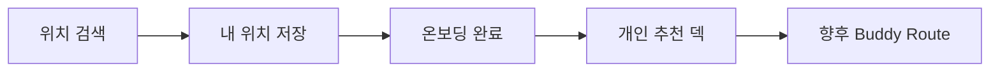

# KoReady 운영 API 설계 일치성 및 종단 검증 보고서

> 기준 시각: 2026-08-02 19:11 KST
> 대상: PM, 디자이너, 프론트엔드, 백엔드
> 운영 API: `https://api.koready.cloud`
> 검증 배포: `0cb120b` (`users` 역할 기반 관리자 권한 도입)
> 관련 이슈: #221

## 1. 결론

현재 API는 **부분 승인** 상태다.

- Google 로그인, 토큰 회전, `USER`/관리자 권한 경계, 프로필, 장소 저장, KTO 운영 조회와 S3 파일 왕복은 실제 운영 환경에서 동작했다.
- 운영 Swagger에 노출된 85개 동작 중 이번 검증 분류는 `운영 정상 42`, `부분 정상 7`, `운영 차단 4`, `격리 자동테스트 정상 32`다.
- 가장 큰 기능 차단은 Kakao 키의 유무가 아니라 `LOCATION_SEARCH_PROVIDER=disabled` 설정이다. 이 때문에 위치 검색, 위치 저장, 온보딩 완료, 추천 덱 생성이 이어서 막힌다.
- 가장 큰 구현 오류는 장소를 저장한 뒤에도 장소 목록·상세·월별 추천의 `saved`/`isSaved`가 계속 `false`인 점이다.
- 가장 큰 계약 오류는 프론트가 보는 운영 Swagger가 인증 방식과 필요 역할을 전혀 표시하지 않는 점이다. 실제 보안은 작동하지만 Swagger만 보고는 어느 API에 토큰이나 관리자 권한이 필요한지 알 수 없다.
- KTO 기본 수집은 끝난 것이 맞지만, 상세 데이터 보강은 전체 68,543곳 중 2,750곳(4.01%)만 완료됐다. 현재 사용자에게 노출 가능한 장소는 2,144곳이고, 제목·주소·좌표·대표 이미지·서비스 권역의 기본 노출 조건을 충족한 장소는 843곳이다.

따라서 프론트는 로그인, 프로필, 공개 장소·축제 조회의 기본 연동은 진행할 수 있다. 다만 위치 기반 가입 완료, 추천 기능, 저장 여부 표시, 풍부한 장소 상세 화면을 “완료”로 판단하면 안 된다.

## 2. 판정 기준

단순히 controller와 service가 존재하는지는 정상 판정의 근거로 사용하지 않았다.

| 표시 | 판정 | 근거 |
|---|---|---|
| ✅ 운영 정상 | 원래 의도한 성공·실패·상태 변경을 운영 HTTPS에서 확인 | 실제 Google 로그인, JWT, Aiven DB, S3, 운영 데이터 사용 |
| ⚠️ 부분 정상 | HTTP 호출은 성공하지만 기획 데이터·개인화·계약 일부가 빠짐 | 응답 본문과 설계 정책 비교 |
| ⛔ 운영 차단 | 선행 설정 또는 데이터가 없어 원래 성공 흐름을 끝내지 못함 | 실제 운영 오류 응답 확인 |
| 🧪 격리 검증 | 운영 데이터 훼손이나 타 사용자 영향 때문에 라이브 변경은 하지 않고 자동테스트로 검증 | controller/application/integration 테스트 |
| 🕒 계획 | 설계 문서에는 있으나 운영 API에는 없음 | 정적 OpenAPI와 운영 `/v3/api-docs` 비교 |

비교 기준은 다음 문서다.

- `07_CONFIRMED_PRODUCT_POLICIES.md`: 확정 제품 정책과 불변조건
- `08_API_CONTRACT.md`: 사용자 API의 값, 호출 흐름, 실패 처리
- `09_ADMIN_API_CONTRACT.md`: `ADMIN`/`OPERATOR`/`AUDITOR` 권한과 운영 작업
- `10_FRONTEND_API_FLOW_GUIDE.md`: 화면별 실제 호출 순서
- `openapi.yaml`: endpoint와 schema의 원래 기계 판독 기준
- 운영 `/v3/api-docs`: 현재 실제 배포가 노출하는 계약

## 3. 이번에 실제로 한 검증

### 3.1 인증과 권한

1. 실제 Google ID Token으로 `POST /api/v1/auth/google`을 호출했다.
2. DB 역할을 잠시 `USER`로 바꾸고 refresh하여 `roles=["USER"]`인 새 JWT를 발급받았다.
3. 해당 JWT로 관리자 API를 호출해 `403 ADMIN_FORBIDDEN`을 확인했다.
4. DB 역할을 즉시 `ADMIN`으로 복구하고 refresh하여 `roles=["ADMIN"]`을 확인했다.
5. 같은 관리자 API가 `200`으로 바뀌는지 확인했다.
6. refresh token을 한 번 사용한 뒤 같은 토큰을 다시 사용해 `401 REFRESH_TOKEN_INVALID`을 확인했다.

검증 뒤 DB 역할은 원래대로 복구했다. 실제 역할 경계는 정상이다. `OPERATOR`와 `AUDITOR`의 세부 읽기/쓰기 차이는 자동테스트가 담당한다.

### 3.2 운영 쓰기와 복구

- 약관 동의 빈 목록 저장
- 사용 언어 `EN → KO → EN` 변경과 원복
- Buddy 프로필을 같은 값으로 다시 저장해 필드와 공개 설정 유지 확인
- 장소 저장 → 저장 목록 포함 확인 → 저장 취소와 삭제 확인
- 프로필 이미지 업로드 URL 발급 → 실제 S3 PUT → 완료 처리 → 비공개/공개 조회 → S3 Range GET 확인
- 시험용 S3 객체와 프로필 이미지 DB 행 삭제
- 관리자 snapshot 다운로드 URL 발급 → 실제 private S3 객체 Range GET 확인

시험용 데이터는 모두 제거하거나 원래 값으로 복구했다.

### 3.3 실패 흐름

| 시나리오 | 실제 결과 | 판정 |
|---|---|---|
| 토큰 없이 보호 API | `401 UNAUTHORIZED` | 정상 |
| 일반 사용자로 관리자 API | `403 ADMIN_FORBIDDEN` | 정상 |
| 재사용한 refresh token | `401 REFRESH_TOKEN_INVALID` | 정상 |
| 잘못된 cursor | `400 INVALID_CURSOR` | 정상 |
| 지원하지 않는 언어 `XX` | `400 INVALID_REQUEST` | 정상 |
| 온보딩 선택 수 위반 | `400` | 정상 |
| 위조 위치 검색 token | `422 LOCATION_SEARCH_RESULT_INVALID` | 정상 |
| 내 위치가 아닌 번호로 온보딩 | `422 ONBOARDING_LOCATION_INVALID` | 정상 |
| 위치 없는 추천 덱 생성 | `422 RECOMMENDATION_CONTEXT_UNAVAILABLE` | 정상 |
| 없는 장소 조회 | `404 PLACE_NOT_FOUND` | 정상 |
| 없는 내 위치 삭제 | `404 USER_LOCATION_NOT_FOUND` | 정상 |

## 4. 최우선 발견 사항

### P0. 위치 검색 공급자가 꺼져 있다 (#225)

- 운영 설정: `LOCATION_SEARCH_PROVIDER=disabled`
- Kakao REST API 키와 위치 token secret은 존재한다.
- 실제 호출: `GET /api/v1/locations/search?query=서울역`
- 실제 결과: `503 LOCATION_PROVIDER_UNAVAILABLE`

영향 범위는 검색 화면 하나가 아니다.

공급자를 `kakao`로 바꾸고 재배포한 뒤 이 전체 흐름을 다시 시험해야 한다.

### P0. 운영 Swagger에 인증·역할 정보가 없다 (#227)

정적 `openapi.yaml`에는 bearer JWT와 `x-required-roles`가 있다. 그러나 프론트가 실제로 보는 `/v3/api-docs`에는 다음 정보가 모두 없다.

- `components.securitySchemes`
- 전역 또는 operation별 `security`
- `x-required-roles`
- `x-implementation-status`

따라서 Swagger의 `Authorize`로 토큰을 넣거나, `USER`/`ADMIN`/`OPERATOR`/`AUDITOR` 요구사항을 판단할 수 없다. 실제 권한이 정상이어도 프론트 계약 전달 수단으로는 불완전하다.

응답 코드도 일부 다르다.

- 장소 저장 취소: Swagger `200`, 실제 `204`
- 프로필 이미지 조회: Swagger `200`, 실제 private S3 이동 응답 `307`

### P1. 장소 저장 여부가 조회 화면에 반영되지 않는다 (#226)

실제 순서:

1. `PUT /users/me/saved-places/{placeId}` → `200 PLACE_SAVED`
2. `GET /users/me/saved-places` → 해당 장소 포함
3. 같은 토큰으로 장소 목록·상세·월별 추천 조회

실제 결과:

- `GET /places`: `saved=false`
- `GET /places/{placeId}`: `isSaved=false`
- `GET /monthly-recommendations`: `saved=false`

설계는 로그인 사용자의 저장 여부를 반환하도록 되어 있다. 현재 controller가 로그인 사용자를 조회 서비스에 전달하지 않거나 일부 응답에서 값을 고정하기 때문에, 프론트의 하트 표시가 저장 직후 다시 풀린다.

### P1. 장소 상세 데이터 완성도가 아직 낮다

| 항목 | 운영 수치 |
|---|---:|
| KTO 기본 장소 행 | 68,543 |
| 현재 서비스 표출 가능 | 2,144 |
| 상세 수집 완료 | 2,750 (4.01%) |
| 기본 노출 조건 충족 | 843 |
| 활성 장소 중 대표 이미지 없음 | 147 |
| 활성 장소 중 영문 없음 | 791 |
| 활성 장소 중 주소 없음 | 24 |

상세 수집 완료 2,750곳의 실제 갤러리 분포:

| 이미지 수 | 장소 수 |
|---|---:|
| 0장 | 250 |
| 1장 | 1,369 |
| 2장 | 49 |
| 3장 | 99 |
| 4장 이상 | 983 |

4장 미만은 64.25%다. 서울 상단 표본 10곳은 모두 상세 조회가 성공했지만 설명은 10/10 비어 있었고, 4장 이상은 8/10이었다. 전국 품질은 표본보다 낮으므로 프론트는 사진 0~3장과 설명 없음 상태를 반드시 지원해야 한다.

### P1. 약관 관리 구조는 정상이나 실제 약관이 없다

`GET /terms/required`는 200이지만 등록 약관이 0개라 `allRequiredAgreed=true`다. 약관 버전 관리와 동의 저장 API는 작동하나, 최종 약관이 들어오기 전까지는 신규 사용자가 동의 없이 다음 단계로 진행한다. 이는 합의된 임시 상태이며 출시 전에 콘텐츠 등록과 차단 흐름 재검증이 필요하다.

### P2. 비공개 프로필 이미지의 익명 응답 의미가 다르다 (#228)

- 소유자 조회: `307`, 정상
- 공개 프로필에 연결한 뒤 익명 조회: `307`, 정상
- 비공개 상태의 익명 조회: `401 UNAUTHORIZED`

설계와 테스트가 의도한 “존재 여부도 감추는 not-found” 동작은 `404`다. 보안 노출은 없지만 클라이언트의 fallback 분기가 계약과 다르다.

## 5. 제품 정책별 일치 여부

### 온보딩

- 방문 목적 `TravelPurpose`를 받지 않는다: 일치
- 순서 `위치 → 여행 스타일 1~4개 → 관심 장소 1~3개`: validation과 상태 응답은 일치
- 운영진 후보 장소: `PUBLISHED`, 정확히 10개, 표시 순서 1~10, 이미지·스타일·태그 존재
- 위치 token 위조 방지: 일치
- 운영 성공 흐름: 위치 공급자 설정 때문에 미완료

### 월별 축제

- 2026년 8월: 12개, `ONGOING`/`UPCOMING`, 이미지와 짧은 설명 존재
- 2026년 7월: 14개 중 `ONGOING` 8, `ENDED` 6
- 종료된 축제가 해당 개최 월에 남는다: 일치
- `eventYear=2026`과 개최 기간이 회차별로 분리된다: 일치
- cursor 페이지 1·2 중복: 0건

### Buddy 프로필

프로필 옵션 API는 국가 249, 언어 13, 한국어 수준 3, 여행 스타일 7, Buddy 스타일 6, SNS 5종을 반환한다.

- 닉네임, 국적: 일치
- 사용 언어 복수 선택: 일치
- 한국어 수준 `BEGINNER`/`INTERMEDIATE`/`ADVANCED`: 일치
- 여행 스타일 7종 복수 선택: 일치
- 한 줄 소개: 일치
- SNS 최대 2개와 계정 ID: 일치
- 프로필 공개, SNS 공개, 쪽지 허용: 일치
- 프로필 이미지 실제 S3 업로드·조회: 부분 일치. 익명 비공개 오류 코드 수정 필요

### KTO 수집

- OpenAPI 호출 로그: 12,404건
- 성공: 12,404, 실패: 0, snapshot: 12,404
- 최근 하루 상세 배치: 16개 job, 800곳 처리, 성공 800, 실패 0
- `KTO_DETAIL_DAILY_PLACES=800`, chunk 50이 의도대로 “하루 총 800곳을 50곳씩 16번” 처리한다.
- 영문 품질 분류: 25,357건 전부 분류, usable 25,349, 비영문 의심 8
- AI 번역 데이터: 0건

즉 “KTO 수집 완료”는 기본 목록 적재를 뜻한다. 사진·소개·반복 행사·연관 관광지까지 갖추는 상세 보강은 계속 진행 중이다.

## 6. 운영 API 85개 전수 판정

아래 경로는 공통 prefix `/api/v1`을 생략했다.

### 인증·약관·언어: 6개

| API | 판정 | 확인 내용 |
|---|---|---|
| `POST /auth/google` | ✅ | 실제 Google 로그인, DB 역할이 JWT에 반영 |
| `POST /auth/refresh` | ✅ | token rotation과 이전 token 재사용 차단 |
| `POST /auth/logout` | ✅ | 세션 폐기 |
| `GET /terms/required` | ⚠️ | API 정상, 게시 약관 0개 |
| `PUT /users/me/term-agreements` | ✅ | 현재 빈 약관 상태 저장 |
| `PATCH /users/me/language` | ✅ | 허용 언어 저장·원복, 잘못된 enum 거절 |

### 온보딩·위치·홈: 10개

| API | 판정 | 확인 내용 |
|---|---|---|
| `GET /onboarding/place-candidate-sets/current` | ✅ | 발행본 10개와 선택 제한 |
| `GET /users/me/onboarding` | ✅ | 실제 다음 단계 계산 |
| `PUT /users/me/onboarding` | ⛔ | validation은 정상, 실제 위치가 없어 완료 불가 |
| `GET /locations/search` | ⛔ | 공급자 disabled, 503 |
| `GET /users/me/locations` | ✅ | 인증 사용자 활성 위치 목록 |
| `POST /users/me/locations` | ⛔ | 유효 searchResultToken 발급 불가 |
| `DELETE /users/me/locations/{locationId}` | 🧪 | 소유권·soft delete·기본 위치 승계 자동검증 |
| `PUT /users/me/locations/{locationId}/default` | 🧪 | 단일 기본 위치와 소유권 자동검증 |
| `GET /home` | ⚠️ | 조회 성공, 위치 없음·saved 개인화 미반영 |
| `GET /profile-options` | ✅ | 프로필 enum과 표시값 전부 조회 |

### 장소·축제·저장·추천: 12개

| API | 판정 | 확인 내용 |
|---|---|---|
| `GET /monthly-recommendations` | ⚠️ | 월/회차/종료 정책 정상, 로그인 saved 미반영 |
| `GET /places` | ⚠️ | cursor 정상, 로그인 saved 미반영 |
| `GET /places/search` | ⚠️ | 검색 정상, 로그인 saved 미반영 |
| `GET /places/{placeId}` | ⚠️ | 10/10 조회, isSaved와 설명 품질 미충족 |
| `GET /users/me/saved-places` | ✅ | 저장 직후 목록 포함 |
| `PUT /users/me/saved-places/{placeId}` | ✅ | idempotent 저장 |
| `DELETE /users/me/saved-places/{placeId}` | ✅ | 실제 204와 삭제 확인 |
| `POST /recommendation-decks` | ⛔ | 위치 없어 422, 설정 복구 뒤 성공 흐름 필요 |
| `GET /recommendation-decks/{deckId}` | 🧪 | 사용자 소유권·cursor·30일 재노출 정책 검증 |
| `POST /recommendation-decks/{deckId}/events` | 🧪 | 노출·저장·건너뛰기 event validation 검증 |
| `GET /places/{placeId}/mates` | ✅ | 공개·차단·저장 관계 필터의 빈 결과 확인 |
| `GET /buddy-profiles/{profileId}` | ✅ | 공개 프로필 조회와 공개 범위 적용 |

### Buddy·이미지·쪽지·안전: 13개

| API | 판정 | 확인 내용 |
|---|---|---|
| `GET /users/me/buddy-profile` | ✅ | 본인 통합 프로필 조회 |
| `PUT /users/me/buddy-profile` | ✅ | 전체 필드·최대 2개 SNS·공개 설정 저장 |
| `POST /users/me/profile-image/upload-url` | ✅ | private S3 업로드 예약 |
| `POST /users/me/profile-image/complete` | ✅ | 실제 PNG PUT 뒤 완료 |
| `GET /profile-images/{imageId}` | ⚠️ | owner/public 307 정상, private 익명 401은 계약과 다름 |
| `GET /message-threads` | ✅ | 목록과 전체 unread 계산 |
| `POST /message-threads` | 🧪 | 자기 자신·차단·수신 설정·중복 thread 검증 |
| `GET /message-threads/{threadId}` | 🧪 | 참여자만 조회, cursor 검증 |
| `POST /message-threads/{threadId}/messages` | 🧪 | 차단·수신 설정·본문 제한 검증 |
| `PUT /message-threads/{threadId}/read` | 🧪 | 참여자 unread 갱신 검증 |
| `POST /reports` | 🧪 | 자기 신고·중복·사유 validation 검증 |
| `PUT /users/me/blocked-profiles/{profileId}` | 🧪 | 차단과 상호작용 제한 검증 |
| `DELETE /users/me/blocked-profiles/{profileId}` | 🧪 | 차단 해제 검증 |

### 관리자 후보·Hori Tip·배치·증빙: 20개

| API | 판정 | 확인 내용 |
|---|---|---|
| `GET /admin/onboarding/place-candidate-sets` | ✅ | 관리자 목록 |
| `POST /admin/onboarding/place-candidate-sets` | 🧪 | ADMIN/OPERATOR 생성과 입력 검증 |
| `GET /admin/onboarding/place-candidate-sets/{candidateSetId}` | ✅ | 발행본 상세 |
| `PUT /admin/onboarding/place-candidate-sets/{candidateSetId}` | 🧪 | DRAFT 편집과 낙관 잠금 |
| `POST /admin/onboarding/place-candidate-sets/{candidateSetId}/archive` | 🧪 | 보관 가능 상태 |
| `POST /admin/onboarding/place-candidate-sets/{candidateSetId}/publish` | 🧪 | 정확히 10개와 단일 발행본 |
| `GET /admin/hori-tips` | ✅ | 운영 팁 목록 |
| `POST /admin/hori-tips` | 🧪 | ADMIN/OPERATOR 생성과 조건 검증 |
| `GET /admin/hori-tips/{horiTipId}` | ✅ | 저장 팁 상세 |
| `PUT /admin/hori-tips/{horiTipId}` | 🧪 | version 기반 수정 |
| `PUT /admin/hori-tips/{horiTipId}/status` | 🧪 | 노출 상태 전이 |
| `GET /admin/batch-jobs` | ✅ | 최근 job과 상태 |
| `POST /admin/batch-jobs` | 🧪 | 동시 작업 방지·허용 job·사유 기록 |
| `GET /admin/batch-jobs/{jobId}` | ✅ | 800곳/일 배치 상세 |
| `GET /admin/batch-jobs/{jobId}/items` | ✅ | chunk 50 처리 항목 |
| `POST /admin/batch-jobs/{jobId}/retry` | 🧪 | 실패 작업 재시도 제한 |
| `GET /admin/evidence-bundles` | ✅ | 기존 증빙 목록 |
| `POST /admin/evidence-bundles` | 🧪 | 개인정보 제외 범위와 생성 상태 |
| `GET /admin/evidence-bundles/{bundleId}` | 🧪 | 소유 권한과 상태별 파일 목록 |
| `POST /admin/evidence-bundles/{bundleId}/download-url` | 🧪 | 완료 상태에서만 서명 URL 발급 |

### 관리자 KTO·외부 API·품질: 24개

| API | 판정 | 확인 내용 |
|---|---|---|
| `GET /admin/data-quality/summary` | ✅ | 실제 USER 403, ADMIN 200 및 품질 집계 |
| `GET /admin/kto/detail-coverage` | ✅ | 상세·이미지 분포 |
| `GET /admin/kto/english-match-reviews` | ✅ | 실제 검수 목록 |
| `GET /admin/kto/english-match-reviews/{sourceRecordId}` | ✅ | 검수 근거 상세 |
| `PUT /admin/kto/english-match-reviews/{sourceRecordId}/decision` | 🧪 | version과 ADMIN/OPERATOR 권한 |
| `GET /admin/kto/english-quality-coverage` | ✅ | 25,357건 품질 분류 집계 |
| `GET /admin/kto/photo-awards` | ✅ | 수상작 후보와 연결 상태 |
| `PUT /admin/kto/photo-awards/{contentId}/mapping` | 🧪 | 장소 연결·우선 이미지·근거 |
| `DELETE /admin/kto/photo-awards/{contentId}/mapping` | 🧪 | 연결 해제와 원복 |
| `GET /admin/kto/photo-gallery` | ✅ | 관광사진 후보와 연결 상태 |
| `PUT /admin/kto/photo-gallery/{contentId}/mapping` | 🧪 | 장소 연결과 이용 근거 |
| `DELETE /admin/kto/photo-gallery/{contentId}/mapping` | 🧪 | 연결 해제 |
| `GET /admin/kto/related-tours` | ✅ | 연관 관광지 후보와 연결 상태 |
| `PUT /admin/kto/related-tours/{recordId}/mapping` | 🧪 | 추천 장소 연결과 근거 |
| `DELETE /admin/kto/related-tours/{recordId}/mapping` | 🧪 | 연결 해제 |
| `GET /admin/open-api/calls` | ✅ | 호출 이력과 성공률 |
| `GET /admin/open-api/calls/{callLogId}` | ✅ | secret이 제거된 요청·응답 메타데이터 |
| `GET /admin/open-api/snapshots` | ✅ | 보관 snapshot 목록 |
| `GET /admin/open-api/snapshots/{snapshotId}` | ✅ | private 저장소 메타데이터 |
| `POST /admin/open-api/snapshots/{snapshotId}/download-url` | ✅ | 서명 URL과 실제 S3 gzip Range GET |
| `GET /admin/open-api/summary` | ✅ | operation별 수집 집계 |
| `GET /admin/open-api/sync-cursors` | ✅ | operation별 진행 위치 |
| `PUT /admin/open-api/sync-cursors/{cursorId}/enabled` | 🧪 | ADMIN 전용 활성 변경 |
| `POST /admin/open-api/sync-cursors/{cursorId}/reset` | 🧪 | ADMIN 전용과 reason 검증 |

## 7. 설계에는 있지만 운영에 없는 API

| API | 상태 | 영향 |
|---|---|---|
| `GET /api/v1/users/me` | 🕒 | 로그인 후 사용자 요약을 한 번에 받지 못함 |
| `POST /api/v1/routes` | 🕒 | TMAP Buddy Route 생성 미구현 |
| `GET /api/v1/routes/{routeId}` | 🕒 | 조회 시점 Hori Tip 재조합 미구현 |
| `GET /api/v1/admin/audit-logs` | 🕒 | 관리자 변경 이력 전용 조회 미구현 |

KTX 예매 가이드는 프론트 정적 콘텐츠, 영상·오디오는 MVP 제외라는 합의에 따라 백엔드 누락으로 보지 않는다.

## 8. 프론트 연동 판단

### 지금 연동 가능

- Google ID Token 교환, refresh rotation, logout
- 약관 조회·저장 UI 구조
- 사용 언어 저장
- 프로필 옵션과 Buddy 통합 프로필
- 프로필 이미지 업로드
- 온보딩 후보 10개 표시
- 장소·월별 축제 목록과 cursor
- 장소 저장 목록·저장·취소
- 사진 0~4장 이상과 설명 없음 fallback
- 빈 메이트·쪽지 목록

### 수정 뒤 확정

- Kakao 위치 검색과 위치 CRUD의 실제 성공 흐름
- 온보딩 완료와 추천 덱
- 목록·상세·월별 카드의 저장 상태
- Swagger의 bearer 인증과 역할 표시
- 프로필 이미지 비공개 fallback 오류 코드

### MVP에서 숨김

- 검수된 설명이 없는 장소의 소개 영역
- AI 번역·AI 소개
- Buddy Route
- KTX 동적 API, 영상·오디오 가이드

## 9. 자동 품질 검증

코드에는 174개 테스트 파일이 있고, 33개 운영 controller 모두 직접 또는 관련 계약 테스트가 존재한다. 실제 운영에서 실행하지 않은 관리자 변경·다중 사용자 상호작용 32개는 이 테스트가 정상 판정의 근거다.

| 검사 | 결과 |
|---|---|
| 최신 main 기준 `clean check` | Docker 실행 성공, 총 45분 46초 |
| 단위·계약 테스트 | 570개 통과, 실패·오류·건너뜀 0 |
| Docker MySQL 통합 테스트 | 134개 통과, 실패·오류·건너뜀 0 |
| 프로덕션 라인 커버리지 | 87.37%, JaCoCo 80% gate 통과 |
| 운영 CI | 배포 run `30741324714`, attempt 2 성공 |
| 운영 health/readiness | 모두 200 |
| CORS 개발 origin | preflight 200, 현재 `*` 허용 |

호스트 JVM은 현재 Windows 실행 환경의 `Bad address: listen` 때문에 시작 전에 실패해 Docker 안에서 같은 `clean check`를 다시 실행했다. MySQL Testcontainers까지 모두 실제 실행했으며 총 704개 테스트가 통과했다.

## 10. 권장 작업 순서

1. `LOCATION_SEARCH_PROVIDER=kakao`로 바꾸고 배포한 뒤 위치 검색부터 추천 덱까지 재검증한다.
2. 로그인 사용자 ID를 장소·월별·홈 조회에 전달해 `saved`/`isSaved`를 고친다.
3. 운영 `/v3/api-docs`에 bearer security, required roles, 구현 상태와 실제 응답 코드를 반영한다.
4. 약관 최종본을 DB에 게시하고 미동의 차단을 신규 계정으로 시험한다.
5. “기본 노출 조건 충족 843곳”을 우선 노출 대상으로 삼고 상세 보강 배치를 계속 돌린다.
6. 프로필 이미지 비공개 익명 조회를 계약과 같은 not-found 응답으로 맞춘다.
7. 전용 테스트 사용자 두 명으로 쪽지·차단·신고 운영 종단 시험을 추가한다.

## 11. 최종 승인 범위

**권한 도입 자체는 승인 가능하다.** DB 역할 변경이 refresh token으로 새 JWT에 반영되고, `USER`는 관리자 API에서 403, `ADMIN`은 같은 API에서 200이 되는 것을 실제로 확인했다. token rotation과 비밀 S3 객체 접근도 정상이다.

**전체 API 기능은 아직 최종 승인 불가다.** 위치 기반 가입 흐름이 운영 설정으로 막혀 있고, 저장 개인화와 Swagger 계약이 설계와 다르며, 장소 상세 데이터 완성도가 낮다. 위 P0/P1을 수정한 뒤 사용자 핵심 흐름을 한 번 더 종단 시험하면 프론트 정상 서빙 승인 여부를 다시 판단할 수 있다.
