# KoReady 운영 API 종단 테스트 및 프론트 연동 보고서

> 기준 시각: 2026-08-02 13:55 KST
> 대상: PM, 디자이너, 프론트엔드, 백엔드
> 운영 API: `https://api.koready.cloud`
> 테스트 배포 버전: `39922a2b278f57a2e4663fb478141f04ff5e51ee`
> 관련 이슈: #221

## 1. 먼저 볼 결론

Google 로그인부터 약관 확인, 사용 언어 저장, 주요 장소 조회, 장소 저장, Buddy 프로필, 토큰 갱신과 로그아웃까지 **실제 운영 서버와 실제 Google 계정으로 확인**했다.

다만 신규 사용자가 앱의 첫 설정을 끝내려면 반드시 필요한 **위치 검색이 운영 환경에서 꺼져 있다.** 따라서 현재 프론트 앱은 로그인과 약관·언어 단계까지 진행할 수 있지만, `위치 입력 → 관광 유형 → 관심 관광지` 온보딩을 끝낼 수 없다. 위치가 없어서 사용자 맞춤 추천 카드 생성도 함께 막힌다.

현재 상태를 한 문장으로 정리하면 다음과 같다.

> 장소와 축제 데이터를 둘러보는 기능은 프론트 연동이 가능하지만, 신규 사용자 가입 흐름은 Kakao 위치 검색 설정 전까지 완결되지 않는다.

### 즉시 판단이 필요한 항목

| 우선순위 | 항목 | 현재 상태 | 필요한 조치 |
|---|---|---|---|
| P0 | Kakao 위치 검색 | `503 LOCATION_PROVIDER_UNAVAILABLE` | EB에 Kakao REST API 키를 등록하고 위치 검색 공급자를 `kakao`로 전환한 뒤 재배포 |
| P0 | DB 비밀번호 | 운영 설정 점검 중 기존에 외부에 노출됐을 가능성이 있는 값 확인 | Aiven 비밀번호 회전 후 EB 값을 교체. 실제 값은 이 문서에 기록하지 않음 |
| P0 | 온보딩 완료 | 위치를 저장할 수 없어 중단 | 위치 검색 정상화 후 실제 가입 흐름 재시험 |
| P0 | 추천 카드 | 사용자 위치가 없어 `422 RECOMMENDATION_CONTEXT_UNAVAILABLE` | 온보딩 완료 후 재시험 |
| P1 | 약관 내용 | API는 정상이나 등록된 약관이 0개 | 서비스 이용약관·개인정보 처리 동의 최종본을 DB에 등록 |
| P1 | 장소 설명 | 표본 10곳 모두 소개 설명이 비어 있음 | MVP에서는 해당 영역을 숨기고, AI 번역·소개 검수 정책 확정 후 공개 |
| P1 | 장소 저장 취소 계약 | 실제 응답은 `204`, 운영 Swagger는 `200` | Swagger 응답 코드를 실제 동작에 맞게 수정 |

## 2. 무엇을 어떻게 시험했나

이번 시험은 Swagger 화면만 확인한 것이 아니라 다음 순서로 실제 사용자 흐름을 실행했다.

```mermaid
flowchart LR
    Google["Google 계정 선택"] --> Login["KoReady 로그인"]
    Login --> Terms["필수 약관 조회·저장"]
    Terms --> Language["사용 언어 저장"]
    Language --> Location["위치 검색·저장"]
    Location --> Onboarding["온보딩 완료"]
    Onboarding --> Home["홈·추천·장소"]
    Home --> Buddy["Buddy 프로필·쪽지"]
    Buddy --> Refresh["토큰 갱신"]
    Refresh --> Logout["로그아웃·재사용 차단"]
```

- Google ID Token과 KoReady 접근·갱신 토큰은 테스트 브라우저 메모리에서만 사용했다.
- 토큰, 이메일, 사용자 번호, 위치 주소는 파일·보고서·로그에 남기지 않았다.
- 임시로 등록한 `localhost` OAuth 리디렉션 URI는 시험 직후 제거했다.
- 실제 다른 사용자에게 쪽지·신고·차단을 보내는 작업은 하지 않았다.
- 관리자 데이터 변경, KTO 수동 배치 실행, S3 업로드 완료 같은 운영 변경 작업은 하지 않았다.

### 결과 집계

| 구분 | 건수 | 의미 |
|---|---:|---|
| 실행한 운영 시나리오 | 32 | 실제 HTTP 요청으로 확인한 정상·실패·차단 흐름 |
| 기능 동작 확인 | 27 | 기대한 저장·조회·보안 동작 확인. 저장 취소의 `204`도 기능 성공에 포함 |
| 운영 설정 때문에 직접 실패 | 1 | Kakao 위치 검색 |
| 앞 단계 실패로 연쇄 차단 | 2 | 온보딩 완료, 추천 카드 생성 |
| 설계만 있고 운영 구현 없음 | 2 | 내 사용자 요약, Buddy Route 상세 |

운영 Swagger에는 **70개 경로, 85개 API 동작**이 노출되어 있다. 전체 설계 문서에는 89개 동작이 있으며 아래 4개는 아직 운영 Swagger에 없는 계획 단계다.

- `GET /api/v1/users/me`
- `POST /api/v1/routes`
- `GET /api/v1/routes/{routeId}`
- `GET /api/v1/admin/audit-logs`

## 3. 사용자 흐름별 결과

### 3.1 로그인과 보안

| 시험 항목 | 실제 결과 | 판정 |
|---|---|---|
| Google 로그인 | `200`, 다음 단계 `TERMS` | 정상 |
| 로그인 없이 보호 API 호출 | `401 UNAUTHORIZED` | 정상 |
| 일반 사용자의 관리자 API 호출 | `403 ADMIN_FORBIDDEN` | 정상 |
| 토큰 갱신 | 새 접근·갱신 토큰 발급 | 정상 |
| 이미 사용한 갱신 토큰 재사용 | `401 REFRESH_TOKEN_INVALID` | 정상 |
| 로그아웃 | `204` | 정상 |
| 로그아웃한 갱신 토큰 재사용 | `401 REFRESH_TOKEN_INVALID` | 정상 |

프론트는 Google 로그인 성공 후 받은 ID Token을 백엔드 로그인 API에 전달하면 된다. 이후 앱 API는 KoReady 접근 토큰을 사용하고, 만료 시 갱신 토큰을 한 번만 사용해 새 토큰 묶음으로 교체해야 한다.

### 3.2 약관과 사용 언어

| API | 오가는 핵심 정보 | 실제 결과 |
|---|---|---|
| `GET /api/v1/terms/required` | 약관 번호, 버전, 필수 여부, 내용 URL, 동의 필요 여부 | `200`, 등록 약관 0개 |
| `PUT /api/v1/users/me/term-agreements` | 약관 버전 번호와 동의 여부 목록 | `200`, 다음 단계 `LANGUAGE` |
| `PATCH /api/v1/users/me/language` | `KO` 또는 `EN` | `200`, `EN` 저장, 다음 단계 `ONBOARDING` |

약관은 DB에서 버전별로 관리할 수 있는 구조가 정상 작동한다. 그러나 현재 약관이 하나도 등록되지 않아 `allRequiredAgreed=true`가 바로 반환된다. 즉, **구현은 됐지만 실제 서비스 약관 내용은 아직 배포되지 않은 상태**다.

### 3.3 온보딩과 위치

확정된 온보딩 순서는 `위치 → 여행 스타일 1~4개 → 운영진 선정 장소 1~3개`다.

| 시험 항목 | 실제 결과 | 화면 영향 |
|---|---|---|
| 온보딩 상태 조회 | `200`, 현재 단계 `LOCATION` | 정상 |
| 현재 장소 후보 조회 | `200`, `PUBLISHED`, 정확히 10개 | 정상 |
| 위치 목록 조회 | `200` | 정상 |
| “서울역” 위치 검색 | `503 LOCATION_PROVIDER_UNAVAILABLE` | 검색 결과를 표시할 수 없음 |
| 위치 저장 | 검색 결과 토큰을 받지 못해 미실행 | 위치 선택 완료 불가 |
| 온보딩 완료 | 위치 번호가 없어 차단 | 홈 진입 전 가입 흐름 중단 |

코드가 기대하는 운영 환경변수는 다음 세 가지다.

- `LOCATION_SEARCH_PROVIDER=kakao`
- `KAKAO_REST_API_KEY`
- `LOCATION_SEARCH_TOKEN_SECRET`

운영 EB 확인 결과 위치 검색 공급자가 `disabled`이고 Kakao REST API 키가 등록되지 않았다. 토큰 서명용 비밀값은 존재한다. 따라서 Kakao 키만 준비되면 설정 변경과 재배포 후 재시험할 수 있다.

## 4. 장소·축제·추천 데이터 상태

### 4.1 실제 조회 결과

| API/데이터 | 실제 결과 | 프론트 해석 |
|---|---|---|
| 홈 | `200`, 월별 추천 있음, 현재 위치 없음 | 위치 없는 초기 홈 상태 처리 필요 |
| 2026년 8월 월별 추천 | 첫 페이지 10개, 전체 12개, 다음 페이지 있음 | 목록 화면 연동 가능 |
| 서울 장소 목록 | 첫 페이지 10개, 다음 페이지 있음 | 목록 화면 연동 가능 |
| “서울” 장소 검색 | 9개 | 검색 화면 연동 가능 |
| 장소 상세 표본 | 10/10 조회 성공 | 상세 화면 호출 가능 |
| 장소 저장 | `200`, 저장됨 | 정상 |
| 장소 저장 취소 | 실제 `204` | 기능 정상, Swagger 계약 수정 필요 |
| 추천 카드 생성 | `422 RECOMMENDATION_CONTEXT_UNAVAILABLE` | 위치 저장 후 재시험 필요 |

장소 목록의 `totalCount`는 이번 운영 응답에서 제공되지 않았다. 프론트는 전체 개수 표시를 전제로 만들지 말고 우선 `nextCursor`와 `hasMore`로 다음 목록을 이어 받아야 한다.

### 4.2 사진과 소개 설명 표본

서울 목록·검색 상단에서 중복을 제거한 10곳의 상세 정보를 확인했다.

| 사진 수 | 장소 수 | 표본 비율 |
|---|---:|---:|
| 0장 | 1 | 10% |
| 1장 | 1 | 10% |
| 2장 | 0 | 0% |
| 3장 | 0 | 0% |
| 4장 이상 | 8 | 80% |

- 상세 API 성공률은 10/10이다.
- 사진이 4장 이상인 곳은 8/10이다.
- 사진이 4장보다 적은 곳은 2/10이며, 그중 1곳은 사진이 없다.
- AI 소개 설명이 채워진 곳은 0/10이다.

이 수치는 전국 전체 비율이 아니라 서울 상단 10곳의 작은 표본이다. 사진 품질의 전국 대표 수치로 사용하면 안 된다. 다만 프론트는 지금부터 다음 예외 상태를 반드시 준비할 수 있다.

- 사진 0장: 기본 이미지 또는 이미지 영역 축소
- 사진 1장: 단일 큰 이미지
- 사진 2~3장: 있는 사진만 배치
- 사진 4장 이상: 기획된 갤러리 구성
- 소개 설명 없음: MVP에서는 설명 영역 자체를 숨김

사용자가 요청한 대로 AI 번역·소개 품질이 검증되기 전에는 매칭되지 않은 설명을 억지로 노출하지 않는 것이 맞다.

## 5. Buddy 프로필과 쪽지

| API | 실제 결과 | 비고 |
|---|---|---|
| `GET /api/v1/profile-options` | 국가 249, 언어 13, 한국어 수준 3, 여행 스타일 7, SNS 종류 5 | 프론트가 enum을 하드코딩하지 않고 사용 가능 |
| `GET /api/v1/users/me/buddy-profile` | `200`, 최초 프로필 없음 | 정상 |
| `PUT /api/v1/users/me/buddy-profile` | `200`, 비공개 프로필 생성 | 공개·SNS·쪽지 설정 모두 `false`로 시험 |
| `GET /api/v1/message-threads` | `200`, 대화 0, 안 읽음 0 | 빈 화면 처리 확인 가능 |
| `GET /api/v1/places/{placeId}/mates` | `200`, 후보 0 | 빈 후보 화면 처리 확인 가능 |

프로필 저장 시험에는 다음 정보가 포함됐다.

- 닉네임
- 국적 코드
- 사용 언어 복수 선택
- 한국어 수준 `BEGINNER`
- 여행 스타일 복수 선택
- 한 줄 소개
- Buddy 스타일
- SNS 링크 최대 2개
- 프로필 공개, SNS 공개, 쪽지 허용 설정

기존 프로필이 있었다면 덮어쓰지 않도록 했고, 이번 계정은 프로필이 없어서 모든 공개 설정을 끈 시험용 프로필만 생성했다.

다른 실제 사용자가 필요한 공개 프로필 상세, 쪽지 전송·답장, 차단, 신고는 운영 데이터에 영향을 주므로 실행하지 않았다. 해당 기능은 자동 테스트와 별도 테스트 계정 두 개로 다시 확인해야 한다.

## 6. 운영 Swagger 전체 범위

| 영역 | 운영 API 수 | 이번 운영 확인 수준 |
|---|---:|---|
| 로그인·약관·언어 | 6 | 실제 정상·실패 흐름 확인 |
| 온보딩·위치·홈 | 9 | 조회 확인, 위치 설정 문제로 완료 흐름 차단 |
| 장소·저장·월별 추천·추천 카드 | 10 | 주요 조회·저장 확인, 추천 카드는 연쇄 차단 |
| 프로필·Buddy·쪽지·안전·이미지 | 16 | 본인 프로필과 목록 확인, 타인 영향 작업 제외 |
| 관리자 후보 장소·Hori Tip | 11 | 사용자 권한 차단 확인, 관리자 변경 작업 제외 |
| KTO·외부 API·배치·증빙·품질 | 33 | Swagger 노출 확인, 운영 변경 작업 제외 |
| **합계** | **85** | 핵심 사용자 흐름 32개 시나리오 직접 실행 |

이번 결과는 “85개를 모두 운영에서 변경 요청까지 눌러 봤다”는 뜻이 아니다. 다음 작업은 데이터 삭제, 배치 실행, 실제 사용자 접촉 또는 관리자 권한이 필요해 의도적으로 제외했다.

- 온보딩 후보 발행·보관
- Hori Tip 생성·수정·상태 변경
- KTO 동기화 위치 초기화
- KTO 배치 실행·재시도
- S3 snapshot 및 증빙 묶음 생성·다운로드
- 프로필 이미지 실제 업로드 완료
- 실제 상대방에게 쪽지·차단·신고

이 범위는 운영 관리자 시험 계정과 삭제 가능한 전용 데이터가 준비된 뒤 별도 시나리오로 확인해야 한다.

## 7. 프론트가 지금 연동해도 되는 범위

### 바로 연동 가능

- Google ID Token을 KoReady 로그인 API로 교환
- 접근 토큰 갱신과 로그아웃
- 필수 약관 조회·동의 저장의 화면 흐름
- 사용 언어 `KO`/`EN` 저장
- 운영진이 발행한 온보딩 장소 후보 10개 조회
- 홈의 월별 추천
- 월별 축제·관광지 목록
- 장소 검색·목록·상세
- 사진 수 0~4장 이상에 따른 상세 화면
- 장소 저장·저장 취소
- 프로필 선택 옵션
- Buddy 프로필 조회·저장
- 빈 쪽지 목록과 빈 메이트 목록

### 설정 수정 후 연동 확정

- Kakao 위치 검색
- 위치 저장·기본 위치·삭제
- 온보딩 완료
- 사용자 맞춤 추천 카드 생성·다음 카드·행동 기록

### MVP에서 숨길 범위

- 값이 없는 AI 장소 소개
- 검수되지 않은 AI 번역
- 영상·오디오 가이드
- 구현되지 않은 Buddy Route
- 구현되지 않은 내 사용자 요약 API
- 구현되지 않은 관리자 감사 로그

## 8. 신뢰도

| 영역 | 신뢰도 | 근거 |
|---|---|---|
| Google 로그인·토큰 보안 | 높음 | 실제 Google 로그인, 토큰 회전, 로그아웃 후 재사용 차단 확인 |
| 약관 API 구조 | 높음 | 운영 DB 기준 조회·저장 확인 |
| 실제 약관 콘텐츠 | 낮음 | 등록 약관 0개 |
| 장소·월별 추천 조회 | 높음 | 운영 DB와 운영 HTTPS에서 실제 조회 |
| 장소 사진 품질 | 중간 | 표본 10곳만 확인. 전국 통계 아님 |
| 장소 소개 설명 | 낮음 | 표본 10곳 모두 없음 |
| 위치·온보딩 완료 | 낮음 | 운영 Kakao 설정이 없어 실패 |
| 추천 카드 | 낮음 | 위치 부재로 생성 단계 진입 실패 |
| Buddy 본인 프로필 | 높음 | 실제 저장과 공개 설정 확인 |
| Buddy 상호작용 | 중간 | 읽기와 빈 상태만 확인, 실제 상대 작업 제외 |
| 관리자·배치·S3 | 중간 | 사용자 권한 차단과 계약은 확인, 운영 변경 호출 제외 |

## 9. 권장 작업 순서

1. Aiven DB 비밀번호를 회전하고 EB 환경변수를 교체한다.
2. Kakao Developers에서 REST API 키를 준비한다.
3. EB에 위치 검색 환경변수 3개를 설정하고 재배포한다.
4. 동일 계정으로 위치 검색 → 위치 저장 → 온보딩 완료를 다시 시험한다.
5. 추천 카드 생성·다음 페이지·행동 기록을 다시 시험한다.
6. 저장 취소와 위치 삭제의 Swagger 응답을 실제 `204`에 맞춘다.
7. 최종 약관 내용을 DB에 등록하고 신규 계정에서 필수 동의 차단을 재시험한다.
8. 장소 사진 전국 표본을 늘려 0장, 1~3장, 4장 이상 비율을 다시 집계한다.
9. 관리자 전용 시험 계정과 삭제 가능한 시험 데이터를 준비해 관리자·배치 API를 검증한다.

## 10. 회의에서 결정할 질문

- 약관 최종 문구와 필수·선택 구분은 누가 언제 제공하는가?
- 사진이 없는 장소를 목록에서 숨길지, 기본 이미지로 노출할지?
- 설명이 없는 장소는 상세 전체를 숨길지, 설명 영역만 숨길지?
- 온보딩 위치 검색이 일시 실패하면 재시도만 제공할지, 위치 입력을 나중으로 미룰 수 있게 할지?
- 실제 쪽지·신고·차단 시험에 사용할 팀 공용 테스트 계정 두 개를 만들 수 있는가?
- 관리자 API 운영 검증은 별도 관리자 UI가 준비된 뒤 할지, 백엔드 시험 도구로 먼저 할지?

## 11. 최종 판정

**부분 승인**이 적절하다.

- 로그인·약관 API 구조·언어·공개 장소·월별 추천·장소 저장·Buddy 본인 프로필은 프론트 연동을 진행해도 된다.
- 신규 사용자 전체 가입 흐름과 사용자 맞춤 추천은 Kakao 위치 검색 정상화 전까지 완료로 판단하면 안 된다.
- AI 설명과 번역은 현재 데이터가 없으므로 MVP 화면에서 숨긴다.
- 보안상 DB 비밀번호 회전을 기능 수정보다 먼저 처리한다.

## 12. 코드 품질 검증 기록

보고서 작성 브랜치는 운영 배포 커밋을 기준으로 전체 Gradle 검사를 실행했다.

| 검사 | 결과 |
|---|---|
| 단위·계약 테스트 | 568개 통과, 실패 0 |
| Docker MySQL 통합 테스트 | 133개 중 129개 통과 |
| 통합 테스트 미통과 4개 | 동일한 `BuddyMessageSchemaIntegrationTest`에서 실행 도구의 로컬 포트 연결이 `Bad address: connect`로 차단 |
| 문서 공백·패치 검사 | `git diff --check` 통과 |
| 민감정보 패턴 검사 | 토큰, 비밀번호, 인증서, 이메일 미포함 확인 |

통합 테스트 실패는 애플리케이션 assertion 실패가 아니라 Testcontainers MySQL 소켓 연결이 현재 실행 도구에서 차단된 환경 오류다. 같은 브랜치의 GitHub Actions 필수 체크에서 격리된 정상 실행 환경으로 다시 판정해야 한다.
