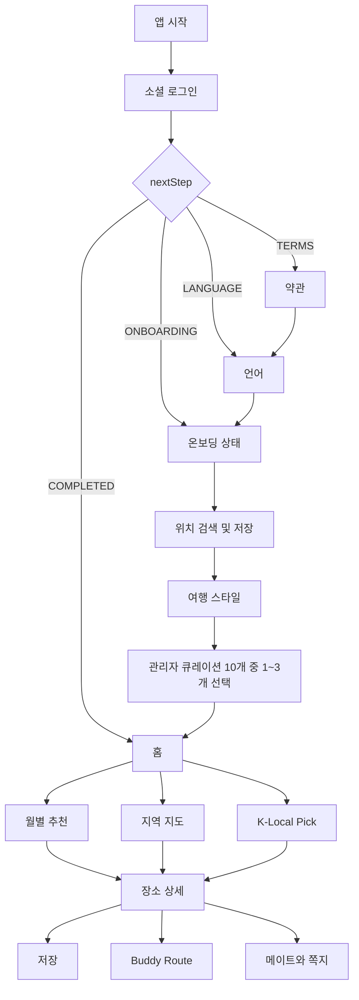
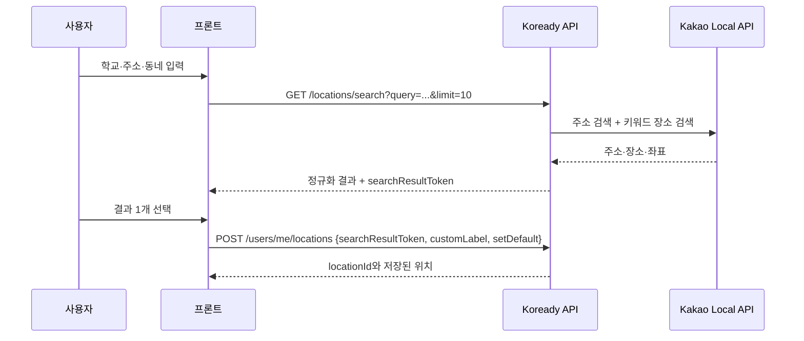
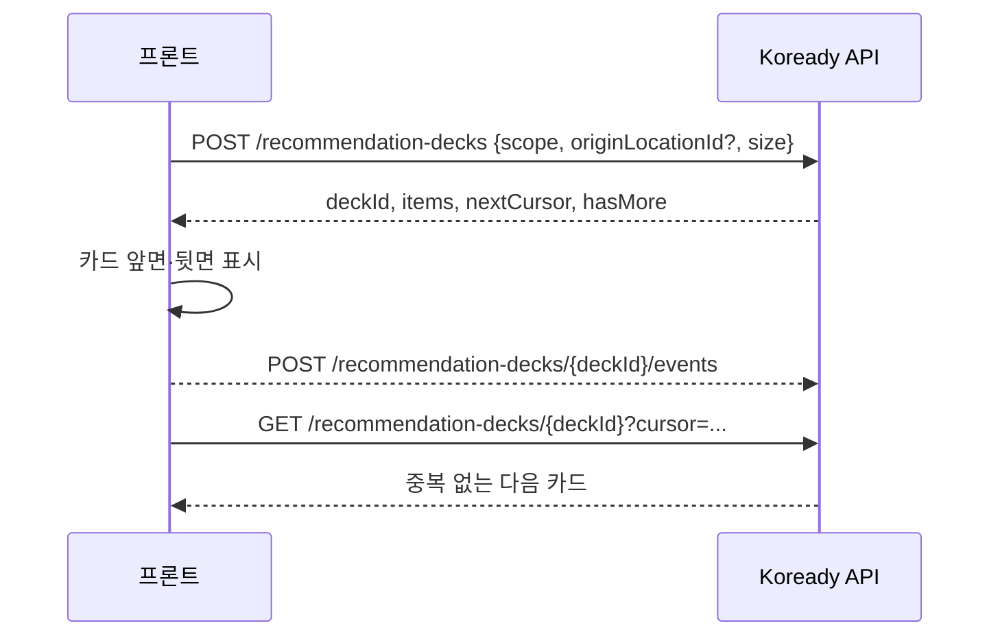
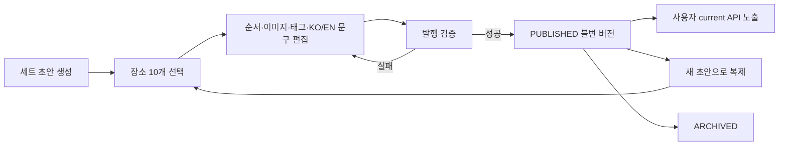

# Koready 프론트엔드 API 연동 가이드

## 0. 문서 목적

이 문서는 프론트 개발자가 Figma 화면과 API 계약을 함께 보면서 다음 질문에 답할 수 있도록 작성한다.

1. 이 API를 어느 화면에서 언제 호출하는가?
2. 호출 전에 어떤 값이 준비되어 있어야 하는가?
3. 요청에 어떤 값을 보내고 응답에서 어떤 값을 화면에 쓰는가?
4. 성공한 뒤 다음 API 또는 화면은 무엇인가?
5. 실패하면 사용자에게 무엇을 보여주고 어디로 이동하는가?

endpoint와 schema의 최종 기계 계약은 `openapi.yaml`, 제품 정책은 `07_CONFIRMED_PRODUCT_POLICIES.md`, 필드별 설명은 `08_API_CONTRACT.md`를 따른다. 문서와 YAML이 충돌하면 구현 전에 반드시 YAML과 이 문서를 함께 수정한다.

## 1. 먼저 알아둘 것

### 1.1 서버 주소

```text
로컬:    http://localhost:8080/api/v1
테스트:  https://koready-backend-staging.onrender.com/api/v1
운영:    추후 확정
```

Swagger에 표시된 API가 모두 구현됐다는 뜻은 아니다. 각 operation의 `x-implementation-status`를 확인한다.

```text
PLANNED      = 명세만 확정, 호출하면 안 됨
IN_PROGRESS  = 백엔드 개발 중, 프론트는 mock 사용
IMPLEMENTED  = 테스트 환경에서 호출 가능
DEPRECATED   = 신규 화면에서 사용 금지
```

### 1.2 공통 요청 header

```http
Authorization: Bearer <accessToken>
Accept-Language: ko-KR
Content-Type: application/json
X-Request-Id: <선택적 UUID>
```

- 로그인·토큰 재발급 API를 제외한 사용자 API는 원칙적으로 access token이 필요하다.
- `Accept-Language`는 이번 응답의 표시 언어다. `ko-KR`, `en-US`만 사용한다.
- 언어 설정 API는 사용자 기본 언어를 저장하며 `Accept-Language`와 역할이 다르다.
- access token, refresh token, 소셜 id token은 콘솔·분석 도구·오류 리포트에 기록하지 않는다.

### 1.3 공통 성공 응답

```json
{
  "success": true,
  "code": "OK",
  "message": "요청이 성공했습니다.",
  "data": {},
  "traceId": "01J2ABCDEF"
}
```

프론트가 실제 화면 데이터로 사용하는 값은 항상 `data` 안에 있다. `message`를 화면 데이터 대신 사용하지 않는다.

### 1.4 공통 실패 응답

```json
{
  "success": false,
  "code": "VALIDATION_ERROR",
  "message": "입력값을 확인해주세요.",
  "errors": [
    {
      "field": "selectedPreferencePlaceIds",
      "reason": "SIZE_OUT_OF_RANGE"
    }
  ],
  "traceId": "01J2ABCDEF"
}
```

- 분기 기준은 번역될 수 있는 `message`가 아니라 안정된 `code`다.
- 고객 문의와 서버 로그 확인에는 `traceId`를 사용한다.
- field 오류는 해당 입력 아래에 표시하고, field가 없는 오류는 화면 상단 또는 toast로 표시한다.

### 1.5 HTTP 상태별 기본 처리

| HTTP | 의미 | 프론트 기본 행동 |
|---:|---|---|
| 200/201 | 조회·저장·생성 성공 | `data`로 화면 상태 갱신 |
| 202 | 배치 같은 비동기 작업 접수 | 완료로 오해하지 말고 상태 조회 시작 |
| 204 | 삭제·로그아웃 성공, body 없음 | JSON parsing 없이 로컬 상태 갱신 |
| 400 | 형식 오류 | 입력값 또는 클라이언트 구현 확인 |
| 401 | access token 없음·만료 | refresh 1회 후 원 요청 1회 재시도 |
| 403 | 권한·공개범위·차단 | 접근 불가 화면 또는 이전 화면 이동 |
| 404 | 리소스 없음 | 이미 삭제된 항목으로 처리하거나 목록 복귀 |
| 409 | 중복·상태 충돌 | 중복 전송 또는 최신 상태 재조회 |
| 410 | 임시 검색·경로 만료 | 원래 검색 또는 경로 생성 화면으로 복귀 |
| 422 | 비즈니스 규칙 위반 | `code`에 맞는 안내 후 선택값 수정 |
| 429 | 호출 제한 | 즉시 반복 호출하지 않고 잠시 후 재시도 |
| 503 | Kakao·KTO·TMAP 장애 | 기존 화면 유지, 재시도 버튼 제공 |

### 1.6 목록과 cursor

```json
{
  "items": [],
  "nextCursor": "opaque-or-null",
  "hasMore": true
}
```

- 첫 요청에는 cursor를 보내지 않는다.
- `hasMore=true`이고 `nextCursor`가 있을 때만 다음 페이지를 호출한다.
- cursor를 해석하거나 직접 만들지 않는다.
- 새 필터를 선택하면 기존 items와 cursor를 모두 버리고 첫 페이지부터 조회한다.
- 무한 스크롤 중 같은 cursor 요청을 동시에 두 번 보내지 않는다.

## 2. 권장 TypeScript 호출 래퍼

```ts
type ApiSuccess<T> = {
  success: true;
  code: "OK" | string;
  message: string;
  data: T;
  traceId: string;
};

type ApiFailure = {
  success: false;
  code: string;
  message: string;
  errors?: Array<{ field?: string; reason: string }>;
  traceId: string;
};

async function apiRequest<T>(path: string, init: RequestInit = {}): Promise<T> {
  const response = await fetch(`${API_BASE_URL}${path}`, {
    ...init,
    headers: {
      "Content-Type": "application/json",
      "Accept-Language": currentLanguage === "EN" ? "en-US" : "ko-KR",
      ...(accessToken ? { Authorization: `Bearer ${accessToken}` } : {}),
      ...init.headers,
    },
  });

  if (response.status === 204) return undefined as T;

  const body = (await response.json()) as ApiSuccess<T> | ApiFailure;
  if (!response.ok || !body.success) throw new KoreadyApiError(response.status, body);
  return body.data;
}
```

401 처리 interceptor는 refresh를 한 번만 수행하고, 동시에 여러 요청이 401이면 하나의 refresh Promise를 공유해야 한다. refresh도 실패하면 token을 모두 지우고 로그인 화면으로 이동한다. 무한 refresh loop를 만들면 안 된다.

## 3. 전체 화면 호출 흐름



로그인과 TMAP은 현재 후순위다. 프론트는 Swagger mock 예제로 화면을 만들 수 있지만 `PLANNED` API를 테스트 서버에서 실제 호출하면 안 된다.

## 4. 앱 시작·로그인·약관 흐름

### 4.1 소셜 로그인

```text
1. 사용자가 Google 또는 Apple 버튼을 누른다.
2. 플랫폼 SDK에서 idToken 또는 authorizationCode를 받는다.
3. POST /auth/social/login을 호출한다.
4. accessToken/refreshToken은 보안 저장소에 저장한다.
5. nextStep 값으로 다음 화면을 결정한다.
```

`POST /auth/social/login`

```json
{
  "provider": "GOOGLE",
  "idToken": "provider-id-token",
  "authorizationCode": null,
  "deviceId": "device-uuid",
  "expoPushToken": null
}
```

```json
{
  "accessToken": "opaque-access-token",
  "refreshToken": "opaque-refresh-token",
  "expiresInSeconds": 3600,
  "user": {
    "userId": 1,
    "email": "emma@example.com",
    "profileImageUrl": "https://...",
    "preferredLanguage": null
  },
  "nextStep": "TERMS"
}
```

`nextStep`은 `TERMS | LANGUAGE | ONBOARDING | COMPLETED`다. 신규 가입 여부를 프론트가 임의로 계산하지 않는다.

### 4.2 토큰 재발급과 로그아웃

- `POST /auth/refresh`: `{refreshToken, deviceId}`를 보내고 새 token 쌍으로 둘 다 교체한다.
- `POST /auth/logout`: 같은 값을 보내고 성공한 `204` 뒤 로컬 token과 사용자 cache를 지운다.
- refresh token 원문은 일반 앱 로그, Redux persist, URL query에 넣지 않는다.

### 4.3 약관

```text
GET /terms/required
  -> required=true 약관을 모두 체크해야 다음 버튼 활성화
  -> marketing required=false는 선택
PUT /users/me/term-agreements
  -> 성공하면 언어 화면
  -> REQUIRED_TERMS_NOT_AGREED면 필수 체크 위치로 스크롤
```

약관 저장 요청은 `agreements[{termVersionId, agreed}]`다. 화면에 보이는 약관 순번이 아니라 API가 준 `termVersionId`를 그대로 보낸다.

## 5. 언어·온보딩 흐름

### 5.1 언어

`PATCH /users/me/language`에 `{ "language": "KO" }` 또는 `{ "language": "EN" }`을 보낸다. 성공 뒤 앱의 i18n 상태와 `Accept-Language`를 함께 변경한다.

```json
{
  "language": "EN",
  "nextStep": "ONBOARDING",
  "updatedAt": "2026-07-19T12:00:00+09:00"
}
```

응답의 `nextStep`으로 이동한다. 서버는 `NEED_TERMS` 사용자가 이 API를 먼저 호출해도
`TERMS`를 반환해 필수 약관을 건너뛰지 못하게 한다. `NEED_LANGUAGE`에서 성공하면
`ONBOARDING`, 온보딩 중이면 계속 `ONBOARDING`, 가입 완료 사용자는 `COMPLETED`다.
프론트는 저장 전 화면이나 로컬 값으로 다음 단계를 다시 계산하지 않는다.

이 API는 구현 완료지만 소셜 로그인·token 발급 전까지 실행 환경에서는 유효한 인증
principal이 있어야 호출할 수 있다.

### 5.2 온보딩 재진입

백엔드 구현 상태는 `IMPLEMENTED`다. `GET /users/me/onboarding`은 `completed`,
`currentStep`, `currentLocationId`, `travelStyles`, `candidateSetId`, `candidateSetVersion`,
`selectedPreferencePlaceIds`를 반환한다. 화면을 열 때 로컬 상태보다 서버 응답을 먼저 기준으로 삼는다.

```text
currentStep = LOCATION | TRAVEL_STYLES | PREFERENCE_PLACES | COMPLETED
```

온보딩은 위치 입력, 여행 스타일 1~4개, 관심 관광지 1~3개 순서다. 방문 목적 화면과 관련 요청 필드는 만들지 않는다.

```text
LOCATION          -> 위치 입력 화면
TRAVEL_STYLES     -> 관광 유형 선택 화면
PREFERENCE_PLACES -> 후보 10개 조회 후 관심 관광지 화면
COMPLETED         -> 홈
```

현재 PUT은 마지막 완료 버튼에서 전체 값을 한 번에 저장한다. 프론트가 아직 서버로 보내지 않은
관광 유형과 장소 선택은 화면 상태 또는 안전한 로컬 상태에 보관한다. GET이 복구하는 범위는
서버에 실제 저장된 값까지다. 단계별 자동 저장 API는 아직 없으므로 PUT을 부분 저장 용도로
호출하지 않는다.

### 5.3 위치 검색과 저장



- 프론트는 입력이 바뀔 때 이전 요청을 취소하고 300~500ms debounce를 적용한다.
- API는 1자를 허용하더라도 프론트는 2자 이상일 때 검색하는 것을 권장한다.
- `items=[]`는 정상적인 검색 결과 없음 상태다.
- `searchResultToken`은 10분 동안만 유효하고 내부를 해석하지 않는다.
- `410 LOCATION_SEARCH_RESULT_EXPIRED`면 안내 후 같은 검색어로 다시 검색한다.
- 주소, 좌표, `serviceRegionCode`를 저장 요청에 다시 보내지 않는다.

위치 관련 API는 다음 역할로 구분한다.

| API | 화면 동작 | 성공 뒤 처리 |
|---|---|---|
| `GET /locations/search` | 검색 결과 dropdown/list | 선택 전까지 저장하지 않음 |
| `POST /users/me/locations` | 검색 결과 선택 후 저장 | 반환된 `locationId`를 온보딩 상태에 보관 |
| `GET /users/me/locations` | 마이·위치 변경 목록 | `default=true` 항목 강조 |
| `PUT /users/me/locations/{id}/default` | 기본 위치 변경 | 홈·추천 query cache 무효화 |
| `DELETE /users/me/locations/{id}` | 위치 삭제 | 목록에서 제거하고 기본 위치 여부 재조회 |

### 5.4 여행 스타일

`TravelStyle`에서 최소 1개, 최대 4개를 선택한다. 다섯 번째 선택을 API 호출 뒤 거절하기보다 프론트에서 막고 안내한다.

### 5.5 관리자 큐레이션 후보 10개

백엔드 구현 상태: 현재 후보 조회, 관리자 초안·발행·보관, 온보딩 상태 조회·완료 API는 구현
완료다. 다만 로그인·JWT 발급과 사용자 위치 생성은 후속 작업이므로 실제 앱의 전체 흐름은
두 기능이 연결된 뒤 가능하다. 그 전에는 프론트 mock과 백엔드 테스트 principal을 사용한다.

```text
1. PREFERENCE_PLACES 화면 진입 시 GET /onboarding/place-candidate-sets/current
2. candidateSetId와 version을 화면 상태에 저장
3. items를 displayOrder 오름차순으로 표시
4. 최소 1개, 최대 3개 선택
5. 온보딩 완료 요청에 세트 ID와 version을 그대로 포함
```

응답 핵심값은 `candidateSetId`, `version`, `publishedAt`, `minSelection=1`, `maxSelection=3`, `items[10]`이다. 각 item은 `placeId`, `title`, `imageUrl`, `serviceRegionCode`, `tags`, `curatorMessage`, `displayOrder`를 가진다.

`PUT /users/me/onboarding`

```json
{
  "currentLocationId": 100,
  "travelStyles": ["LOCAL_FOOD", "LOCAL_FESTIVAL"],
  "candidateSetId": "onb-curation-2026-07-v1",
  "candidateSetVersion": 1,
  "selectedPreferencePlaceIds": [1001, 2001]
}
```

- 화면을 보는 중 새 버전이 발행돼도 프론트가 임의로 최신 세트를 다시 받아 선택을 바꾸지 않는다.
- 과거에 발행된 세트는 현재 보관 상태여도 제출할 수 있다. 발행된 적 없는 초안은 제출할 수 없다.
- `ONBOARDING_CANDIDATE_SET_INVALID`면 현재 세트를 다시 조회하고 사용자가 1~3개를 다시 선택하게 한다.
- `ONBOARDING_SELECTION_INVALID`이면 제출을 중단하고 선택 개수와 모든 `placeId`가 같은 세트에서 왔는지 확인한다.
- `ONBOARDING_LOCATION_INVALID`이면 위치 단계로 돌아간다.
- `ONBOARDING_TRAVEL_STYLES_INVALID`이면 1~4개와 중복 여부를 확인한다.
- 성공 응답의 `completed=true`, `nextStep=COMPLETED`를 확인한 뒤 홈으로 이동한다.

네트워크 오류로 성공 여부가 불분명할 때만 같은 본문을 재전송한다. 서버는 같은 선택이면
처음 저장한 `completedAt`을 그대로 반환한다. 완료 후 다른 선택을 보내 `409
ONBOARDING_ALREADY_COMPLETED`가 오면 덮어쓰지 말고 GET으로 저장 상태를 다시 읽는다.

성공 응답의 `profile.preferenceTags`는 현재 항상 `[]`다. 프론트 오류가 아니며, 태그 점수 정책이
승인되기 전까지 숨겨진 추천값을 임의 생성하지 않는다.

## 6. 홈·월별 추천·지도

### 6.1 홈

`GET /home`은 홈 화면 진입과 pull-to-refresh에서 호출한다. 보호 API이며 성공 code는 `HOME_OK`다. 응답은 `currentLocation`, `preferredLanguage`, `monthlyRecommendation{year,month,title,totalCount,items}`다.

- 월별 미리보기는 `Asia/Seoul`의 현재 연월, 사용자 선호 언어, 기본 위치와 같은 서비스 권역을 기준으로 최대 5개를 반환한다.
- `currentLocation=null`이면 월별 미리보기도 `items=[]`, `totalCount=0`이므로 위치 등록 화면으로 이동한다.
- 월별 추천 미리보기는 진행 중·예정 축제를 종료 축제보다 우선한 API 순서를 그대로 사용한다.
- 로그인 구현 전 개발 서버의 익명 호출은 401이며, 백엔드는 테스트 principal과 DB fixture로 계약을 검증한다.
- 읽지 않은 쪽지 개수는 Buddy 쪽지 구현 뒤 추가하며 현재 응답에는 없다.
- KTX 가이드 카드와 본문은 프론트 정적 asset이므로 API 응답에서 찾지 않는다.

### 6.2 월별 추천 전체보기

`GET /monthly-recommendations` query는 다음과 같다.

로그인 토큰 없이 호출할 수 있다. 성공하면 `code=MONTHLY_RECOMMENDATIONS_OK`이며 현재 모든 `saved`는 `false`다.

```text
year=2000..2100
month=1..12
serviceRegionCode=SEOUL|GYEONGGI|GANGWON|CHUNGCHEONG|JEOLLA|GYEONGSANG|JEJU
dateFilterType=ALL|THIS_WEEK|THIS_MONTH|NEXT_MONTH|CUSTOM
customStartDate=yyyy-MM-dd
customEndDate=yyyy-MM-dd
travelStyles=LOCAL_FESTIVAL,NATURE
sort=RECOMMENDED|DEADLINE
cursor=<첫 요청 생략>
size=1..50
```

- `ALL`은 선택 연월 전체다.
- `THIS_WEEK`는 서울 오늘이 속한 월요일~일요일, `THIS_MONTH`는 오늘의 달, `NEXT_MONTH`는 다음 달이다.
- `CUSTOM`일 때 시작일과 종료일을 모두 보내고 다른 날짜 필터에서는 custom 날짜를 보내지 않는다.
- 연월과 날짜 필터는 합집합이 아니라 교집합이다.
- 두 범위가 겹치지 않으면 정상 응답의 빈 `items`가 온다.
- 필터가 바뀌면 기존 cursor를 폐기한다.
- 축제 카드는 `festivalOccurrence{occurrenceId,eventYear,startDate,endDate,status,dateRangeText}`를 사용한다.
- 같은 축제라도 `eventYear`와 `occurrenceId`가 다르면 다른 개최 회차이므로 프론트 상태와 cache key를 섞지 않는다.
- `status=UPCOMING | ONGOING | ENDED`를 예정·진행 중·종료 badge로 표시한다. 종료 항목도 해당 개최 연도·월 목록에서는 숨기지 않는다.
- `dateRangeText`는 화면 표시에만 쓰고 날짜 계산이 필요하면 `festivalOccurrence.startDate/endDate`를 사용한다.
- 저장 버튼은 카드의 `saved`로 초기화하고 저장 API 성공 뒤 갱신한다.
- `400 INVALID_DATE_RANGE`이면 직접 선택한 두 날짜를 확인하고, `400 INVALID_CURSOR`이면 목록과 cursor를 비운 뒤 첫 페이지를 다시 요청한다.

### 6.3 지역 지도

지도 도형과 일곱 권역 이름은 프론트 정적 asset이다. 사용자가 권역을 누르면 `GET /places?serviceRegionCode=...`를 호출한다.

- `serviceRegionCode`는 필수다.
- 선택 query는 `travelStyles`, `sort`, `cursor`, `size`다.
- GPS, `bbox`, `zoom`, 화면 중심 좌표는 보내지 않는다.
- 지도 확대·축소만으로 API를 재호출하지 않는다.

### 6.4 KTX 예매 가이드·시뮬레이션

KTX 가이드는 백엔드를 호출하지 않는 프론트 정적 기능이다. 기획에서 다음 자료를 가이드별로 정리해 프론트에 전달한다.

1. 전체 화면 순서와 단계 수
2. 단계별 제목, 본문, 버튼 문구, 주의사항
3. 사용할 화면 이미지 예시, crop 기준, 대체 텍스트, 출처와 사용 가능 여부
4. 이전, 다음, 건너뛰기, 완료 동작과 재진입 위치
5. KO/EN 문구와 업데이트 담당자·버전

프론트는 이를 정적 JSON 또는 TypeScript 데이터와 asset으로 구성한다. Route 응답의 Hori Tip과 결합하거나 Hori Tip API로 조회하지 않는다. 영상·오디오 가이드는 MVP에서 만들지 않는다.

## 7. K-Local Pick 추천 흐름



- `scope=NEARBY`는 위치의 같은 서비스 권역이며 실제 반경 거리가 아니다.
- `originLocationId`를 생략하면 기본 위치를 사용한다.
- 기본 위치가 없으면 `422 DEFAULT_LOCATION_REQUIRED`이며 위치 등록 화면으로 보낸다.
- 덱 응답 순서를 프론트가 다시 random shuffle하지 않는다.
- 같은 `deckId+cursor` 재요청은 동일 결과이므로 네트워크 재시도에 안전하다.
- `CARD_SERVED`는 서버가 응답 시 기록하므로 프론트 event로 보내지 않는다.
- 행동 이벤트는 실제 사용자 동작 한 번에 한 번만 비차단으로 전송하며 실패해도 자동 재시도하지 않는다.
- 행동 이벤트 실패 때문에 카드 전환, 상세·경로 진입, 저장 UI를 되돌리거나 막지 않는다.
- `PLACE_SAVED/UNSAVED` 이벤트는 실제 저장 API가 성공한 뒤 전송한다.
- `occurredAt`에는 가능하면 사용자 동작 시각을 ISO 8601로 보낸다. 생략 시 서버 수신 시각이 사용되며, 어떤 경우에도 30일 재노출 제한에는 영향을 주지 않는다.
- 현재 덱 응답에서 실제로 받은 카드만 기록할 수 있다. 없는 덱, 타인 덱, 미노출 카드는 모두 404이며 이벤트 전송만 포기하고 화면 흐름은 유지한다.

`RecommendationEventType`은 `CARD_EXPANDED | CARD_PREVIOUS | CARD_NEXT | PLACE_DETAIL_CLICKED | PLACE_SAVED | PLACE_UNSAVED | ROUTE_OPENED`다.

## 8. 장소 상세·저장 흐름

### 8.1 장소 검색과 상세

- `GET /places/search?query=...`: KoReady에 적재된 관광지를 검색한다. 사용자 주소 검색과 다른 API다.
- `GET /places/{placeId}`: 카드에서 상세로 진입할 때 호출한다.
- 상세 응답의 `availableTabs`만 노출하며 현재 값은 `DESCRIPTION | ROUTE | MATES`다.
- 운영시간·휴무·요금·주차가 `null`이면 빈 문자열이나 `null` 글자를 표시하지 말고 해당 행을 숨긴다.
- 이미지가 여러 개면 `order` 오름차순으로 표시한다.
- `relatedPlaces` 클릭은 해당 `placeId`로 같은 상세 화면을 다시 연다.

### 8.2 저장

| API | 의미 | UI 처리 |
|---|---|---|
| `PUT /users/me/saved-places/{placeId}` | 멱등 저장 | 성공 뒤 하트 활성화 |
| `DELETE /users/me/saved-places/{placeId}` | 멱등 취소 | 204 뒤 하트 비활성화 |
| `GET /users/me/saved-places` | 저장 탭 목록 | cursor 무한 스크롤 |

`PUT`에는 현재 화면에 맞는 출처를 반드시 JSON 본문으로 보낸다.

| 저장 버튼 위치 | `source` |
|---|---|
| 홈 월별 추천 | `HOME_MONTHLY` |
| K-Local Pick 추천 카드 | `RECOMMENDATION_CARD` |
| 장소 상세 | `PLACE_DETAIL` |
| 권역 지도 | `MAP` |

```json
{
  "source": "PLACE_DETAIL"
}
```

중복 PUT은 성공하지만 최초 저장 시각과 출처를 바꾸지 않는다. 취소 뒤 다시 저장하면 그때의
시각과 화면 출처로 갱신된다. 목록의 `nextCursor`는 내부 구조를 해석하지 말고 응답값 그대로
다음 GET의 `cursor`에 넣는다. 현재 세 API는 구현 완료지만 소셜 로그인·token 발급 전까지
실행 환경에서는 유효한 인증 principal이 있어야 호출할 수 있다.

빠른 연속 클릭 중에는 같은 장소의 저장 요청을 하나만 실행한다. optimistic UI를 사용한다면 실패 시 원래 상태로 되돌리고 오류 안내를 표시한다.

## 9. Buddy Route 흐름

TMAP 기능은 후순위지만 프론트 계약은 다음과 같다.

```text
POST /routes
  request: originLocationId, destinationPlaceId, departureAt?
  response: routeId, expiresAt, summary
GET /routes/{routeId}
  response: summary, segments, warnings
```

- 출발·도착은 응답의 `origin`, `destination`을 사용하고 `summary`는 편도 분, 환승·도보, 교통수단, 난이도, 당일치기 상태, 요금, Hori Tip을 포함한다.
- Hori Tip을 위한 별도 사용자 API는 호출하지 않는다. 서버가 운영진 등록 팁을 조회 시점에 조합하므로 `summary.horiTips[]`와 `segments[].horiTips[]`를 받은 순서대로 표시한다.
- `horiTips`가 빈 배열이면 팁 영역을 숨긴다. 프론트가 TMAP 노선명이나 이동시간으로 팁 문구를 직접 생성하지 않는다.
- 모든 Hori Tip의 `source`는 `OPERATOR_CURATED`이며 `title`은 `Hori Tip`으로 고정한다.
- Hori Tip은 경로 구간의 짧은 안내다. 코레일톡 화면을 따라가는 KTX 예매 가이드·시뮬레이션은 6.4의 정적 콘텐츠로 별도 구현한다.
- `providerTotalTimeSeconds < 10800`만 `DAY_TRIP_AVAILABLE`이고 정확히 10800초부터 `STAY_RECOMMENDED`다.
- `segments`는 `WALK | BUS | SUBWAY | EXPRESS_BUS | TRAIN | AIRPLANE | FERRY | SHUTTLE_BUS` 순서 조합이다.
- `422 ROUTE_NOT_FOUND`면 해당 출발지와 목적지 사이 대중교통 경로가 없음을 안내한다.
- `422 ROUTE_NOT_AVAILABLE_AT_DEPARTURE_TIME`이면 출발 시각을 바꾸도록 안내한다.
- `410 ROUTE_EXPIRED`면 기존 `routeId`를 재호출하지 않고 `POST /routes`부터 다시 실행한다.
- `503 ROUTE_PROVIDER_UNAVAILABLE`이면 장소 상세를 유지하고 재시도 버튼을 제공한다.
- TMAP 원본 JSON 필드를 프론트 타입으로 사용하지 않는다.

## 10. Buddy·쪽지·안전 흐름

### 10.1 Buddy 프로필

- `GET /users/me/buddy-profile`: 내 프로필 편집 초기값.
- `PUT /users/me/buddy-profile`: 전체 저장. 부분 수정이 아니므로 화면의 모든 필드를 보낸다.
- `GET /places/{placeId}/mates`: 장소의 공개 메이트 목록.
- `GET /buddy-profiles/{profileId}`: 공개 프로필 상세.

`KoreanLevel`은 `BEGINNER | INTERMEDIATE | ADVANCED`, `BuddyStyle`은 `TRADITIONAL_CULTURE | CAFE_TOUR | FOODIE | PHOTOGRAPHY | HANOK_EXPERIENCE | QUIET_TRAVEL`이다. 온보딩 `TravelStyle`과 섞지 않는다.

### 10.2 쪽지

```text
쪽지함:      GET /message-threads
첫 쪽지:    POST /message-threads
스레드 조회: GET /message-threads/{threadId}
답장:        POST /message-threads/{threadId}/messages
읽음:        PUT /message-threads/{threadId}/read
```

- 첫 쪽지는 `receiverProfileId`, 관련 `placeId`, `content`를 보낸다.
- 첫 쪽지와 답장은 `Idempotency-Key` header가 필수다. 버튼을 누를 때 UUID를 만들고 같은 요청의 재시도에는 같은 값을 사용한다.
- 같은 key로 다른 본문을 보내면 `409 IDEMPOTENCY_KEY_REUSED`다.
- 본문은 trim 후 1~1,000자다. 화면 counter도 1,000자를 기준으로 한다.
- 실시간 채팅이 아니므로 websocket 연결을 만들지 않는다.

### 10.3 차단과 신고

- `PUT /users/me/blocked-profiles/{profileId}`: 차단 성공 뒤 상대 프로필·목록·스레드에서 즉시 제거한다.
- `DELETE /users/me/blocked-profiles/{profileId}`: 차단 해제. 과거 쪽지를 자동 복원한다는 의미는 아니다.
- `POST /reports`: `targetType=PROFILE|MESSAGE`, 대상 ID, 사유를 전송한다. 신고와 차단은 서로 다른 동작이다.

## 11. 관리자 호출 흐름

관리자 API는 일반 사용자 앱이나 Figma 사용자 화면에서 호출하지 않는다. 관리자 role이 없으면 모두 `403 ADMIN_FORBIDDEN`이다.

### 11.1 온보딩 큐레이션 발행



- 목록·생성: `GET/POST /admin/onboarding/place-candidate-sets`
- 상세·수정: `GET/PUT /admin/onboarding/place-candidate-sets/{candidateSetId}`
- 발행: `POST /admin/onboarding/place-candidate-sets/{candidateSetId}/publish`
- 보관: `POST /admin/onboarding/place-candidate-sets/{candidateSetId}/archive`
- 발행은 후보가 정확히 10개이고 장소·순서 중복과 필수 카드 데이터 누락이 없어야 성공한다.
- 발행본은 수정하지 않고 새 DRAFT를 복제해 다음 버전을 만든다.
- 현재 발행본을 보관하면 current 응답은 404가 되며 과거 발행본을 자동으로 다시 노출하지 않는다.
- 현 단계에서는 `representativeImageId`를 보내지 않고 장소의 KTO 대표 이미지를 사용한다. 장소별 이미지 자산 관리는 후속 범위다.

### 11.2 OpenAPI 증빙 운영

- 현황: `GET /admin/open-api/summary`
- 호출 로그: `GET /admin/open-api/calls`, `GET /admin/open-api/calls/{callLogId}`
- KTO snapshot: `GET /admin/open-api/snapshots`, `GET /admin/open-api/snapshots/{snapshotId}`, `POST /download-url`
- 배치 조회(구현): `GET /admin/batch-jobs`, `GET /{jobId}`, `GET /{jobId}/items`
- 배치 실행·재시도(후속): `POST /admin/batch-jobs`, `POST /{jobId}/retry`
- cursor 조회(구현): `GET /admin/open-api/sync-cursors`
- cursor 활성 변경·초기화(후속): `PUT /{cursorId}/enabled`, `POST /{cursorId}/reset`
- 증빙 번들: `GET/POST /admin/evidence-bundles`, `GET /{bundleId}`, `POST /{bundleId}/download-url`
- 데이터 품질 요약(구현): `GET /admin/data-quality/summary`
- 감사 로그(후속): `GET /admin/audit-logs`

- cursor 목록은 화면 진입과 사용자의 새로고침 동작에서 호출하며 자동 polling하지 않는다.
- 서버 정렬을 그대로 사용하고 `cursorValue`는 해석하지 않는다. `null`이면 `-`처럼 값 없음으로 표시한다.
- `lastSuccessAt`, `lastFailureAt`, `failureCount`, `enabled`를 함께 보여 주되 DB에 없는 오류 메시지를 추측해 만들지 않는다.
- enabled 토글과 reset 버튼은 후속 API가 구현될 때까지 숨기거나 비활성화한다.

데이터 품질 화면은 진입 시 `GET /admin/data-quality/summary`를 한 번 호출하고, 이후에는 사용자가 새로고침을 요청할 때 다시 호출한다. 자동 polling은 하지 않는다.

- `places.total`은 전체 저장 수, `places.active`는 현재 표출 가능한 수로 구분해 표시한다.
- 네 가지 `missing*` 숫자는 서로 겹칠 수 있으므로 합산하거나 `active`에서 빼지 않는다.
- `curationReady`는 서버가 동일한 추천 후보 준비 조건으로 직접 계산한 값을 그대로 표시한다.
- `localization`의 세 숫자는 관광지 수가 아니라 번역 출처별 현지화 행 수다.
- `lastSuccessfulSyncAt=null`이면 오류로 처리하지 않고 `성공 이력 없음`처럼 표시한다.
- 이 API에는 개별 문제 관광지 목록이 없다. 숫자를 눌러 상세 목록으로 이동하는 UI는 후속 목록 API가 생길 때 연결한다.
- `401`이면 로그인 흐름, `403 ADMIN_FORBIDDEN`이면 관리자 권한 안내 흐름으로 보낸다.

`POST`가 202를 반환하는 관리자 작업은 비동기다. 프론트는 즉시 완료 toast를 표시하지 말고 반환된 ID의 상세 조회를 반복해 `PENDING -> RUNNING -> COMPLETED|FAILED|PARTIAL_FAILED`를 확인한다.

## 12. Enum 화면 표시표

| Enum | 값 | 기본 한글 표시 |
|---|---|---|
| `LanguageCode` | `KO`, `EN` | 한국어, English |
| `OnboardingStep` | `LOCATION`, `TRAVEL_STYLES`, `PREFERENCE_PLACES`, `COMPLETED` | 위치, 여행 스타일, 관심 관광지, 완료 |
| `TravelStyle` | `LOCAL_FOOD`, `LOCAL_FESTIVAL`, `TRADITIONAL_MARKET`, `CULTURE_EXPERIENCE`, `NATURE`, `EXHIBITION_MUSEUM`, `DRAMA_LOCATION` | 로컬 맛집, 지역 축제, 전통시장, 문화체험, 자연 명소, 전시/미술관, 드라마 촬영지 |
| `ServiceRegionCode` | `SEOUL`, `GYEONGGI`, `GANGWON`, `CHUNGCHEONG`, `JEOLLA`, `GYEONGSANG`, `JEJU` | 서울, 경기·인천, 강원, 충청, 전라, 경상, 제주 |
| `RecommendationScope` | `NEARBY`, `NATIONWIDE` | 근교, 전국 |
| `SortType` | `RECOMMENDED`, `DEADLINE` | 추천순, 마감순 |
| `DateFilterType` | `ALL`, `THIS_WEEK`, `THIS_MONTH`, `NEXT_MONTH`, `CUSTOM` | 전체, 이번 주, 이번 달, 다음 달, 직접 선택 |
| `FestivalOccurrenceStatus` | `UPCOMING`, `ONGOING`, `ENDED` | 예정, 진행 중, 종료 |
| `Difficulty` | `EASY`, `NORMAL`, `HARD` | 쉬움, 보통, 어려움 |
| `DayTripStatus` | `DAY_TRIP_AVAILABLE`, `STAY_RECOMMENDED` | 당일치기 가능, 숙박 권장 |
| `CandidateSetStatus` | `DRAFT`, `PUBLISHED`, `ARCHIVED` | 초안, 발행, 보관 |
| `BatchJobStatus` | `PENDING`, `RUNNING`, `COMPLETED`, `FAILED`, `PARTIAL_FAILED` | 대기, 실행 중, 완료, 실패, 일부 실패 |

화면 표시 문자열을 API enum 대신 서버에 다시 보내지 않는다. 예를 들어 `경기·인천`을 요청값으로 보내지 않고 `GYEONGGI`를 보낸다.

## 13. Figma 대조 체크리스트

- 로그인 뒤 약관, 언어, 온보딩 이동 순서가 `nextStep`과 일치하는가?
- 방문 목적 화면과 요청 필드가 삭제됐는가?
- 온보딩 단계가 위치, 여행 스타일, 선호 여행지 순서인가?
- 선호 여행지 화면은 정확히 10개를 보여주며 1~3개 선택인가?
- 큐레이션 카드에 필요한 필드가 이미지, 제목, 지역, 태그, 한 줄 설명, 선택 상태로 충분한가?
- 위치 화면에 GPS 또는 현재 위치 버튼이 남아 있지 않은가?
- 홈의 KTX 가이드가 서버 데이터처럼 설계되지 않았는가?
- KTX 단계별 문구와 이미지가 프론트 정적 데이터·asset으로 준비됐는가?
- 월별 추천 필터가 API의 연도, 월, 권역, 날짜, 관광유형, 정렬과 일치하는가?
- 종료 축제가 해당 개최 연도·월에는 종료 badge와 함께 남는가?
- 추천 카드의 이전·다음이 좋아요·싫어요로 표현되지 않았는가?
- 장소 상세 탭이 설명, 이동, 메이트 세 개인가?
- 편도 180분 이상 예시가 숙박 권장으로 표시되는가?
- 쪽지 글자 수가 500자가 아니라 1,000자인가?
- 지도, 저장, 마이의 최신 독립 화면이 존재하며 위 호출 흐름과 연결되는가?
