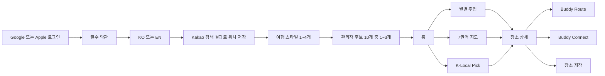

# Koready MVP 개발 착수 승인서

> - 문서 상태: 2026-07-17 PM 1차 검토 반영, 최종 개발 착수 승인 요청
> - 기준일: 2026-07-17 (Asia/Seoul)
> - 제품 기준: KOREADY Figma `UI` 페이지와 2026-07-17 확정 정책
> - API 기준: 배포된 Swagger/OpenAPI 3.0.3 계약
> - 데이터 근거: KTO 실제 전수 프로파일과 TMAP 제한 probe
> - 승인 대상: 제품 동작, 데이터 처리, 유일성, 구현 순서, MVP 범위

## 0. 이 문서의 결론

Koready는 **개발 착수 직전의 계약과 검증 자료는 준비됐지만, 비즈니스 기능 구현은 아직 시작 전**이다.

- 공개 스테이징, Aiven MySQL 연결, CI, Swagger 배포, 보안 기본 설정은 준비됐다.
- Swagger에는 59개 path, 71개 operation이 정의돼 있으며 71개 모두 `PLANNED` 상태다.
- 실제 구현된 것은 애플리케이션 기동, health endpoint, Swagger 공개, 보안 기본값, 테스트 하네스다.
- Controller, Service, Repository, Entity와 도메인 Flyway migration은 아직 없다.
- 따라서 Swagger에서 요청/응답 예시는 볼 수 있지만 사용자 기능을 실제 호출할 수 있는 상태는 아니다.
- KTO 데이터 기반 장소, 월별 추천, 관리자 후보 10개, K-Local Pick은 실제 데이터 프로파일상 구현 가능하다.
- 온보딩은 위치, 여행 스타일, 관심 관광지의 세 단계이며 방문 목적 데이터는 API와 DB에서 제거한다.
- 핵심 타깃은 외국인 유학생·교환학생·장기체류 외국인이고 단기 여행자는 확장 사용자다.
- 반복 축제는 연도별 개최 회차로 분리하며, 종료 뒤에도 해당 개최 연도·월 상세 목록에 `ENDED`로 남긴다.
- 영문 매칭, 연관 관광지, 이미지 사용은 추가 가공과 검수가 필요한 조건부 가능 영역이다.
- `DRAMA_LOCATION`은 KTO 분류만으로 공급할 수 없어 운영자 큐레이션이 필요하다.
- TMAP 경로는 3회 실제 호출로 parser와 오류 계약 구현을 시작할 근거가 확보됐다. 다만 기능 착수 직전에 복수 후보와 영문 응답 등을 제한적으로 더 확인한다.
- Kakao 위치 검색, Google/Apple OAuth, AI provider는 아직 실제 프로파일 또는 공급자 결정을 완료하지 않았다.

권장 개발 순서는 **KTO 데이터 기반 기능을 먼저 만들고, 로그인과 TMAP은 뒤 단계로 미루는 방식**이다. 단, 로그인 구현 전이라고 사용자 API를 임시 공개하지는 않는다. 사용자별 기능은 인증 경계를 유지한 채 테스트 principal과 mock 계약으로 개발하고, 실제 프론트 연동 전에 OAuth를 연결한다.

이 문서의 PM 승인 후 첫 구현 PR에서 도메인 migration을 만든다. migration은 한 번 배포되면 변경 비용이 크므로, 아래 정책과 유일성 기준을 먼저 승인받는다.

---

## 1. 문서 목적과 판정 방법

### 1.1 PM이 판정할 내용

PM은 코드 구현 방법보다 다음을 확인한다.

1. 실제 화면 흐름과 이 문서의 사용자 흐름이 같은가.
2. 추천, 월별, 위치, 경로, Hori Tip, Buddy Connect의 제품 규칙이 맞는가.
3. KTO와 TMAP 실제 응답으로 약속한 기능을 만들 수 있는가.
4. 데이터가 중복되거나 사용자의 선택이 뒤바뀌지 않도록 잡은 유일성 기준이 맞는가.
5. 빠른 개발을 위해 KTO부터 만들고 로그인과 TMAP을 뒤로 미루는 순서가 맞는가.
6. MVP에서 제외한 기능이 맞는가.

### 1.2 용어

| 상태 | 의미 |
|---|---|
| 확정 | 기존 대화와 정책 문서에서 결정돼 구현 기준으로 사용하는 항목 |
| 승인 요청 | 권장안을 제시했으며 PM의 승인 또는 수정이 필요한 항목 |
| 프로파일 확인 | 실제 외부 API를 호출해 응답 구조나 데이터 분포를 확인한 항목 |
| 조건부 가능 | 구현은 가능하지만 매칭, 운영 검수, 라이선스 확인 등이 추가로 필요한 항목 |
| 미검증 | 문서 설계만 있고 실제 공급자 호출 또는 운영 조건 확인이 남은 항목 |
| `PLANNED` | OpenAPI 계약만 있고 실제 기능 코드는 아직 없는 상태 |

### 1.3 기준 문서 우선순위

승인 후 내용이 충돌할 때는 다음 순서로 판단한다.

1. 이 문서에서 PM이 승인 또는 수정한 결정
2. `07_CONFIRMED_PRODUCT_POLICIES.md`
3. `openapi.yaml`
4. `08_API_CONTRACT.md`, `09_ADMIN_API_CONTRACT.md`
5. `06_FINAL_UI_SCREEN_ANALYSIS.md`, `10_FRONTEND_API_FLOW_GUIDE.md`
6. DTO와 DB 초안 문서

PM 수정으로 API가 달라지면 구현 전에 OpenAPI와 관련 문서를 같은 PR에서 함께 변경한다.

---

## 2. 현재 준비 상태

### 2.1 상태표

| 영역 | 현재 상태 | 개발 착수 판단 |
|---|---|---|
| 최종 화면 분석 | Figma 최신 UI 흐름과 서버 데이터 요구사항 분석 완료 | 완료 |
| 제품 정책 | 위치, 권역, 추천 재노출, 축제 기간, Route, Hori Tip, 메시지 규칙 정리 | PM 최종 승인 필요 |
| OpenAPI | 59 path, 71 operation, 요청/응답/오류/예시 정의 | 계약 완료, 구현 0/71 |
| DTO | OpenAPI schema와 상세 DTO 초안 존재 | Java DTO 클래스는 미구현 |
| DB | 테이블과 관계 초안 존재 | migration 없음, 승인 후 생성 |
| KTO | 국문/영문/사진/수상작 전수와 연관 관광지 표본 분석 | 1차 개발 가능 |
| TMAP | 상세 경로 3회 실제 probe, 성공/오류 구조 확인 | 후순위 개발 가능 |
| Kakao Local | 검색/token/save 계약 설계 | 실제 probe 미실시 |
| Google/Apple OAuth | endpoint와 token 회전 정책 설계 | 앱 설정과 실제 연동 미실시 |
| AI | 번역/설명 provenance 구조 설계 | provider/model/비용/검수 미결정 |
| 테스트 환경 | Render staging, Aiven MySQL, health/Swagger 정상 | 준비 완료 |
| 운영 환경 | 약 한 달 뒤 AWS EB 재검토 | 현재 착수 비차단 |
| AI 개발 하네스 | 이슈 -> RED -> GREEN -> REFACTOR -> check -> PR/CI | 준비 완료 |
| 공개 저장소 보안 | env 제외, secret scan, 원본 공개 제한 정책 | 준비 완료, 계속 준수 |

### 2.2 2026-07-14 배포 확인

다음 공개 스테이징 endpoint가 HTTP 200으로 확인됐다.

- `https://koready-backend-staging.onrender.com/actuator/health`
- `https://koready-backend-staging.onrender.com/swagger-ui/index.html`
- `https://koready-backend-staging.onrender.com/openapi/koready.yaml`

Swagger의 목적은 프론트가 계약과 예시를 먼저 확인하게 하는 것이다. 현재 모든 operation에 `x-implementation-status: PLANNED`가 붙어 있으므로 Swagger 노출을 기능 완료로 해석하지 않는다.

### 2.3 인증 상태

71개 operation 중 소셜 로그인과 token refresh 2개만 인증 전 호출이며, 나머지 69개는 사용자 또는 관리자 인증 계약을 가진다. Swagger UI와 OpenAPI 문서는 공개지만 실제 사용자 데이터 API의 인증을 해제하지 않는다.

---

## 3. 제품 정의와 MVP 경계

### 3.1 대상 사용자와 가치

Koready는 한국에서 생활하는 외국인이 로컬 여행을 준비하고 이동할 수 있도록 돕는 추천 서비스다.

- 핵심 타깃은 외국인 유학생, 교환학생, 장기체류 외국인이다.
- 단기 여행자는 핵심 타깃 검증 이후 확장할 사용자군이다.
- 사용자가 직접 저장한 체류 위치와 여행 취향을 추천 기준으로 사용한다.
- KTO 관광 데이터를 가공해 장소, 축제, 설명, 이미지, 추천 후보를 제공한다.
- TMAP 대중교통 경로와 운영진 Hori Tip을 조합해 이동 가능성을 안내한다.
- 같은 장소에 관심 있는 사용자끼리 공개 프로필과 비실시간 쪽지로 연결한다.
- 한국어와 영어를 지원한다.

### 3.2 MVP 포함

1. Google/Apple 로그인, 약관, 언어 설정
2. 위치, 여행 스타일, 선호 장소 온보딩
3. 홈과 월별 추천
4. 7개 권역 지도 탐색
5. K-Local Pick 추천 덱
6. 장소 검색, 상세, 저장
7. Buddy Route와 Hori Tip
8. Buddy 공개 프로필, 장소별 메이트, 비실시간 쪽지
9. 차단과 신고
10. 관리자 온보딩 후보 10개 큐레이션
11. 관리자 Hori Tip 운영
12. KTO 배치, 품질, 호출 로그, 공모전 증빙

### 3.3 MVP 제외

- GPS와 기기 현재 위치
- 실시간 채팅, 읽는 중 표시, 접속 상태
- 여행 체크리스트
- 영상 가이드와 오디오 가이드
- 숙박 목록 추천
- KTX 가이드용 백엔드 API: KTX 한국 여행 가이드는 프론트 정적 콘텐츠로 둔다.
- TMAP 원본 경로의 장기 저장
- 사용자의 자유 좌표 입력
- KTO 원본을 그대로 프론트에 전달하는 proxy API

### 3.4 Figma에서 구현 전에 바로잡을 값

최신 Figma에도 아래 샘플 또는 표기 오류가 남아 있다. 서버 계약과 구현은 수정 값을 기준으로 하고, 프론트 화면도 함께 정정해야 한다.

| 화면 | 현재 Figma | 구현 기준 |
|---|---|---|
| 위치 검색 | `현재 위치로 찾기` 버튼 | 삭제. 주소/학교/동네 검색만 사용 |
| 경로 요약 | 3시간 10분 / 당일치기 가능 | 편도 180분 이상이므로 숙박 권장 |
| 경로 Hori Tip | `당일치기는 가능하지만` | 편도 3시간 이상이면 숙박 권장 문구 |
| 쪽지 작성/답장 | `0/500` | `0/1000` |
| 지역 필터 | 강원 중복 | 7개 권역을 한 번씩 표시 |
| 온보딩 방문 목적 | 방문 목적 선택 화면 | 화면과 단계 삭제. API·DB에도 저장하지 않음 |
| 온보딩 단계 | 방문 목적과 위치가 모두 `01` | 위치 01, 여행 스타일 02, 선호 여행지 03 |
| 월별 축제 | 개최 연도와 종료 상태 구분 없음 | 개최 연도·회차와 예정/진행/종료 상태 표시 |

과거 UI 섹션에 있던 출신 국가, 이동 범위, 체크리스트, 후기 시안은 현재 API의 근거로 사용하지 않는다.

---

## 4. 전체 사용자 흐름



로그인은 구현 순서상 뒤로 미루지만 제품 흐름에서는 첫 단계다. KTO 수집과 추천 도메인은 로그인 없이 먼저 개발할 수 있고, 사용자별 endpoint는 테스트 인증으로 검증한다.

### 4.1 최초 진입과 온보딩

1. 소셜 로그인 응답의 `nextStep`에 따라 약관, 언어, 온보딩 또는 홈으로 이동한다.
2. 필수 약관 버전을 모두 동의해야 다음 단계로 진행한다.
3. 언어는 `KO` 또는 `EN`이다.
4. 위치 검색어는 Koready 백엔드로 보내며 백엔드가 Kakao Local API를 호출한다.
5. 검색 결과에 포함된 10분 유효 `searchResultToken`으로 위치를 저장한다.
6. 여행 스타일을 중복 없이 1~4개 선택한다.
7. 현재 발행된 관리자 큐레이션 10개 중 1~3개 장소를 선택한다.
8. 서버가 위치 소유권, 스타일 개수, 후보 세트 버전, 선택 장소 포함 여부를 한 transaction에서 검증하고 온보딩을 완료한다.
9. 같은 완료 요청이 재전송돼도 동일 상태를 반환한다.

방문 목적은 화면, 요청/응답 DTO, enum, DB 어디에도 만들지 않는다. 온보딩 상태는 `LOCATION`, `TRAVEL_STYLES`, `PREFERENCE_PLACES`, `COMPLETED`만 사용한다.

### 4.2 홈과 탐색

- 홈은 기본 위치, 사용자 언어, 현재 연도·월을 기준으로 필요한 요약 데이터를 한 번에 반환한다.
- 월별 추천은 연도별 축제 회차와 일반 장소의 월별 추천 feature를 조합한다.
- 축제 상세는 시작 6개월 전부터 조회할 수 있고, 종료 뒤에도 해당 개최 연도·월 목록에는 `ENDED`로 남는다.
- 홈과 현재 월 추천은 `ONGOING`, `UPCOMING` 회차를 `ENDED`보다 우선한다.
- 지도 화면 자체와 7개 권역 버튼은 프론트가 그린다.
- 권역을 선택하면 `serviceRegionCode`로 장소 목록을 cursor 조회한다.
- `NEARBY`는 실제 반경 계산이 아니라 사용자의 기본 위치와 같은 서비스 권역을 뜻한다.
- 장소 상세는 `DESCRIPTION`, `ROUTE`, `MATES` 탭 가능 여부를 함께 반환한다.

### 4.3 K-Local Pick

1. 프론트가 `NEARBY` 또는 `NATIONWIDE`, 요청 크기, 선택적 출발 위치를 보내 덱을 생성한다.
2. 서버는 사용자 스타일과 태그가 모두 맞는 후보를 먼저 배치한다.
3. 다음으로 스타일만 맞는 후보를 배치하고, 일부 탐색 후보를 섞는다.
4. 같은 덱의 장소와 순서는 생성 시 고정한다.
5. `deckId + cursor` 재요청은 같은 결과를 반환한다.
6. 카드가 응답에 포함되는 시점에 서버가 `CARD_SERVED`를 기록한다.
7. 해당 장소는 30일 동안 새 덱 후보에서 제외한다.
8. 후보 부족 시 30일을 줄이지 않고 권역 또는 매칭 우선순위를 넓힌다.
9. 그래도 없으면 `hasMore=false`를 반환한다.

MVP v1은 `servedAt`, `suppressionDays=30`, `policyVersion=recommendation-suppression-v1`을 함께 기록한다. 서비스 테스트에서 후보 소진율이나 빈 덱 비율이 높다는 근거가 확인되면 새 정책 버전에서 기록 시점 또는 제한 기간을 조정하며, 기존 이력을 소급 변경하지 않는다.

### 4.4 Buddy Route

1. 저장 위치와 목적지 장소 ID를 받는다.
2. 서버가 내부 좌표를 조회한 뒤 TMAP 상세 경로 API에 후보 3개를 요청한다.
3. 필수 대중교통 leg가 모두 `service=1`인 후보만 남긴다.
4. `totalTime`, `transferCount`, `totalWalkDistance` 순으로 최적 후보를 선택한다.
5. TMAP 응답을 Koready `RouteSummary`와 `RouteSegment[]`로 정규화한다.
6. 원본 `totalTime < 10,800초`면 `DAY_TRIP_AVAILABLE`, 정확히 10,800초 이상이면 `STAY_RECOMMENDED`다.
7. 운영진이 저장한 현재 `ACTIVE` Hori Tip을 목적지와 trigger에 맞춰 조회 시점에 조합한다.
8. 정규화 경로는 기본 30분, 절대 24시간 미만만 임시 보관한다.
9. 만료된 `routeId`는 `410 ROUTE_EXPIRED`를 반환하고 새 경로 요청을 유도한다.

현재 이동 난이도 v1 초안은 도보를 제외한 segment별 교통수단 점수, 환승, 총 도보 거리를 합산한다.

| 입력 | 초기 점수/penalty |
|---|---|
| 지하철, 서울권 시내/마을버스, 비행기 | segment당 1 |
| 지방권 시내/마을버스, 셔틀버스, 기차 | segment당 2 |
| 시외/고속버스 | segment당 3 |
| 환승 | 1회당 0.5 또는 1.0 후보 |
| 총 도보 1,000m 이상 | 1 추가 |

초기 threshold 후보는 0~3 `EASY`, 3.5~6 `NORMAL`, 6 초과 `HARD`다. 환승 penalty와 threshold는 아직 확정 제품 정책이 아니며 TMAP 실제 경로 표본으로 조정하고 `difficultyAlgorithmVersion`을 응답에 남긴다.

### 4.5 Buddy Connect

1. 사용자는 공개 Buddy 프로필을 만든다.
2. 장소 상세에서 같은 장소에 관심 있는 공개 프로필을 cursor 조회한다.
3. 상대 프로필에서 첫 쪽지를 보내면 장소 단위 thread가 생성된다.
4. 첫 쪽지와 답장은 모두 `Idempotency-Key`를 요구한다.
5. 메시지는 공백 제거 후 1~1,000자다.
6. 자기 자신, 차단 관계, 수신 거부 프로필에는 전송할 수 없다.
7. 실시간 채팅이 아니며 push는 발송 성공 후 비동기로 처리한다.
8. 차단은 즉시 목록/프로필/메시지 가능 여부에 반영하고 신고는 별도 운영 상태로 관리한다.

### 4.6 관리자 운영 흐름

관리자 API는 사용자 앱과 분리된 화면 또는 운영 도구에서 사용한다.

1. KTO sync cursor에 따라 batch를 예약하거나 관리자가 사유를 입력해 수동 실행한다.
2. batch job은 page/place/image/translation item으로 나뉘며 실패한 item만 새 child job으로 재시도한다.
3. 외부 API 호출마다 secret이 제거된 call log를 append-only로 남긴다.
4. KTO 성공 원문은 private snapshot과 SHA-256을 남기고 가공 데이터와 연결한다.
5. 운영자는 데이터 품질 요약에서 결측, unknown code, 표출 중단, 매칭 대기 건을 확인한다.
6. 온보딩 후보 세트를 초안으로 만들고 정확히 10개를 검수한 뒤 발행한다.
7. Hori Tip을 초안으로 만들고 KO/EN, scope, trigger, 기간을 채운 뒤 활성화한다.
8. 공모전 제출 시 기간/provider/operation을 지정해 증빙 bundle을 만들고 manifest와 checksum을 확인한다.
9. snapshot 또는 bundle 다운로드 URL은 짧게 만료되며 발급 행위가 감사 로그에 남는다.
10. TMAP route 원문과 개인 위치는 증빙 bundle에 포함하지 않는다.

관리자 권한은 `ADMIN`, `OPERATOR`, `AUDITOR` 역할에 따라 분리하고, role 부여와 변경 행위도 감사 로그에 남긴다. 초기 관리자 계정을 만드는 bootstrap 절차는 구현 전에 별도로 정한다.

### 4.7 공통 API 규칙

- base path는 `/api/v1`, JSON field는 `camelCase`다.
- 언어는 `Accept-Language: ko-KR` 또는 `en-US`로 요청하고 서버가 `KO`/`EN`으로 정규화한다.
- 시각은 ISO 8601 offset, 행사 날짜는 `yyyy-MM-dd`, 기준 시간대는 `Asia/Seoul`이다.
- 금액은 정수 원 단위와 `currencyCode=KRW`를 사용한다.
- 성공 응답은 공통 `data` envelope, 실패 응답은 안정적인 `code`, 사용자용 `message`, 추적용 `traceId`를 사용한다.
- 목록은 `items`, `nextCursor`, `hasMore`를 사용하며 offset page 번호를 프론트 계약으로 노출하지 않는다.
- `400`은 형식 오류, `401`은 인증 실패, `403`은 권한 부족, `404`는 대상 없음, `409`는 상태/멱등성 충돌, `410`은 임시 route 만료, `422`는 형식은 맞지만 제품 규칙 위반, `429`는 rate limit, `503`은 외부 provider 장애다.
- 외부 provider의 원문 오류 메시지와 code를 그대로 사용자에게 노출하지 않는다.
- 공개 numeric DB ID는 해당 resource 참조에만 사용한다. `deckId`, `candidateSetId`, `routeId`, `threadId`, `bundleId`, cursor는 opaque string이다.

---

## 5. 확정 도메인 값

외부 API 코드는 예고 없이 늘거나 문서와 다를 수 있으므로 문자열로 보존한다. 아래 enum은 Koready가 프론트와 약속한 내부 통제 값이다. 외부 값을 직접 JPA enum으로 저장하지 않는다.

### 5.1 핵심 enum

| 구분 | 값 |
|---|---|
| 언어 | `KO`, `EN` |
| 소셜 로그인 | `GOOGLE`, `APPLE` |
| 여행 스타일 | `LOCAL_FOOD`, `LOCAL_FESTIVAL`, `TRADITIONAL_MARKET`, `CULTURE_EXPERIENCE`, `NATURE`, `EXHIBITION_MUSEUM`, `DRAMA_LOCATION` |
| 온보딩 단계 | `LOCATION`, `TRAVEL_STYLES`, `PREFERENCE_PLACES`, `COMPLETED` |
| 축제 회차 상태 | `UPCOMING`, `ONGOING`, `ENDED` |
| 추천 범위 | `NEARBY`, `NATIONWIDE` |
| 장소 탭 | `DESCRIPTION`, `ROUTE`, `MATES` |
| 후보 세트 상태 | `DRAFT`, `PUBLISHED`, `ARCHIVED` |
| Hori Tip 상태 | `DRAFT`, `ACTIVE`, `INACTIVE`, `ARCHIVED` |
| Hori Tip 범위 | `ALL_ROUTES`, `DESTINATION_PLACES` |
| Hori Tip 위치 | `TOP_SUMMARY`, `AFTER_SEGMENT` |
| 경로 mode | `WALK`, `BUS`, `SUBWAY`, `EXPRESS_BUS`, `TRAIN`, `AIRPLANE`, `FERRY`, `SHUTTLE_BUS` |
| 난이도 | `EASY`, `NORMAL`, `HARD` |
| 당일치기 | `DAY_TRIP_AVAILABLE`, `STAY_RECOMMENDED` |
| 한국어 수준 | `BEGINNER`, `INTERMEDIATE`, `ADVANCED` |
| 신고 대상 | `PROFILE`, `MESSAGE` |

`BuddyStyle`은 여행 추천용 `TravelStyle`과 분리한다. 현재 값은 `TRADITIONAL_CULTURE`, `CAFE_TOUR`, `FOODIE`, `PHOTOGRAPHY`, `HANOK_EXPERIENCE`, `QUIET_TRAVEL`이다.

### 5.2 7개 서비스 권역

| 코드 | 포함 지역 |
|---|---|
| `SEOUL` | 서울 |
| `GYEONGGI` | 경기, 인천 |
| `GANGWON` | 강원 |
| `CHUNGCHEONG` | 대전, 세종, 충북, 충남 |
| `JEOLLA` | 광주, 전북, 전남 |
| `GYEONGSANG` | 부산, 대구, 울산, 경북, 경남 |
| `JEJU` | 제주 |

권역은 추천과 지도 탐색을 위한 Koready 내부 분류다. KTO의 17개 시도 코드와 Kakao 주소를 이 7개 값으로 정규화한다. 인천은 독립 서비스 권역이 아니라 `GYEONGGI`에 포함한다.

### 5.3 관리자 후보 10개

- 사용자를 위해 실시간으로 10개를 생성하지 않는다.
- 운영자가 장소, 순서, 대표 이미지, KO/EN 문구, 노출 태그를 검수해 발행한다.
- 초안은 10개 미만일 수 있지만 발행 시 정확히 10개여야 한다.
- 장소와 표시 순서는 세트 안에서 중복될 수 없다.
- 발행 가능한 장소는 활성 상태이며 한국어 제목, 주소, 좌표, 대표 이미지가 있어야 한다.
- 발행된 세트는 수정하지 않고 새 버전을 만든다.
- 신규 사용자에게 보이는 현재 발행 세트는 하나다.
- 사용자가 이전 세트를 이미 조회했다면 새 버전 발행 후에도 그 세트의 유효한 1~3개 선택을 제출할 수 있다.
- 유형과 권역 편중은 관리자 화면에서 경고하되, 초기에는 자동 발행 차단 규칙으로 고정하지 않는다.

### 5.4 월별 추천

- 월별 상세 API는 개최 `year`와 `month`를 필수로 받는다.
- 반복 축제는 축제 시리즈와 연도별 개최 회차를 분리하며 회차마다 `eventYear`, 시작일, 종료일을 저장한다.
- 축제는 `startDate - 6개월`부터 해당 개최 연도·월 상세 목록에 노출 가능하다.
- 종료 뒤에도 해당 개최 연도·월에는 `ENDED`로 유지한다.
- 상태는 저장하지 않고 `Asia/Seoul` 조회일에 `UPCOMING`, `ONGOING`, `ENDED`로 계산한다.
- 홈과 현재 월 추천은 진행 중·예정 회차에 종료 회차보다 높은 우선순위를 준다.
- 시작 6개월 전과 종료일 당일 경계는 포함한다.
- 날짜 누락 또는 형식 오류 행은 축제 추천에서 제외한다.
- 일반 장소의 계절성은 KTO 사진 촬영월, 분류, 운영자 또는 AI feature를 힌트로 사용할 수 있지만 사실처럼 단정하지 않는다.

### 5.5 Hori Tip

- Hori Tip 본문은 운영진이 직접 작성한다.
- TMAP 또는 AI가 본문을 생성하지 않는다.
- `ACTIVE`, 노출 기간, 목적지 scope, trigger를 모두 만족할 때만 노출한다.
- `TOP_SUMMARY` 또는 처음 일치한 `AFTER_SEGMENT` 한 곳에 붙는다.
- 같은 template은 한 route에 한 번만 노출한다.
- 정렬은 `priority DESC`, `code ASC`다.
- 활성화 전 KO/EN 본문이 모두 있어야 한다.
- Hori Tip 결과는 경로 cache에 넣지 않는다.
- 운영진이 비활성화하면 이미 발급된 `routeId`도 다음 조회부터 해당 팁을 제외한다.
- 백엔드 Hori Tip 범위는 Buddy Route의 짧은 이동 안내로 한정한다.
- 코레일톡 화면을 따라가는 KTX 예매 가이드·시뮬레이션은 프론트 정적 콘텐츠이며 Hori Tip API나 DB를 사용하지 않는다.
- 기획은 가이드별 화면 순서, 단계별 문구, 버튼·주의사항, 이미지 예시와 출처를 정리해 프론트에 전달한다.

---

## 6. 외부 API 프로파일과 구현 가능성

### 6.1 KTO 실제 데이터 범위

2026-07-13 실제 호출 결과다. 전수 프로파일 294회와 추천 준비도 보강 5회가 수행됐고 secret은 산출물에 저장하지 않았다.

| 데이터셋 | 수집 | ID 유니크 | 범위 |
|---|---:|---:|---|
| 국문 `areaBasedSyncList2` | 68,493 | `contentid` 68,493 | 전수 |
| 영문 `areaBasedSyncList2` | 25,348 | `contentid` 25,348 | 전수 |
| 관광사진 `galleryList1` | 6,119 | `galContentId` 6,119 | 전수 |
| 관광공모전 수상작 | 96 | `contentId` 96 | 전수 |
| 연관 관광지 | 7,955 | 기준 243, 연관 2,609 | 여러 지역 표본, 전국 전수 아님 |

국문 데이터의 추천 준비도는 다음과 같다.

| 단계 | 건수 | 전체 대비 |
|---|---:|---:|
| 전체 | 68,493 | 100.0% |
| `showflag=1` | 50,674 | 74.0% |
| 좌표 포함 | 50,622 | 73.9% |
| 이미지+주소 포함 카드 준비 | 42,517 | 62.1% |
| 숙박/여행코스를 제외한 온보딩 기본 풀 | 40,510 | 59.1% |

필드 품질은 좌표 100.0%, 주소 98.5%, 대표 이미지 82.9%, 신분류 L1 86.5%, 전화번호 4.7%였다. 전화번호는 필수 필드가 될 수 없다.

### 6.2 여행 스타일 공급량

| 스타일 | 온보딩 준비 후보 | 판정 |
|---|---:|---|
| `LOCAL_FOOD` | 9,831 | 충분 |
| `LOCAL_FESTIVAL` | 912 | 가능 |
| `TRADITIONAL_MARKET` | 788 | 가능 |
| `CULTURE_EXPERIENCE` | 1,660 | 가능 |
| `NATURE` | 3,435 | 충분 |
| `EXHIBITION_MUSEUM` | 1,431 | 가능 |
| `DRAMA_LOCATION` | 0 | KTO 직접 분류만으로 불가 |

`드라마 촬영지` 검색은 3건, `촬영지` 검색은 14건뿐이고 혼합 결과다. `DRAMA_LOCATION`은 운영자가 seed 장소를 정하고, 설명/사진 키워드와 AI 후보 분류를 보조로 사용한 뒤 수동 검수해야 한다.

### 6.3 국문과 영문 연결

국문과 영문 `contentid`를 같은 ID로 취급하면 안 된다.

| 매칭 근거 | 결과 |
|---|---:|
| 동일 현재 `contentid` | 0 |
| 영문 `oldContentid`와 국문 ID 일치 | 0 |
| 정규화 이미지 경로 동일 | 18,209 |
| 좌표 6자리 반올림 + 대응 관광유형 동일 | 16,086 |
| 단계 규칙으로 최종 연결 | 20,106 / 25,348, 79.3% |
| 모호 | 1,142 |
| 미연결 | 4,100 |
| 이미지/좌표 단서 충돌 | 503 |

20,106개 영문 행은 19,966개 국문 장소에 연결됐다. 국문 카드 준비 후보 중 영문 연결이 있는 장소는 13,718개다.

구현 원칙은 다음과 같다.

1. 국문 장소를 master로 둔다.
2. 국문과 영문 원천 record를 각각 provider-scoped ID로 저장한다.
3. 이미지 경로와 좌표+관광유형을 단계적으로 매칭한다.
4. `match_method`, `confidence`, `candidate_count`, 근거, matcher version을 남긴다.
5. 후보가 여러 개이거나 근거가 충돌하면 자동 확정하지 않는다.
6. 영문 원천이 없는 장소는 승인된 AI 번역 또는 수동 번역으로 보강한다.
7. 수동 편집값은 후속 batch가 덮어쓰지 않는다.

### 6.4 KTO 기능별 판정

| 기능 | 판정 | 근거와 조건 |
|---|---|---|
| 장소 master/검색/지도 | 가능 | 국문 68,493건, 좌표/주소 공급 충분 |
| 관리자 후보 10개 | 가능 | 온보딩 준비 후보 40,510건, 운영 검수 필요 |
| K-Local Pick | 가능 | 스타일별 후보 충분, deck/no-repeat는 Koready가 구현 |
| 월별 축제 | 가능 | 연도별 회차·시작/종료일 가공, 종료 상태 유지, 누락/오류 제외 |
| 한국어 상세 | 가능 | 국문 detail API 보강 |
| 영어 상세 | 조건부 가능 | 79.3% 자동 crosswalk + AI/수동 fallback |
| 관련 장소 | 조건부 가능 | opaque ID staging과 수동/자동 확정 필요 |
| 관광사진/수상작 | 조건부 가능 | 저작권 유형과 표시 문구 검수 필요 |
| 드라마 촬영지 | 자체 큐레이션 필요 | 직접 분류 후보 0 |
| 대중교통 경로 | KTO로 불가 | TMAP 담당 |
| 사용자 위치 | KTO로 불가 | Kakao 담당 |
| Hori Tip | KTO로 불가 | 운영진 입력 데이터 |
| Buddy Connect/인증 | KTO로 불가 | Koready 자체 도메인 |

KTO 운영 batch는 한 번에 70,000건을 받지 않고 500~1,000건 페이지를 사용한다. 응답 수와 `totalCount`, 중간 빈 페이지, 중복 ID, unknown code, `showflag`, 수정 시각과 이미지 변경을 검증한다.

현재 개발 계정의 일일 호출 한도는 1,000회로 확인돼 있다. 국문 목록과 변경분을 먼저 처리하고 상세/영문/이미지 보강은 우선순위 queue와 cursor로 나눠 호출한다.

스타일/태그 근거의 우선순위는 `MANUAL_VERIFIED > LCLS_EXACT > LEGACY_CATEGORY_EXACT > KTO_KEYWORD_RULE > AI_CLASSIFIED`다. source, rule version, confidence와 근거를 함께 저장해 공식 분류와 AI 분류를 구별한다.

이미지 후보 우선순위는 관광지 `firstimage`, `detailImage2`, 관광사진 매칭, 수상작 매칭, 운영자 지정 순이다. 단, 운영자가 확정한 대표 이미지는 자동 batch가 덮어쓰지 않는다. 관광사진 6,119건의 촬영월에는 월 `00`처럼 날짜로 쓸 수 없는 값이 있어 원문을 보존하되 유효한 `yyyyMM`만 계절 feature로 변환한다.

### 6.5 TMAP 실제 probe

실제 호출은 3회다.

- 서울 도심 정상 경로
- 서울-김천 장거리 정상 경로
- 매우 가까운 거리의 HTTP 200 provider 오류

확인된 mode는 `WALK`, `BUS`, `SUBWAY`, `TRAIN`이다. 공식 문서의 `EXPRESSBUS`, `AIRPLANE`, `FERRY`도 parser가 허용하며 공개 enum으로 정규화한다.

확인된 중요한 차이는 다음과 같다.

- 문서의 `lane`이 실제 표본에서는 `Lane`으로 왔다. 두 casing을 필드 단위로 허용한다.
- 정상 itinerary 안에도 `service=0` leg가 있었다.
- HTTP 200이어도 최상위 `result`만 있고 `plan`이 없는 오류가 있었다.
- 성공은 2xx, non-empty itineraries, provider error 부재를 모두 만족해야 한다.
- provider code 11~14는 `422 ROUTE_NOT_FOUND`, 31/32는 `503 ROUTE_PROVIDER_UNAVAILABLE`로 변환한다.

3회 표본은 응답 parser와 contract 구현을 시작하기에 충분하지만 통계적 성능 검증은 아니다. Route 구현 직전에 `count=3`, 미래 `searchDttm`, 영문, 미관찰 mode를 적은 횟수로 추가 확인한다.

### 6.6 Kakao, OAuth, AI 판정

| 공급자 | 현재 상태 | 구현 전 필요한 확인 |
|---|---|---|
| Kakao Local | 계약만 설계, 실제 probe 없음 | 주소/키워드 각 1회, 빈 결과 1회, ID/주소/좌표/region 필드와 오류 확인 |
| Google OAuth | 계약만 설계 | client 설정, redirect URI, subject/email 정책, 탈퇴/재가입 |
| Apple OAuth | 계약만 설계 | private relay email, authorization code 검증, key 회전 |
| AI | 저장 구조만 설계 | provider/model, 비용 상한, prompt version, 검수와 수동 override |

Kakao 미검증은 KTO 1차 개발을 막지 않지만 Location slice 시작 전에는 완료해야 한다. OAuth 미구현도 KTO 수집/가공을 막지 않지만 실제 사용자별 프론트 연동 전에 완료해야 한다.

---

## 7. ID, 유일성, 멱등성

### 7.1 현재 사실

**현재 Aiven DB에 도메인 migration이 없으므로 아래 유일성은 아직 DB에서 작동 중인 보장이 아니다.**

- KTO 프로파일 산출물에서는 각 데이터셋 내부 ID가 실제로 유일함을 확인했다.
- OpenAPI와 DB 문서에는 유일성 계약이 정의돼 있다.
- 실제 보장은 PM 승인 후 Flyway unique index, FK, transaction, 서명 token, cache key로 구현한다.
- 애플리케이션의 사전 조회만으로 중복을 막지 않는다. 동시 요청의 최종 방어선은 DB unique constraint다.

### 7.2 ID 계층

| 종류 | 사용 방식 |
|---|---|
| 내부 PK | MySQL `BIGINT` PK. 조인과 내부 참조에 사용 |
| 외부 원천 ID | `provider + api/operation + language + sourceContentId` 범위로 해석 |
| 공개 business key | `candidateSetId`, `deckId`, `routeId`, `threadId`, `bundleId`처럼 의미를 숨긴 opaque string |
| cursor/token | 서버만 해석하는 서명 또는 random opaque 값. 만료와 버전을 포함 |
| idempotency key | 프론트가 한 동작을 재시도할 때 같은 UUID를 재사용 |

공개 business key의 구체 인코딩은 API 계약이 아니다. 구현 권장은 `deck_`, `route_`, `thread_`, `evidence_` prefix와 cryptographically strong random UUID 조합이다. DB unique index를 최종 보장으로 두고 극히 드문 충돌 시 새 값을 생성해 재시도한다.

KTO 국문 ID, 영문 ID, 관광사진 ID, 연관 관광지 opaque ID는 서로 다른 namespace다. 숫자나 문자열이 우연히 같아도 같은 장소라고 판단하지 않는다.

### 7.3 유일성 보장표

| 대상 | 유일성 또는 불변 조건 | 구현 장치 | 수락 테스트 |
|---|---|---|---|
| 소셜 계정 | `(provider, provider_user_id)` 하나의 사용자 | DB unique + transaction | 같은 provider subject 동시 로그인 시 user 1개 |
| 인증 세션 | `refresh_token_hash` unique | 원문 미저장, hash unique, token rotation | 재사용/폐기 token 거절 |
| 약관 버전 | `(term_id, version)` unique | DB unique | 같은 버전 중복 발행 거절 |
| 약관 동의 | `(user_id, term_version_id)` 한 상태 | upsert/DB unique | 재전송 시 row 증가 없음 |
| 사용자 역할 | `(user_id, role)` unique | DB unique + 관리자 감사 로그 | 중복 부여 시 상태 동일 |
| 온보딩 완료 상태 | `users.id`당 완료 시각 한 값 | 사용자 row lock + 단일 transaction | 완료 재요청 결과 동일 |
| 여행 스타일 | `(user_id, travel_style)` unique, 최대 4개 | DB unique + request 검증 | 중복/5개 거절 |
| 사용자 위치 | `(user_id, provider, provider_result_hash)` 한 row를 재활성화 | token 검증 + DB unique + soft delete | 같은 검색 결과 재저장 시 중복 없음 |
| 기본 위치 | 사용자당 `users.default_location_id` 하나 | 소유권/FK 검증 + transaction | 동시 기본 변경 후 한 값만 유지 |
| 후보 세트 | `candidate_set_key` unique, 발행 row 불변 | DB unique + 상태 전이 | 발행 후 수정 거절 |
| 후보 item | `(candidate_set_id, place_id)`, `(candidate_set_id, display_order)` unique | DB unique | 중복 장소/순서 발행 거절 |
| 현재 후보 세트 | 신규 사용자용 현재본 한 개 | singleton publication pointer를 `SELECT FOR UPDATE` 후 원자 교체 | 동시 발행 후 current pointer 1개 |
| 온보딩 장소 선택 | `(user_id, candidate_set_id, place_id)` unique | DB unique + 후보 소속 검증 | 중복/세트 외 장소 거절 |
| KTO 국문 master | `places.kto_content_id` unique | DB unique + idempotent upsert | batch 재실행 후 place 수 불변 |
| 원천 snapshot 내 record | `(raw_snapshot_id, language, source_content_id)` unique | DB unique + duplicate metric | 같은 snapshot 내 중복 탐지 |
| 장소 번역 | `(place_id, language)` unique | DB unique + source 우선순위 | batch가 수동 편집을 덮지 않음 |
| 원천 매칭 | source record의 확정 place 하나 | 상태 전이 + 후보 수/근거 저장 | 다중 후보 자동 확정 금지 |
| 태그 code | `tags.code` unique | DB unique | 같은 code 중복 생성 거절 |
| 장소-스타일 | `(place_id, travel_style, source)` unique | DB unique | batch 재실행 후 중복 없음 |
| 축제 시리즈 | `series_key` unique | DB unique + 운영 병합 절차 | 같은 반복 축제 시리즈 중복 생성 거절 |
| 축제 개최 회차 | `(festival_series_id, event_year, occurrence_sequence)` unique | DB unique + 연도별 upsert | 전년도 기간과 신규 연도 기간이 섞이지 않음 |
| 저장 장소 | `(user_id, place_id)` 한 row를 재활성화 | DB unique + soft delete | PUT 반복/삭제 반복이 멱등 |
| 추천 덱 | `deck_key` unique | random key + DB unique | 충돌 시 재생성 |
| 덱 item | `(deck_id, place_id)`, `(deck_id, display_order)` unique | DB unique | 덱 내 장소/순서 중복 0 |
| 추천 상태 | `(user_id, place_id)` unique | upsert + `suppress_until` + 정책 버전 | 노출 후 30일 새 덱 제외, 적용 정책 추적 |
| 덱 page | 같은 `deckId + cursor`는 같은 구간 | 고정 item 순서 + versioned cursor | 재요청 body 동일 |
| Route | `routeId`가 임시 cache entry 하나를 가리킴 | random key + TTL | 만료 전 동일 상세, 만료 후 410 |
| Hori Tip | `code` 영구 unique, 생성 후 변경/재사용 금지 | DB unique + 물리 삭제 금지 | archive 후 같은 code 생성 거절 |
| Hori Tip scope | `(template_id, place_id)` unique | DB unique | 같은 장소 scope 중복 거절 |
| Hori Tip 번역 | `(template_id, language)` unique | DB unique | KO/EN 각각 1개 |
| Hori Tip trigger | `template_id`당 1개 | DB unique + version | stale version 수정은 409 |
| Hori Tip 노출 | `(route_log_id, template_id, segment_order)` unique | DB unique, summary order는 0 | 한 route에서 팁 한 번 |
| Buddy thread | `(place_id, profile_low_id, profile_high_id)` unique | 두 profile ID 정렬 + DB unique | 발신 순서 반대여도 thread 1개 |
| 쪽지 요청 | `(sender_profile_id, idempotency_key)` unique | request hash 저장 | 같은 key/같은 body는 같은 결과, 다른 body는 409 |
| sync cursor | `(provider, api_name, operation, cursor_type)` unique | DB unique + row lock | scheduler 중복 실행에도 cursor 하나 |
| batch item | `(batch_job_id, target_type, target_id)` unique | DB unique | 동일 job 대상 중복 처리 방지 |
| 원본/증빙 파일 | raw와 stored object의 SHA-256 | immutable object + checksum | 다운로드 후 checksum 일치 |

이 표의 복합 unique는 migration 작성 시 MySQL 8.x 동작과 soft delete 전략을 통합 테스트로 확인한다. 후보 세트 발행은 서로 다른 DRAFT row를 각각 잠그는 것만으로 경쟁 조건을 막을 수 없으므로, 현재 세트를 가리키는 singleton row를 잠근 뒤 pointer를 교체한다. 과거 세트는 기존 온보딩 검증용으로 보존한다. MySQL unique index는 `NULL` 중복을 허용하므로 Hori Tip summary 노출의 `segment_order`는 `NULL`이 아니라 0을 저장한다.

### 7.4 서명 token과 cursor

`searchResultToken`은 다음 정보를 서버가 서명한 10분 유효 token이다.

- Kakao provider와 결과 유형
- provider place ID 또는 정규화 주소 식별값
- 서버가 확인한 이름, 주소, 좌표, 행정구역, 7권역
- 발급/만료 시각과 token version

프론트는 token을 문자열로만 전달한다. 저장 요청에서 주소와 좌표를 받지 않으므로 사용자가 권역이나 좌표를 바꿔 제출할 수 없다. token 원문은 DB와 장기 로그에 저장하지 않고 정규화 결과 hash만 남긴다.

추천 cursor에는 deck ID, 다음 offset, cursor version과 만료 정보를 서명한다. cursor가 변조되거나 다른 사용자 덱에 사용되면 거절한다.

---

## 8. 데이터 저장과 변경 정책

### 8.1 원천과 가공 데이터 분리

```text
KTO call log
  -> immutable raw snapshot + SHA-256
  -> provider-scoped source record
  -> 국문 place master
  -> KO/EN localization, image, event, tag, style, relation
  -> 추천 score와 사용자 응답
```

- KTO 원천과 가공 결과를 연결하는 `source_record`, `source_match`, hash, matcher version을 남긴다.
- KTO의 `showflag=0`은 원천 record를 삭제하지 않고 사용자 노출만 비활성화한다.
- external code가 코드북에 없어도 버리지 않고 raw string으로 저장하며 경고 metric을 낸다.
- 수동 번역과 운영자 편집은 batch보다 우선한다.
- AI 결과는 model, prompt version, source hash, 생성 시각, 검수 여부를 남긴다.
- 연관 관광지는 `AUTO_CONFIRMED` 또는 `MANUAL_CONFIRMED`만 사용자에게 노출한다.

### 8.2 보관 정책

| 데이터 | 정책 |
|---|---|
| KTO 원천 | private object storage에 gzip, SHA-256, retention class와 함께 보관 가능 |
| TMAP 원본 | 파일/DB/증빙에 장기 저장하지 않음 |
| TMAP 정규화 경로 | 기본 30분, 절대 24시간 미만 cache |
| Kakao 원본 검색 응답/검색어 | 장기 저장하지 않음 |
| OAuth token/idToken | 로그 금지, refresh token은 hash만 저장 |
| 사용자 위치 | 서비스 기능용 최소 필드만 저장, 삭제 즉시 기능에서 제외 |
| Hori Tip | 운영 이력과 감사 로그 보존, 물리 삭제 API 없음 |
| 관리자 호출/감사 로그 | append-only, secret과 재현 가능한 route 내용 제외 |

soft delete된 사용자 위치와 계정 데이터의 물리 삭제 기간은 개인정보 처리방침과 함께 PM/법무 정책으로 확정해야 한다.

### 8.3 공개 저장소 보안

- `.env`, `.env.local`, `.env.*.local`은 Git에서 제외한다.
- 저장소에는 placeholder만 있는 `.env.example`만 둔다.
- KTO service key, TMAP app key, Kakao key, OAuth secret, DB 비밀번호, JWT key는 로컬 env 또는 Render secret에만 둔다.
- Authorization header, token, 개인 위치, 실제 사용자 데이터는 fixture와 문서에 넣지 않는다.
- 외부 API request parameter는 key 단위로 마스킹한다.
- PR CI에서 Gitleaks와 테스트를 통과해야 한다.
- 공모전 증빙 bundle도 TMAP route 원문과 개인 데이터를 포함하지 않는다.

---

## 9. 구현 방향

### 9.1 기술 기준

- Java 21
- Spring Boot 4.1 / Spring Framework 7
- Spring MVC, Validation, Security, OAuth2 Client
- Spring Data JPA, Flyway, MySQL 8.x
- Gradle, Docker, Render staging, Aiven MySQL
- Springdoc Swagger UI
- Testcontainers MySQL 통합 테스트

도메인은 Controller -> Application/UseCase -> Domain -> Port -> Infrastructure 방향으로 의존하게 한다. KTO, TMAP, Kakao, AI client는 port 뒤에 두고 단위/통합 테스트에서는 network 대신 fake와 최소 fixture를 사용한다.

### 9.2 권장 개발 순서

#### Phase 0. PM 승인과 기준선 고정

- 이 문서의 승인표 확정
- 수정 결정은 OpenAPI와 정책 문서에 반영
- 최초 Flyway migration의 테이블과 unique 제약 확정

#### Phase 1. KTO 수집 기반

- 서비스 권역, 장소 master, localization, image, 축제 시리즈·연도별 회차, tag/style
- call log, raw snapshot metadata, batch job/item, sync cursor
- KTO 국문 sync와 idempotent upsert
- 품질 metric과 관리자 조회

이 단계는 로그인과 TMAP 없이 착수할 수 있다.

#### Phase 2. 장소와 추천의 첫 수직 기능

- 장소 검색/권역 목록/상세
- 관리자 후보 10개 초안/발행
- 월별 추천
- K-Local Pick deck, cursor, 30일 no-repeat
- 프론트가 사용할 실제 response DTO와 contract test

사용자 ID가 필요한 use case는 테스트 principal로 먼저 검증하고 외부에 무인증으로 열지 않는다.

#### Phase 3. 인증, 위치, 온보딩

- Kakao 제한 probe 후 location client/token/save
- Google/Apple OAuth와 세션 회전
- 약관/언어/온보딩 완료와 상태 복구
- 실제 프론트 사용자 흐름 연결

#### Phase 4. 영문과 데이터 보강

- KO/EN source crosswalk
- AI 번역 fallback과 수동 override
- 사진 라이선스 검수
- 연관 관광지 staging/검수
- `DRAMA_LOCATION` 운영 seed

#### Phase 5. Buddy Route와 Hori Tip

- TMAP 제한 추가 probe
- 후보 3개 선택, parser, 오류 변환, TTL cache
- 난이도/당일치기
- Hori Tip 관리자 CRUD, trigger, 조회 시점 조합

#### Phase 6. Buddy Connect

- Buddy profile와 공개 범위
- 장소별 mates
- thread/message/idempotency
- 차단/신고/push 비동기 처리

### 9.3 PR 권장 범위

한 PR에서 71개 endpoint를 만들지 않는다. migration과 domain unit 단위로 나누되 각 PR은 실제로 사용할 수 있는 얇은 수직 기능 또는 독립된 데이터 기반을 완성한다.

1. KTO/domain migration과 enum/constraint
2. KTO client, sync, snapshot lineage
3. 장소 query와 관리자 품질/evidence
4. 후보 10개, 월별, recommendation deck
5. OAuth, 위치, 온보딩
6. KO/EN/AI/연관 장소 보강
7. TMAP Route와 Hori Tip
8. Buddy Connect와 safety

### 9.4 AI 개발 하네스

모든 구현 이슈는 다음 순서를 따른다.

```text
작은 이슈와 수락 기준
  -> 실패 테스트(RED)
  -> 최소 구현(GREEN)
  -> 정리(REFACTOR)
  -> ./gradlew check
  -> PR 리뷰
  -> GitHub Actions
  -> main merge와 Render staging 배포
```

필수 gate는 다음과 같다.

- unit/slice test
- OpenAPI contract test
- ArchUnit 의존성 규칙
- Testcontainers MySQL migration/unique/transaction test
- JaCoCo line coverage 80%
- Docker build
- Gitleaks

외부 API 기능은 정상, 빈 결과, timeout, 4xx/5xx, 문서와 casing 차이, unknown enum/code fixture를 포함한다.

---

## 10. 기능별 완료 기준

### 10.1 KTO와 장소

- 동일 snapshot 또는 batch 재실행 후 master 중복이 없다.
- `showflag=0` 장소가 사용자 API에 노출되지 않는다.
- unknown 외부 code 때문에 batch 전체가 실패하지 않는다.
- 카드/상세 필수 필드가 없는 장소는 해당 기능 후보에서 제외된다.
- 원천 record에서 가공 장소까지 snapshot/hash/matcher version을 추적할 수 있다.

### 10.2 후보 10개와 온보딩

- 방문 목적 필드, enum, DB 컬럼이 존재하지 않는다.
- 온보딩 상태가 위치, 여행 스타일, 관심 관광지 순서로 복구된다.
- 9개와 11개 세트는 발행되지 않는다.
- 중복 장소와 중복 display order는 발행되지 않는다.
- 발행본 수정이 거절된다.
- 새 버전 발행 후 기존 사용자가 조회한 과거 버전 제출은 성공한다.
- 스타일 0개/5개, 장소 0개/4개, 세트 외 장소는 거절된다.
- 온보딩 완료 재전송으로 row가 늘어나지 않는다.

### 10.3 추천

- 같은 덱에 place ID 중복이 없다.
- 같은 `deckId + cursor`가 같은 장소와 순서를 반환한다.
- `CARD_SERVED` 장소는 30일간 새 덱에서 제외된다.
- 후보가 부족해도 suppress 기간을 줄이지 않는다.
- `NEARBY`가 같은 7권역 기준으로 동작한다.
- 노출 기록에서 정책 버전과 당시 제한 일수를 확인할 수 있다.

### 10.4 월별 축제

- 필수 `year/month`로 개최 회차를 조회한다.
- 같은 축제의 2026년과 2027년 회차가 별도 ID와 기간으로 저장된다.
- 시작 6개월 전 경계부터 상세 목록에 노출된다.
- 종료 다음 날에도 해당 개최 연도·월에는 `ENDED`로 남는다.
- 홈과 현재 월 추천에서 `ONGOING`, `UPCOMING`이 `ENDED`보다 먼저 정렬된다.
- 날짜 누락·파싱 실패 회차는 날짜 기반 목록에서 제외된다.

### 10.5 위치

- 만료, 변조, 다른 환경의 `searchResultToken`은 거절된다.
- 클라이언트가 주소나 좌표를 직접 저장할 수 없다.
- 같은 검색 결과 반복 저장 시 중복 위치가 생기지 않는다.
- 한 사용자에게 기본 위치가 동시에 두 개 존재하지 않는다.
- 위치 삭제 즉시 추천과 경로에서 제외된다.

### 10.6 Route와 Hori Tip

- TMAP HTTP 200 provider 오류를 성공으로 처리하지 않는다.
- `Lane`과 `lane`을 모두 읽는다.
- `service=0` 필수 leg만 있는 경로는 성공으로 반환하지 않는다.
- 10,799초는 당일치기, 10,800초는 숙박 권장이다.
- 만료 route는 410이다.
- Hori Tip은 운영진 데이터만 노출하고 한 route에서 template당 한 번이다.
- 팁 비활성화 후 기존 route를 조회하면 팁이 사라진다.
- KTX 가이드·시뮬레이션용 백엔드 API가 존재하지 않는다.

### 10.7 Buddy Connect

- 메시지 1,000자는 성공하고 1,001자는 거절된다.
- 같은 idempotency key와 같은 body는 메시지를 하나만 만든다.
- 같은 key와 다른 body는 409다.
- profile ID 순서가 달라도 같은 장소/두 사용자 thread는 하나다.
- 차단 또는 수신 거부 상대에게 전송할 수 없다.

---

## 11. 위험과 미결정 사항

| ID | 항목 | 영향 | 권장 처리 시점 |
|---|---|---|---|
| R-01 | Kakao 실제 응답 미검증 | 위치 DTO/region mapping 변경 가능 | Phase 3 직전 2~3회 probe |
| R-02 | OAuth 앱/redirect 미확정 | 실제 로그인 연동 지연 | Phase 3 시작 전 |
| R-03 | AI provider/model/비용 미확정 | 영문 fallback과 설명 생성 지연 | Phase 4 전 |
| R-04 | `DRAMA_LOCATION` 공급 0 | 7번째 스타일 후보 부족 | 운영 seed와 검수 담당 지정 |
| R-05 | 영문 자동 연결 79.3% | 일부 EN 상세 fallback 필요 | Phase 4에서 우선 장소부터 보강 |
| R-06 | 연관 관광지 전국 전수 아님 | 지역별 품질 편차 | staging과 검수 후 노출 |
| R-07 | 이미지 라이선스/표시 | 공개 이미지 사용 제한 가능 | 실제 노출 전 권리 검수 |
| R-08 | Route 3회 표본 | 복수 후보/영문/mode 변동 | Phase 5 직전 제한 probe |
| R-09 | 난이도 threshold 초안 | UX와 체감 불일치 | 실제 route 표본으로 조정 |
| R-10 | soft delete 물리 삭제 기간 | 개인정보 정책 영향 | 약관/개인정보처리방침과 확정 |
| R-11 | Render cold start/Aiven credit | 테스트 가용성과 비용 | 모니터링, 한 달 뒤 인프라 검토 |
| R-12 | 관리자 초기 계정/role 부여 | 큐레이션 운영 불가 | 최초 admin bootstrap 절차 필요 |

R-01, R-02, R-03, R-08은 각 후속 phase의 진입 조건이며 KTO Phase 1 착수를 막지 않는다.

---

## 12. PM 승인 요청표

각 항목에 `승인`, `수정`, `보류` 중 하나와 수정 내용을 기록한다. 아래 체크된 행은 2026-07-17 1차 피드백에서 PM이 명시적으로 승인하거나 수정한 내용이며, 문서 전체의 최종 착수 승인은 별도로 기록한다.

| ID | 승인 요청 내용 | 권장안 | PM 판정/메모 |
|---|---|---|---|
| D-01 | 대상 사용자와 언어 | 외국인 유학생·교환학생·장기체류 외국인 핵심, 단기 여행자 확장, KO/EN | `[ ] 승인 [x] 수정 [ ] 보류` 1차 피드백 반영 |
| D-02 | 개발 순서 | KTO 우선, 로그인과 TMAP 후순위 | `[ ] 승인 [ ] 수정 [ ] 보류` |
| D-03 | 로그인 지연 방식 | 인증을 임시 해제하지 않고 테스트 principal/mock으로 선개발 | `[ ] 승인 [ ] 수정 [ ] 보류` |
| D-04 | 위치 기준 | GPS 없음, Kakao 검색 결과와 10분 서명 token만 저장 | `[ ] 승인 [ ] 수정 [ ] 보류` |
| D-05 | 서비스 권역 | 7권역, 인천은 경기권 | `[ ] 승인 [ ] 수정 [ ] 보류` |
| D-06 | 여행 스타일 | 7개 유지, `DRAMA_LOCATION`은 운영 seed/검수 | `[ ] 승인 [ ] 수정 [ ] 보류` |
| D-07 | 온보딩 스타일 선택 | 중복 없이 1~4개 필수 | `[x] 승인 [ ] 수정 [ ] 보류` 1차 피드백 확인 |
| D-08 | 선호 장소 | 관리자 발행 10개 중 1~3개, 발행본 불변 | `[x] 승인 [ ] 수정 [ ] 보류` 1차 피드백 확인 |
| D-09 | 월별 축제 | 시작 6개월 전 노출, 연도별 회차 분리, 종료 후 해당 연월에 `ENDED` 유지, 홈은 진행·예정 우선 | `[ ] 승인 [x] 수정 [ ] 보류` 1차 피드백 반영 |
| D-10 | `NEARBY` 의미 | 거리 반경이 아니라 같은 7권역 | `[ ] 승인 [ ] 수정 [ ] 보류` |
| D-11 | 추천 재노출 | v1은 `CARD_SERVED` 후 30일, 지표 악화 시 새 버전에서 시점·기간 조정 | `[x] 승인 [ ] 수정 [ ] 보류` 1차 피드백 확인 |
| D-12 | 영어 보강 | KTO crosswalk 우선, AI 번역 허용, provenance/수동 override | `[ ] 승인 [ ] 수정 [ ] 보류` |
| D-13 | Route | TMAP 후보 3개, 운행 가능 후보 우선, 180분 미만 당일치기, 난이도 v1은 표본으로 보정 | `[ ] 승인 [ ] 수정 [ ] 보류` |
| D-14 | Hori Tip | Buddy Route의 짧은 팁만 백엔드 관리·조회 시점 조합 | `[ ] 승인 [x] 수정 [ ] 보류` 1차 피드백 반영 |
| D-15 | Buddy Connect | 공개 프로필, 장소별 mates, 비실시간 1~1,000자 쪽지, 차단/신고 | `[ ] 승인 [ ] 수정 [ ] 보류` |
| D-16 | MVP 제외 | GPS, 실시간 채팅, 체크리스트, 영상·오디오, 숙박 추천 제외; KTX 가이드·시뮬레이션은 프론트 정적 | `[ ] 승인 [x] 수정 [ ] 보류` 1차 피드백 반영 |
| D-17 | 데이터 보관 | KTO snapshot만 조건부 장기 보관, TMAP/Kakao/OAuth 민감 원문 금지 | `[ ] 승인 [ ] 수정 [ ] 보류` |
| D-18 | 유일성 | 7.3의 unique/transaction/token/idempotency 정책을 migration 기준으로 채택 | `[ ] 승인 [ ] 수정 [ ] 보류` |
| D-19 | 인프라 | 현재 Render+Aiven, 약 한 달 뒤 AWS EB 재검토 | `[ ] 승인 [ ] 수정 [ ] 보류` |
| D-20 | API 범위 | 현재 59 path/71 operation을 MVP 계약 기준선으로 채택 | `[ ] 승인 [ ] 수정 [ ] 보류` |
| D-21 | Figma 보정 | 3.4의 GPS 버튼, 180분, 1,000자, 권역·축제 상태 표기를 수정 | `[ ] 승인 [ ] 수정 [ ] 보류` |
| D-22 | 온보딩 단계 | 방문 목적 제거, 위치 -> 스타일 1~4개 -> 관심 관광지 1~3개 | `[ ] 승인 [x] 수정 [ ] 보류` 1차 피드백 반영 |

### 12.1 승인 완료 조건

- D-01~D-22에 판정이 있다.
- `수정` 항목은 변경 문구가 구체적으로 적혀 있다.
- 수정 사항이 OpenAPI endpoint/schema/enum에 영향을 주면 구현 전에 계약을 갱신한다.
- R-04, R-07, R-10, R-12의 제품/운영 담당과 처리 방식이 정해진다.
- 위 조건 후 최초 domain migration PR을 시작한다.

### 12.2 승인 기록

| 항목 | 기록 |
|---|---|
| 1차 피드백 | 2026-07-17, D-01·D-09·D-14·D-16·D-22 수정 및 D-07·D-08·D-11 확인 |
| 승인자 |  |
| 승인 일시 |  |
| 승인 범위 | 전체 / 조건부 / 일부 |
| 조건 또는 수정 요약 |  |
| 다음 검토일 |  |

---

## 부록 A. 현재 API 71개

모든 URI의 base path는 `/api/v1`이다.

### Auth 3

- `POST /auth/social/login`
- `POST /auth/refresh`
- `POST /auth/logout`

### Terms 2

- `GET /terms/required`
- `PUT /users/me/term-agreements`

### User 2

- `GET /users/me`
- `PATCH /users/me/language`

### Onboarding 3

- `GET /users/me/onboarding`
- `PUT /users/me/onboarding`
- `GET /onboarding/place-candidate-sets/current`

### Location 5

- `GET /locations/search`
- `GET /users/me/locations`
- `POST /users/me/locations`
- `PUT /users/me/locations/{locationId}/default`
- `DELETE /users/me/locations/{locationId}`

### Home 1

- `GET /home`

### Recommendation 4

- `GET /monthly-recommendations`
- `POST /recommendation-decks`
- `GET /recommendation-decks/{deckId}`
- `POST /recommendation-decks/{deckId}/events`

### Place 6

- `GET /places/search`
- `GET /places`
- `GET /places/{placeId}`
- `GET /users/me/saved-places`
- `PUT /users/me/saved-places/{placeId}`
- `DELETE /users/me/saved-places/{placeId}`

### Route 2

- `POST /routes`
- `GET /routes/{routeId}`

### Buddy 4

- `GET /users/me/buddy-profile`
- `PUT /users/me/buddy-profile`
- `GET /places/{placeId}/mates`
- `GET /buddy-profiles/{profileId}`

### Message 5

- `GET /message-threads`
- `POST /message-threads`
- `GET /message-threads/{threadId}`
- `POST /message-threads/{threadId}/messages`
- `PUT /message-threads/{threadId}/read`

### Safety 3

- `PUT /users/me/blocked-profiles/{profileId}`
- `DELETE /users/me/blocked-profiles/{profileId}`
- `POST /reports`

### Admin Curation 6

- `GET /admin/onboarding/place-candidate-sets`
- `POST /admin/onboarding/place-candidate-sets`
- `GET /admin/onboarding/place-candidate-sets/{candidateSetId}`
- `PUT /admin/onboarding/place-candidate-sets/{candidateSetId}`
- `POST /admin/onboarding/place-candidate-sets/{candidateSetId}/publish`
- `POST /admin/onboarding/place-candidate-sets/{candidateSetId}/archive`

### Admin Hori Tip 5

- `GET /admin/hori-tips`
- `POST /admin/hori-tips`
- `GET /admin/hori-tips/{horiTipId}`
- `PUT /admin/hori-tips/{horiTipId}`
- `PUT /admin/hori-tips/{horiTipId}/status`

### Admin OpenAPI 6

- `GET /admin/open-api/summary`
- `GET /admin/open-api/calls`
- `GET /admin/open-api/calls/{callLogId}`
- `GET /admin/open-api/snapshots`
- `GET /admin/open-api/snapshots/{snapshotId}`
- `POST /admin/open-api/snapshots/{snapshotId}/download-url`

### Admin Batch 8

- `GET /admin/batch-jobs`
- `POST /admin/batch-jobs`
- `GET /admin/batch-jobs/{jobId}`
- `GET /admin/batch-jobs/{jobId}/items`
- `POST /admin/batch-jobs/{jobId}/retry`
- `GET /admin/open-api/sync-cursors`
- `PUT /admin/open-api/sync-cursors/{cursorId}/enabled`
- `POST /admin/open-api/sync-cursors/{cursorId}/reset`

### Admin Evidence 4

- `GET /admin/evidence-bundles`
- `POST /admin/evidence-bundles`
- `GET /admin/evidence-bundles/{bundleId}`
- `POST /admin/evidence-bundles/{bundleId}/download-url`

### Admin Audit 2

- `GET /admin/data-quality/summary`
- `GET /admin/audit-logs`

---

## 부록 B. 근거 자료

- 최종 화면 분석: `06_FINAL_UI_SCREEN_ANALYSIS.md`
- 확정 정책: `07_CONFIRMED_PRODUCT_POLICIES.md`
- 사용자 API 설명: `08_API_CONTRACT.md`
- 관리자 API 설명: `09_ADMIN_API_CONTRACT.md`
- 프론트 호출 흐름: `10_FRONTEND_API_FLOW_GUIDE.md`
- 기계 판독 계약: `openapi.yaml`
- DB 초안: `04_PROCESSED_DB_MODEL_DRAFT.md`
- KTO 활용 판정: `05_KTO_DATA_PROFILE_AND_PROJECT_USAGE.md`
- KTO 전수 결과: `../kto-api-analysis/20260713_091224/SUMMARY.md`
- KTO 추천/영문 보강: `../kto-api-analysis/supplements/20260713_092845/SUMMARY.md`
- TMAP 실제 probe: `11_TMAP_API_PROFILE.md`
- 테스트 하네스: `../AI_DEVELOPMENT_HARNESS.md`
- 공개 데이터/secret 정책: `../PUBLIC_DATA_POLICY.md`

---

## 부록 C. OpenAPI enum 전체 목록

| schema | 값 |
|---|---|
| `LanguageCode` | `KO`, `EN` |
| `SocialProvider` | `GOOGLE`, `APPLE` |
| `ExternalApiProvider` | `KTO`, `TMAP`, `KAKAO`, `AI` |
| `TravelStyle` | `LOCAL_FOOD`, `LOCAL_FESTIVAL`, `TRADITIONAL_MARKET`, `CULTURE_EXPERIENCE`, `NATURE`, `EXHIBITION_MUSEUM`, `DRAMA_LOCATION` |
| `BuddyStyle` | `TRADITIONAL_CULTURE`, `CAFE_TOUR`, `FOODIE`, `PHOTOGRAPHY`, `HANOK_EXPERIENCE`, `QUIET_TRAVEL` |
| `KoreanLevel` | `BEGINNER`, `INTERMEDIATE`, `ADVANCED` |
| `ServiceRegionCode` | `SEOUL`, `GYEONGGI`, `GANGWON`, `CHUNGCHEONG`, `JEOLLA`, `GYEONGSANG`, `JEJU` |
| `SortType` | `RECOMMENDED`, `DEADLINE` |
| `DateFilterType` | `ALL`, `THIS_WEEK`, `THIS_MONTH`, `NEXT_MONTH`, `CUSTOM` |
| `FestivalOccurrenceStatus` | `UPCOMING`, `ONGOING`, `ENDED` |
| `RecommendationScope` | `NEARBY`, `NATIONWIDE` |
| `RecommendationEventType` | `CARD_EXPANDED`, `CARD_PREVIOUS`, `CARD_NEXT`, `PLACE_DETAIL_CLICKED`, `PLACE_SAVED`, `PLACE_UNSAVED`, `ROUTE_OPENED` |
| `RouteMode` | `WALK`, `BUS`, `SUBWAY`, `EXPRESS_BUS`, `TRAIN`, `AIRPLANE`, `FERRY`, `SHUTTLE_BUS` |
| `Difficulty` | `EASY`, `NORMAL`, `HARD` |
| `DayTripStatus` | `DAY_TRIP_AVAILABLE`, `STAY_RECOMMENDED` |
| `CandidateSetStatus` | `DRAFT`, `PUBLISHED`, `ARCHIVED` |
| `HoriTipStatus` | `DRAFT`, `ACTIVE`, `INACTIVE`, `ARCHIVED` |
| `HoriTipStatusChangeTarget` | `ACTIVE`, `INACTIVE`, `ARCHIVED` |
| `HoriTipScopeType` | `ALL_ROUTES`, `DESTINATION_PLACES` |
| `HoriTipPlacement` | `TOP_SUMMARY`, `AFTER_SEGMENT` |
| `HoriTipSource` | `OPERATOR_CURATED` |
| `LocationSearchResultType` | `ADDRESS`, `PLACE` |
| `BatchJobStatus` | `PENDING`, `RUNNING`, `COMPLETED`, `FAILED`, `PARTIAL_FAILED` |
| `BatchJobType` | `KTO_DAILY_SYNC`, `KTO_DETAIL_ENRICHMENT`, `KTO_EN_SYNC`, `AI_TRANSLATION`, `IMAGE_ENRICHMENT` |
| `NextStep` | `TERMS`, `LANGUAGE`, `ONBOARDING`, `COMPLETED` |
| `SignupStatus` | `TERMS_REQUIRED`, `LANGUAGE_REQUIRED`, `ONBOARDING_REQUIRED`, `ACTIVE` |
| `OnboardingStep` | `LOCATION`, `TRAVEL_STYLES`, `PREFERENCE_PLACES`, `COMPLETED` |
| `SocialLinkType` | `INSTAGRAM`, `KAKAOTALK`, `THREADS`, `TIKTOK`, `ETC` |
| `AvailablePlaceTab` | `DESCRIPTION`, `ROUTE`, `MATES` |
| `ReportTargetType` | `PROFILE`, `MESSAGE` |
| `ReportStatus` | `RECEIVED`, `REVIEWING`, `RESOLVED`, `REJECTED` |
| `RouteSource` | `TMAP`, `KOREADY_CURATED` |
| `FareCoverage` | `FULL_ROUTE`, `AVAILABLE_SEGMENTS_ONLY`, `UNAVAILABLE` |
| `RawSnapshotStatus` | `NOT_APPLICABLE`, `NOT_CAPTURED`, `AVAILABLE`, `EXPIRED`, `FAILED` |
| `EvidenceBundleStatus` | `QUEUED`, `RUNNING`, `COMPLETED`, `FAILED` |
